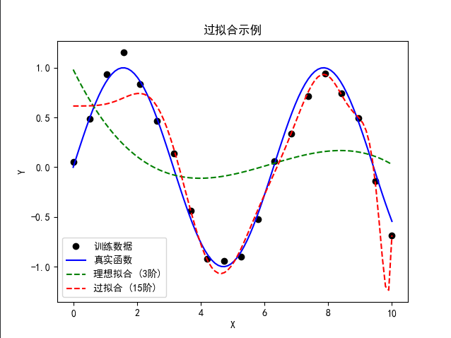
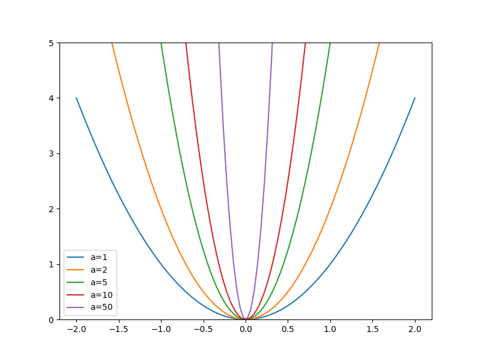

# 协同过滤

过拟合（Overfitting）是指模型在训练数据上表现得非常好，但在未见过的数据（测试集或验证集）上表现较差的现象。换句话说，模型过于“记住”了训练数据的细节和噪声，而没有学到数据的通用模式，导致其泛化能力不足。



**输出描述**：图中黑色点是带噪声的训练数据，蓝色实线是真实正弦函数，绿色虚线（3阶多项式）接近真实函数，红色虚线（15阶多项式）在训练点附近剧烈波动，试图“记住”每个点，这是过拟合的典型表现。：图中黑色点是带噪声的训练数据，蓝色实线是真实正弦函数，绿色虚线（3阶多项式）接近真实函数，红色虚线（15阶多项式）在训练点附近剧烈波动，试图“记住”每个点，这是过拟合的典型表现。

## 嵌入

在深度学习中，嵌入（Embedding） 是一种将离散的、高维的、稀疏的数据（如单词、用户ID、物品ID等）映射到连续的、低维的、稠密的向量空间的技术。这些嵌入向量通常是可学习的参数，能够捕捉数据之间的语义或关系特征，常用于自然语言处理（NLP）、推荐系统等领域。

[视频资料-向量数据库](https://www.youtube.com/watch?v=dN0lsF2cvm4)

<iframe width="514" height="289" src="https://www.youtube.com/embed/dN0lsF2cvm4" title="向量数据库" frameborder="0" allow="accelerometer; clipboard-write; encrypted-media; gyroscope; picture-in-picture" allowfullscreen="">
</iframe>

例如：

- 在 NLP 中，单词（如 "cat" 或 "dog"）可以通过嵌入表示为一个固定长度的实数向量（如 [0.2, -0.1, 0.5, ...]），这些向量能够捕捉单词的语义关系（如 "cat" 和 "dog" 的向量在空间中更接近）。
- 在推荐系统中，用户或物品的 ID 可以被映射为嵌入向量，用来表示用户偏好或物品特性。

嵌入的优点在于：

1. **降维**：将高维稀疏数据（如 one-hot 编码）映射到低维稠密向量，减少计算复杂度。
2. **语义捕捉**：嵌入向量通过训练可以学习到数据之间的内在关系，例如相似的单词具有相似的向量。
3. **可学习性**：嵌入向量是可训练的参数，可以通过优化器（如 SGD 或 Adam）在训练过程中更新。

**原理**

嵌入的核心思想是通过一个权重矩阵（通常是随机初始化的）将离散的索引（如单词 ID 或用户 ID）映射到连续的向量空间。

**输入表示**：

- 离散数据通常以整数索引的形式表示（例如，词汇表中的单词 ID）。
- 这些索引可以看作是 one-hot 编码的向量。例如，词汇表大小为 10,000，单词 ID 为 5 的 one-hot 向量是一个 10,000 维的向量，其中第 5 位为 1，其余为 0。

**嵌入矩阵**：

- 嵌入层本质上是一个形状为 (vocab_size, embedding_dim) 的权重矩阵，其中：
  - vocab_size 是离散数据的总数（如词汇表大小）。
  - embedding_dim 是嵌入向量的维度（通常远小于 vocab_size）。维度代表潜在属性，通常难以解释，是在低纬度上的特征，这也是嵌入向量与传统特征向量的区别
- 每个索引对应矩阵中的一行。例如，索引 5 对应嵌入矩阵的第 5 行，这是一个 embedding_dim 维的向量。

也可以用特征向量来解释。假设我们有 10,000 部电影，我们希望为每部电影生成一个 4 维的嵌入向量，形成一个 (10,000, 4) 的嵌入矩阵。每一行是一个电影的嵌入向量，表示该电影的潜在特征（例如，科幻程度、动作强度等）。这些特征不是手动定义的（如“未来”或“动作”），而是通过训练从用户评分或电影描述中自动学习得到的。嵌入矩阵最初随机初始化（例如，服从正态分布 $ \mathcal{N}(0, 0.01) $），在训练过程中通过优化器更新，使相似电影的向量在空间中更接近。这种嵌入矩阵可以用于推荐系统，通过计算用户嵌入与电影嵌入的点积来预测评分。

**映射过程**：

- 给定一个索引，嵌入层通过查表（lookup）操作，从嵌入矩阵中提取对应的行向量作为该索引的嵌入表示。
- 数学上，如果输入是索引 $ i $，嵌入矩阵是 $ W \in \mathbb{R}^{\text{vocab\_size} \times \text{embedding\_dim}} $，则嵌入向量为 $ W[i] $，即矩阵的第 $ i $ 行。

**训练过程**：

- 嵌入矩阵 $ W $ 是可学习的参数，通常用 nn.Parameter 包装，并通过随机初始化（例如正态分布 $ \mathcal{N}(0, 0.01) $）开始。
- 在模型训练中，嵌入矩阵会通过反向传播和优化器更新，使嵌入向量逐渐捕捉输入数据的语义关系。

## 权重衰减

使用`L2`正则化来阻止**过拟合**，`L2`通过在损失函数中加入所有权重的平方和。这回给梯度增加一项从而促使权重尽可能变小。

原理：系数越大，损失函数的峡谷就越陡峭。如果使用基础的抛物线`y = a * (x**2)`例子举例，`a`越大，抛物线就越窄。

原文：

>Weight decay, or *L2 regularization*, consists in adding to your loss function the sum of all the weights squared. Why do that? Because when we compute the gradients, it will add a contribution to them that will encourage the weights to be as small as possible.
>
>Why would it prevent overfitting? The idea is that the larger the coefficients are, the sharper canyons we will have in the loss function. If we take the basic example of a parabola, `y = a * (x**2)`, the larger `a` is, the more *narrow* the parabola is:

```python
x = np.linspace(-2,2,100)
a_s = [1,2,5,10,50] 
ys = [a * x**2 for a in a_s]
_,ax = plt.subplots(figsize=(8,6))
for a,y in zip(a_s,ys): ax.plot(x,y, label=f'a={a}')
ax.set_ylim([0,5])
ax.legend();
```



较大的参数会导致过于复杂的函数去拟合训练集中的所有数据点，这会引发过拟合。限制权重过度增长可能会对模型的训练造成一定阻碍，但会使模型的泛化能力增强。

原文：

>So, letting our model learn high parameters might cause it to fit all the data points in the training set with an overcomplex function that has very sharp changes, which will lead to overfitting.
>
>Limiting our weights from growing too much is going to hinder the training of the model, but it will yield a state where it generalizes better. Going back to the theory briefly, weight decay (or just `wd`) is a parameter that controls that sum of squares we add to our loss (assuming `parameters` is a tensor of all parameters):

```python
loss_with_wd = loss + wd * (parameters**2).sum()
```

公式：$loss\_with\_wd = loss + \lambda\sum_{i=1}^n\omega_i^2$

**也就是放大系数对损失函数的影响**

不过，在实际中这样操作，计算这么大的一个总和并将其加到损失函数中会非常低效（<span style="font-size:15px; font-family: '楷体', '楷体_GB2312', serif;"><strong>现代深度学习模型（如Transformer或大型神经网络）往往包含数百万到数十亿个参数（权重）。每次计算损失时，都需要遍历整个模型的所有权重，计算它们的平方并求和。这在训练循环中（涉及多次前向传播、反向传播和优化步骤）会反复执行，导致额外的计算负担，尤其在GPU/TPU等硬件上，内存访问和求和操作会消耗大量时间和资源。</strong></span>），而且可能在数值上不稳定。

高数中：$y=p^2$ 其导数 $y'=2p\frac{p}{dp}$

如上数学公式，所以把这个总和加到损失函数中，效果完全等同于：

```python
parameters.grad += wd * 2 * parameters
```

原文：

>In practice, though, it would be very inefficient (and maybe numerically unstable) to compute that big sum and add it to the loss. If you remember a little bit of high school math, you might recall that the derivative of `p**2` with respect to `p` is `2*p`, so adding that big sum to our loss is exactly the same as doing:

为什么等价？

**数学推导**

在梯度下降中，参数 $w_i$ 的更新基于总损失 $\text{loss\_with\_wd}$ 对 $w_i$ 的梯度：

>$\frac{\partial loss\_with\_wd}{\partial \omega_i}= \frac{\partial loss}{\partial \omega_i} + \frac{\partial}{\partial\omega_i}(\lambda\sum_j\omega_j^2)$

计算正则化项的导数：(<span style="color: red">反向传播时，通过对损失函数求导计算梯度来找到梯度度指向损失函数增加最快的方向，而梯度下降沿梯度的反方向更新参数以最小化损失”</span>)

>$\frac{\partial}{\partial w_i} \left( \lambda \sum_j w_j^2 \right) = \lambda \cdot \frac{\partial}{\partial w_i} \left( w_i^2 + \sum_{j \neq i} w_j^2 \right) = \lambda \cdot 2 w_i$

因此，总梯度为：

>$\frac{\partial \text{loss\_with\_wd}}{\partial w_i} = \frac{\partial \text{loss}}{\partial w_i} + 2 \lambda w_i$

对应代码：

```python
parameters.grad += wd * 2 * parameters
```

**梯度下降更新**

在梯度下降中，参数更新规则为：

>$w_i \gets w_i - \eta \cdot \frac{\partial \text{loss\_with\_wd}}{\partial w_i}$

代入梯度：

>$w_i \gets w_i - \eta \left( \frac{\partial \text{loss}}{\partial w_i} + 2 \lambda w_i \right)$

整理后：

>$w_i \gets w_i - \eta \frac{\partial \text{loss}}{\partial w_i} - \eta \cdot 2 \lambda w_i$

这里：

- 第一项 $-\eta \frac{\partial \text{loss}}{\partial w_i}$ 是基于原始损失的更新。
- 第二项 $-\eta \cdot 2 \lambda w_i$ 是一个与当前权重 $w_i$ 成正比的衰减项，效果是使权重向零靠拢。这正是权重衰减的实现方式。

**等价于权重衰减**

权重衰减的经典形式是在每次更新时直接让权重乘以一个小于 1 的因子，例如：
$$
w_i \gets (1 - \eta \cdot \lambda') w_i - \eta \cdot \frac{\partial \text{loss}}{\partial w_i}
$$
其中 $\lambda'$ 是权重衰减系数。比较 L2 正则化的更新：
$$
w_i \gets w_i - \eta \cdot 2 \lambda w_i - \eta \cdot \frac{\partial \text{loss}}{\partial w_i}
$$
可以看出，L2正则化的 $2 \lambda$ 对应权重衰减的 $\lambda'$，只是系数不同（$\lambda' \approx 2 \lambda$）。在实现中，框架（如`PyTorch`、`TensorFlow`）通常通过调整超参数（如 `wd`）来统一这两种形式。


在实际操作中，由于权重衰减是选择的一个参数，只需要将其设置为原来的两倍，这样在这个等式中甚至无需乘以2.要在`fastai`中使用权重衰减，只需要调用`fit`或`fit_one_cycle`函数时传入`wd`即可。

即把$$w_i \gets w_i - \eta \cdot 2 \lambda w_i - \eta \cdot \frac{\partial \text{loss}}{\partial w_i}$$中的$2\omega_i$使用$\omega'$代替

原文：

>In practice, since `wd` is a parameter that we choose, we can just make it twice as big, so we don't even need the `*2` in this equation. To use weight decay in fastai, just pass `wd` in your call to `fit` or `fit_one_cycle`:

```python
model = DotProductBias(n_users, n_movies, 50)
learn = Learner(dls, model, loss_func=MSELossFlat())
learn.fit_one_cycle(5, 5e-3, wd=0.1) # wd是权重衰减系数，人为指定
```

| epoch | train_loss | valid_loss | time  |
| :---: | :--------: | :--------: | :---: |
|   0   |  0.964149  |  0.947329  | 00:08 |
|   1   |  0.853209  |  0.862615  | 00:09 |
|   2   |  0.734107  |  0.828079  | 00:08 |
|   3   |  0.595621  |  0.812455  | 00:08 |
|   4   |  0.490830  |  0.812497  | 00:08 |

<section id="1">
    <a href="#2">返回</a>
</section>

## 创建自己的集成模型（Creating Our Own Embedding Module）

`DotProductBias`类屏蔽了底层的工作原理，现在不借助这个类来重新创建点积偏差。这需要为每个嵌入分别准备一个随机初始化的权重矩阵。不过，必须对其加以留意。优化器要求它们能够从模块的`parameters`方法中获取该模块的所有参数。但这并非完全自动实现的。如果只是将一个张量作为属性添加到`Module`中，它不会包含在参数里。

>So far, we've used `Embedding` without thinking about how it really works. Let's re-create `DotProductBias` *without* using this class. We'll need a randomly initialized weight matrix for each of the embeddings. We have to be careful, however. Recall from <> that optimizers require that they can get all the parameters of a module from the module's `parameters` method. However, this does not happen fully automatically. If we just add a tensor as an attribute to a `Module`, it will not be included in `parameters`:

```python
class T(Module):
    def __init__(self): self.a = torch.ones(3) # 创建一个包含三个元素的张量，每个元素为1，类型为浮点型

L(T().parameters())
```

```markdown
(#0) []
```

要让`Module`将某个张量视为参数，就必须用`nn.Parameter`类对其进行包装。这个类实际上没有增加任何功能（除了会自动为我们调用`requires_grad_`之外）。它仅被用作一种“标记”，用于指示哪些内容应该包含在参数中。

> To tell `Module` that we want to treat a tensor as a parameter, we have to wrap it in the `nn.Parameter` class. This class doesn't actually add any functionality (other than automatically calling `requires_grad_` for us). It's only used as a "marker" to show what to include in `parameters`:

```python
class T(Module):
    def __init__(self): self.a = nn.Parameter(torch.ones(3))

L(T().parameters())
```

```markdown
(#1) [Parameter containing:
tensor([1., 1., 1.], requires_grad=True)]
```

所有`Pytorch`模块都将`nn.Parameter`用于任何可训练参数，这就是为什么不需要显式使用这个包装器的原因。：

>All PyTorch modules use `nn.Parameter` for any trainable parameters, which is why we haven't needed to explicitly use this wrapper up until now:

```python
class T(Module):
    def __init__(self): self.a = nn.Linear(1, 3, bias=False) # Linear创建线性（全连接池）层的张量，这里是线性层的输入特征的张量是1维，经过线性层后输出特征的张量是3维。bias=False表示不包含偏置参数

t = T()
L(t.parameters())
```

```markdown
(#1) [Parameter containing:
tensor([[-0.2714],
        [ 0.3146],
        [ 0.0898]], requires_grad=True)]
```

<span style="color: red">线性变换公式：y = xW^T</span>

- x 是输入张量
- W 是权重矩阵
- y 是输出张量
- 如果bias=True（默认），还会加上偏置项 b，即 y = xW^T

```python
type(t.a.weight)
```

```markdown
torch.nn.parameter.Parameter
```

我们可以使用随机初始化的方式创建一个张量作为参数，如：

```python
def create_params(size):
    return nn.Parameter(torch.zeros(*size).normal_(0, 0.01)) # 创建一个形状为size、元素值服从 N (0, 0.01²) 正态分布的张量。 normal_以原地操作的方式将张量的值替换为从正态（高斯）分布中采样的值
```

>注意事项
>
>1. **梯度追踪**：如果张量启用了梯度追踪（requires_grad=True），原地操作可能会影响自动求导，因为它改变了张量的历史记录。在某些情况下（如修改中间计算结果），可能导致梯度计算错误。
>2. **谨慎使用**：原地操作会破坏原始数据，如果需要保留原始张量，建议先复制（使用 tensor.clone()）。
>3. **性能优化**：在内存受限的场景下（如 GPU 训练），原地操作可以显著减少内存开销，但需确保不会意外覆盖关键数据。

再次使用`DotProductBias`，但不嵌入。

```python
class DotProductBias(Module):
    def __init__(self, n_users, n_movies, n_factors, y_range=(0,5.5)):
        self.user_factors = create_params([n_users, n_factors])
        self.user_bias = create_params([n_users])
        self.movie_factors = create_params([n_movies, n_factors])
        self.movie_bias = create_params([n_movies])
        self.y_range = y_range
        
    def forward(self, x):
        users = self.user_factors[x[:,0]]
        movies = self.movie_factors[x[:,1]]
        res = (users*movies).sum(dim=1)
        res += self.user_bias[x[:,0]] + self.movie_bias[x[:,1]]
        return sigmoid_range(res, *self.y_range)
```

> 嵌入长这样子:
>
> ```python
> class DotProductBias(Module):
>     def __init__(self, n_users, n_movies, n_factors, y_range=(0,5.5)):
>         self.user_factors = Embedding(n_users, n_factors)
>         self.user_bias = Embedding(n_users, 1)
>         self.movie_factors = Embedding(n_movies, n_factors)
>         self.movie_bias = Embedding(n_movies, 1)
>         self.y_range = y_range
>         
>     def forward(self, x):
>         users = self.user_factors(x[:,0])
>         movies = self.movie_factors(x[:,1])
>         res = (users * movies).sum(dim=1, keepdim=True)
>         res += self.user_bias(x[:,0]) + self.movie_bias(x[:,1])
>         return sigmoid_range(res, *self.y_range)
> ```

然后再次训练它来验证其结果是否与上一次结果相似。

>Then let's train it again to check we get around the same results we saw in the previous section:

```python
model = DotProductBias(n_users, n_movies, 50)
learn = Learner(dls, model, loss_func=MSELossFlat())
learn.fit_one_cycle(5, 5e-3, wd=0.1)
```

| epoch | train_loss | valid_loss | time  |
| :---: | :--------: | :--------: | :---: |
|   0   |  0.946225  |  0.933384  | 00:09 |
|   1   |  0.866075  |  0.868197  | 00:09 |
|   2   |  0.704416  |  0.825246  | 00:10 |
|   3   |  0.604527  |  0.817444  | 00:10 |
|   4   |  0.499887  |  0.817852  | 00:09 |

<section id="2"><a href="#1">查看之前的训练结果</a></section>

## 解读嵌入与偏差（Interpreting Embeddings and Biases）

很好，模型已经具备实用性了，因为它能为我们的用户提供电影推荐--但了解它发现了哪些参数也很有趣。最容易解读的是偏差，以下是偏差向量中数值最低的几部电影：

>Our model is already useful, in that it can provide us with movie recommendations for our users—but it is also interesting to see what parameters it has discovered. The easiest to interpret are the biases. Here are the movies with the lowest values in the bias vector:

```python
movie_bias = learn.model.movie_bias.squeeze()
idxs = movie_bias.argsort()[:5]
[dls.classes['title'][i] for i in idxs]
```

```markdown
['Children of the Corn: The Gathering (1996)',
 'Home Alone 3 (1997)',
 'Crow: City of Angels, The (1996)',
 'Mortal Kombat: Annihilation (1997)',
 'Cable Guy, The (1996)']
```

