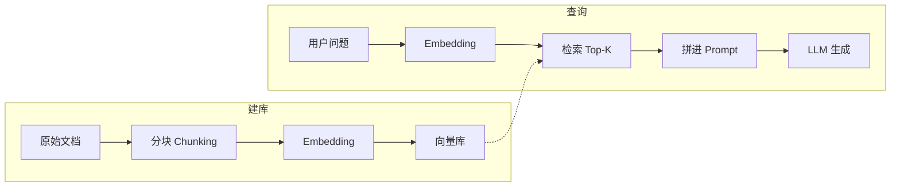

# RAG 技术：检索增强生成

> **RAG（Retrieval-Augmented Generation）= 检索增强生成**：先从文档/知识库里检索出与问题相关的片段，再把这些片段作为上下文喂给 LLM，让回答有据可依、减少幻觉。  
> 与 [长期记忆](./long-term-memory) 共用「向量化 + 检索」技术，但**数据来源与使用场景不同**；在 Agent 里常作为「知识库工具」或上下文流水线的一环。

---

## 一、RAG 解决什么问题？

LLM 的**知识截止于训练数据**，且容易产生幻觉。若希望 Agent 能回答「你们公司内部文档」「产品手册」「最新公告」等内容，有两种思路：

1. **微调/继续训练**：把知识灌进模型——成本高、更新慢、难以应对频繁变更的文档。  
2. **RAG**：文档单独存成「知识库」，**不改模型**；每次回答前，先根据用户问题从知识库里**检索**相关片段，再和问题一起交给 LLM 生成答案。

RAG 的核心就是：**用检索到的外部知识来增强（Augment）生成（Generation）**，让模型「有材料可抄」，而不是凭空编造。

---

## 二、RAG 与长期记忆的区别

| 维度 | 长期记忆 | RAG |
|------|----------|-----|
| **数据来源** | Agent 运行过程中产生的**交互、摘要、用户偏好**等 | 事先准备好的**文档、知识库、说明手册**等 |
| **写入时机** | 随对话/任务进行**动态写入** | 多为**离线建库**，定期或按需更新 |
| **典型用途** | 跨会话「回忆」用户说过什么、上次任务结果 | 回答「文档里写了什么」、基于公司/产品知识作答 |
| **技术栈** | 同样用 Embedding + 向量库 + 检索 | 相同，额外多一步**分块（Chunking）**与建库流程 |

因此：**长期记忆 = 对「过去发生的事」做检索；RAG = 对「固定知识 corpus」做检索并增强当前回答**。两者可以并存——例如先查长期记忆再查 RAG 文档，一起拼进上下文。

---

## 三、RAG 流水线概览

### 1. 建库阶段（离线）

- **分块（Chunking）**：把长文档切成适合检索和上下文长度的小段（如 200～500 字/块，可重叠或按段落/小节切）。  
- **向量化**：对每个块做 Embedding，和 [长期记忆](./long-term-memory) 里一样，写入同一套向量库或单独建一个「文档向量库」。  
- **元数据**：为每块附带来源、标题、时间等，便于过滤和展示引用。

### 2. 查询阶段（在线）

- 用户问题（或 Agent 当前目标）→ **Embedding** → 在向量库中 **Top-K 检索** → 得到若干相关块。  
- 把检索结果**拼进 Prompt**（例如「根据以下参考内容回答问题：…」），再调用 LLM 生成。  
- 可选：对 Top-K 结果做**重排序（Rerank）**再拼进 Prompt，提高相关性。

---

## 四、在 Agent 中的用法

RAG 不必改变 Agent 的五大模块结构，可以以两种方式接入：

1. **作为 Tool（工具）**  
   - 提供一个「查知识库」工具：输入 query，内部走 RAG 检索 + 可选摘要，返回文本给 Agent。  
   - Planner/ReAct 在需要「查文档」时调用该工具，把返回内容当作观察再推理。

2. **作为上下文流水线**  
   - 在每次调用 LLM 前，先用当前用户问题/目标做一次 RAG 检索，把 Top-K 文档块与短期记忆、长期记忆一起拼进 Prompt，再交给 LLM。  
   - 适合「每轮回答都尽量基于文档」的问答/客服场景。

选哪种取决于产品需求：需要 Agent **主动决定何时查文档**用工具式；需要**每轮都带文档上下文**用流水线式。

---

## 五、实现要点小结

| 环节 | 要点 |
|------|------|
| **分块** | 按段落/固定长度/语义边界切，控制块大小与重叠，避免断句不当。 |
| **向量模型** | 与 [长期记忆](./long-term-memory) 相同：写入与检索用同一套 Embedding；与 LLM 不必同源。 |
| **检索** | 向量 Top-K，可加关键词/元数据过滤、Rerank。 |
| **Prompt** | 明确「以下为参考内容」「仅根据参考内容回答」，减少幻觉。 |
| **与 Agent 结合** | 可做 Tool，也可做每轮上下文的固定步骤。 |

---

## 六、延伸阅读

- 向量化与检索的底层实现（与 RAG 共用）：[长期记忆实现原理](./long-term-memory)。  
- Agent 模块与工具接入：[五大核心模块](./agent-core-modules)。
