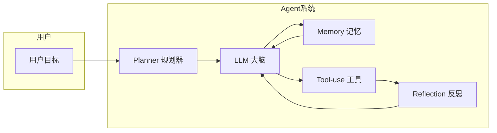
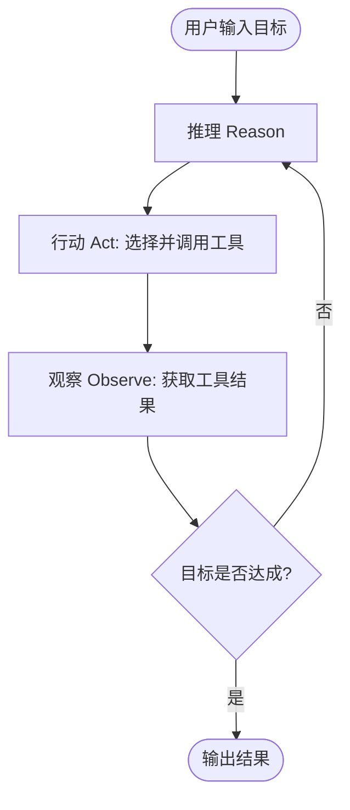
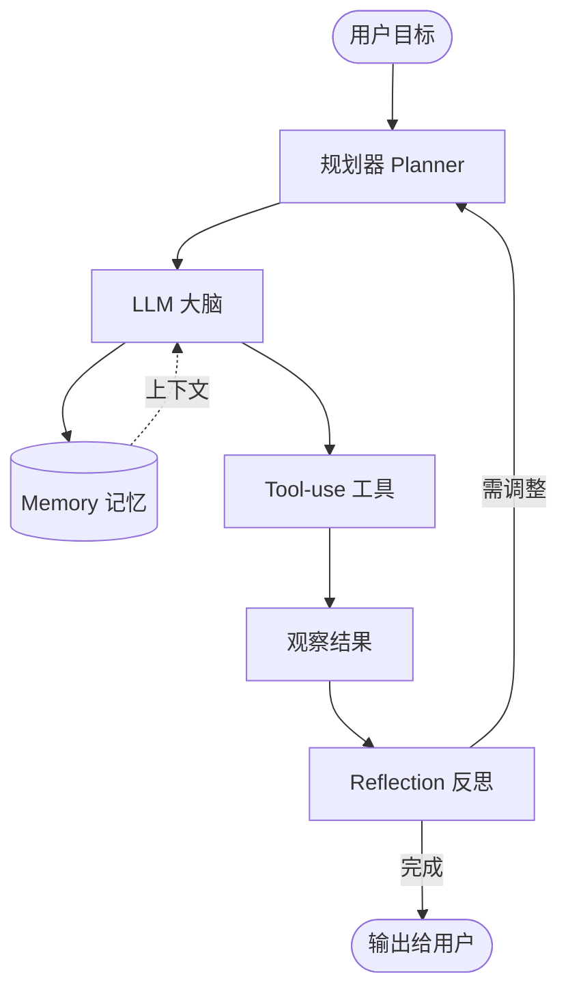

# AI Agent 入门笔记

> 面向新手的 Agent 概念、架构与入门路径说明。  
> 目标：看懂 Agent 是什么、由哪些部分组成、如何运转，并能按步骤动手搭一个简单 Agent。

---

## 一、什么是 Agent？

**Agent**（智能体 / 智能代理）不是「一个更大的聊天机器人」，而是一类**能感知环境、做决策并执行动作**的智能系统。

可以简单理解为：

- **传统 AI（如单一问答）**：你问一句，它答一句，没有「记住上下文」或「主动去查、去执行」的能力。
- **Agent**：你给一个**目标**（例如「帮我查北京明天天气并总结要不要带伞」），它会自己决定要调用天气 API、拿到结果后再推理、最后给你结论，甚至多步、多工具配合完成。

所以：**Agent = 有目标 + 能规划 + 能调用工具 + 能根据结果再思考的一整套系统**，而不是「一个大模型 + 一个接口」那么简单。

---

## 二、Agent 和传统 AI 的区别

| 维度       | 传统 AI 模型 / 简单聊天 | AI Agent                    |
|------------|--------------------------|-----------------------------|
| **自主性** | 低，按单轮问答响应       | 高，围绕目标自主拆任务、选工具 |
| **功能**   | 多为单一能力（问答/翻译）| 可组合多种能力（查、算、写、执行） |
| **适应性** | 逻辑相对固定             | 可根据执行结果动态调整策略     |
| **学习/记忆** | 多为无状态或短期会话     | 可具备短期/长期记忆与反思     |

理解这一点，有助于避免把「加了个工具调用的 prompt」就当成 Agent；真正的 Agent 是**多模块协同的一整套系统**。

---

## 三、Agent 的五大核心模块

一个可运行、可扩展的 Agent 通常包含以下五个部分（可以记成：**大脑、记忆、规划、手脚、反思**）：

### 1. LLM（语言模型）——Agent 的「大脑」

- **作用**：理解用户意图、做推理、生成要执行的步骤和最终回答。
- **局限**：只负责「想」和「说」，不负责长期记忆、状态管理和真实执行，需要和其他模块配合。

### 2. Memory（记忆系统）——上下文与经验的延续

- **作用**：保存对话上下文、任务进度、历史经验，让 Agent 不是「每轮失忆」。
- **常见分类**：
  - **短期记忆**：当前会话的对话与状态（如 Session Buffer）。
  - **长期记忆**：跨会话的经验、知识（常借助向量库如 Chroma、Weaviate）。
  - **工作记忆**：当前任务步骤、状态、已执行的 Action 历史。

### 3. Planning（规划器）——从目标到执行路径

- **作用**：把用户给的**复杂目标**拆成**可执行的子任务序列**，并可在执行中动态调整。
- **常见实现**：基于规则（流程图、状态机）、基于模型（ReAct、Chain-of-Thought）、或混合（如 LangGraph 的调度器）。

### 4. Tool-use（工具调用）——Agent 的「手脚」

- **作用**：真正与外部世界交互——调 API、查数据库、读文件、发请求等。没有工具调用，Agent 只能「说」不能「做」。
- **常见形态**：API、数据库、文件读写、以及基于文档/知识库的 **[RAG](../agent-rag)**（检索增强生成）——先检索相关片段再交给 LLM，减少幻觉。
- **工程要点**：工具的描述（Schema）、工具选择（Tool Router）、错误处理与重试。

### 5. Reflection（反思）——元认知与策略调整

- **作用**：评估当前执行效果；失败或结果不好时，审视行为并调整策略或重试。
- **常见思路**：Reflexion、Tree-of-Thought、Critic Agent + Actor Agent、ReAct 中的「观察→再推理」闭环。

---

## 四、Agent 如何运转：ReAct 循环

当前最常见的一种运行方式就是 **ReAct**（Reasoning + Acting）：**思考 → 行动 → 观察 → 再思考**，形成闭环。

**简单例子**：

- **用户**：「北京明天天气怎么样？要带伞吗？」
- **Reason**：需要先查天气 → 选「天气 API」。
- **Act**：调用天气 API。
- **Observe**：得到「明天有雨」。
- **Reason**：有雨 → 建议带伞。
- **Act**：生成最终回复（或再调用其他工具）。
- **Observe**：任务完成 → 输出答案。

这种「推理—行动—观察」的循环，让 Agent 可以**多步、跨工具**完成任务，而不是一次调用就结束。

---

## 五、主流架构简析

不同项目会用不同方式把「大脑、记忆、规划、工具、反思」组合起来，常见有三种思路：

| 架构    | 全称 / 含义           | 特点简述                     | 适合场景           |
|---------|------------------------|------------------------------|--------------------|
| **MCP** | Memory–Controller–Planner | 记忆 + 控制中心 + 规划器，结构清晰、易扩展 | 企业级、长流程、多 Agent |
| **ReAct** | Reasoning + Acting   | 轻量、思考与行动交替循环     | 快速原型、单 Agent 任务 |
| **A2A** | Agent-to-Agent        | 多 Agent 协作、分工与通信    | 复杂协作、角色分工 |

- **MCP**：偏工程化，适合对稳定性和可控性要求高的 B 端。
- **ReAct**：上手快，很多教程和框架（如 [LangChain](../agent-langchain-and-frameworks)）都围绕它。
- **A2A**：当你需要「多个专业 Agent 一起干活」时考虑。

---

## 六、整体架构关系图（小结）

下面这张图把「用户目标 → 规划 → 大脑 → 记忆/工具 → 反思 → 再规划」串起来，便于建立整体观。

---

## 七、新手快速入门步骤

1. **明确需求**：先想清楚你要 Agent 做什么（例如：自动查天气、总结网页、写周报），避免一上来就堆技术。
2. **选模型**：选一个带「工具调用 / Function Calling」的模型（如 GPT、Claude、通义、DeepSeek 等），并确认 API 支持。
3. **选框架**：新手可先用 **LangChain** 或 **LangGraph** 做 ReAct 式 Agent；想更工程化再看 MCP、多 Agent 框架（如 AutoGen、CrewAI）。各框架概念与选型见 [LangChain 与同类框架详解](../agent-langchain-and-frameworks)。
4. **设计最小闭环**：先实现：用户目标 → 规划 1～2 步 → 调 1 个工具 → 把结果塞回 LLM → 输出。确保「规划→工具→反思」跑通。
5. **加记忆（可选）**：在单轮闭环稳定后，再加短期记忆（会话缓冲）或简单长期记忆（向量检索）。
6. **测试与迭代**：用典型场景和边界 case 测试，再逐步加工具、加反思、加多 Agent。

---

## 八、小结

- **Agent** = 有目标、能规划、能调工具、能根据反馈再思考的**系统**，不是单纯「大模型 + 接口」。
- **五大模块**：LLM（大脑）、Memory（记忆）、Planner（规划）、Tool-use（工具）、Reflection（反思），缺一不可才能算完整 Agent。
- **ReAct** 是最常见的运行方式：推理 → 行动 → 观察 → 再推理，形成闭环。
- **架构选择**：快速验证用 ReAct；要稳定、可维护选 MCP；多角色协作考虑 A2A。
- **入门路径**：从「单目标 + 单工具 + 最小 ReAct 循环」开始，再逐步加记忆、多工具和多 Agent。

后续可以在此基础上继续学习：[LangChain 与同类框架详解](../agent-langchain-and-frameworks)、Prompt 设计、[RAG 技术（检索增强生成）](../agent-rag)、以及 Memory / Reflection 的进阶用法。
