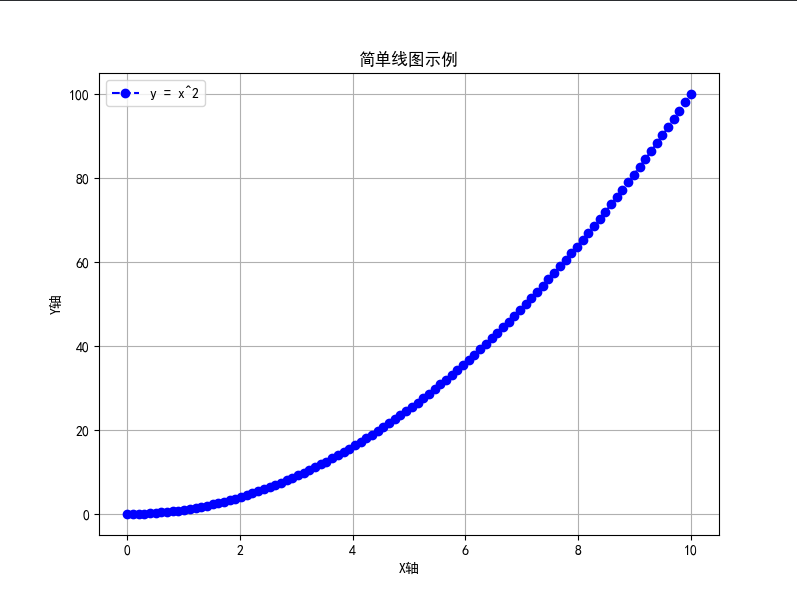
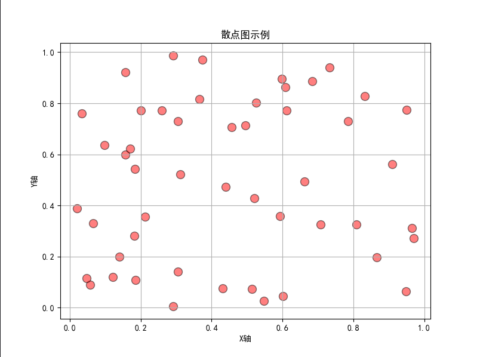
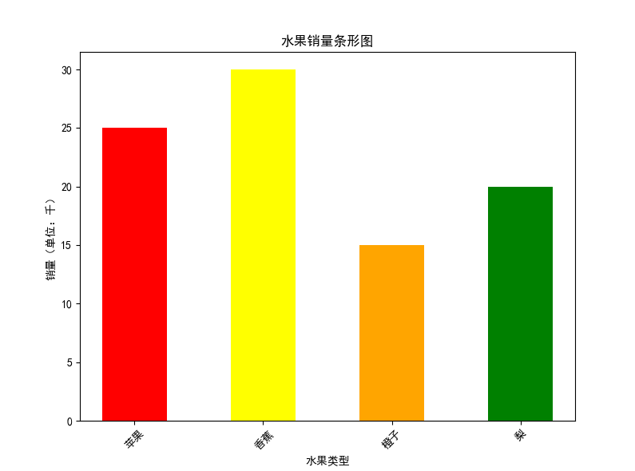
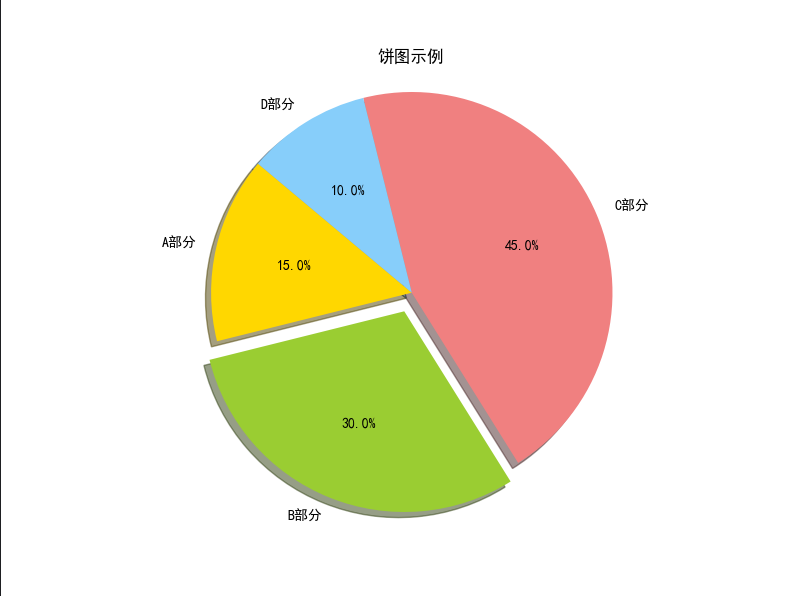
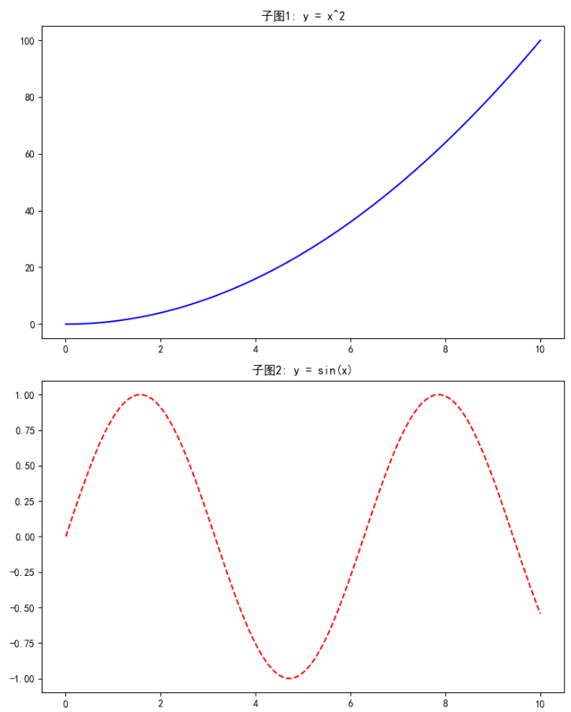

# Matplotlib 库

## 连续图

`Matplotlib`的核心模块是``pyplot`，它提供了一个类似`MATLAB`的接口，便于快速绘图。

**Figure**：整个图形窗口，像一张画布。

**Axes**：`Figure`上的一个绘图区域（子图），你可以有多个Axes。

**Artist**：绘图元素，如线条、文本、轴等。

绘图流程：创建Figure和Axes → 添加数据和元素 → 显示或保存图形。

```python
import matplotlib.pyplot as plt  # 常用别名为plt
import numpy as np  # 常用于生成数据
```

```python
# 导入库
import matplotlib.pyplot as plt
import numpy as np
1
# 生成数据：x轴从0到10，y轴是x的平方
x = np.linspace(0, 10, 100)  # 生成100个均匀分布的点
y = x ** 2

plt.rcParams['font.sans-serif'] = ['SimHei']
plt.rcParams['axes.unicode_minus'] = False

# 创建图形
plt.figure(figsize=(8, 6))  # 设置画布大小（宽度8英寸，高度6英寸）

# 绘制线图
plt.plot(x, y, label='y = x^2', color='blue', linestyle='--', marker='o')
# 参数解释：
# - label: 图例标签
# - color: 线条颜色（可选项：'red', 'green'等）
# - linestyle: 线型（'-'实线, '--'虚线, ':'点线）
# - marker: 数据点标记（'o'圆点, 's'方块, '^'三角）

# 添加标题和标签
plt.title('简单线图示例')  # 图形标题
plt.xlabel('X轴')  # X轴标签
plt.ylabel('Y轴')  # Y轴标签
plt.legend()  # 显示图例  就是左上角函数表达式
plt.grid(True)  # 添加网格线，便于阅读

# 显示图形
plt.show()
```



## 散点图

```python
import matplotlib.pyplot as plt
import numpy as np

# 生成随机数据
np.random.seed(42)  # 设置随机种子，确保可复现
x = np.random.rand(50)  # 50个随机数（0-1间）
y = np.random.rand(50)

# 创建图形
plt.figure(figsize=(8, 6))

# 绘制散点图
plt.scatter(x, y, s=100, c='red', alpha=0.5, edgecolors='black')  
# 参数解释：
# - s: 点的大小（可变，根据另一个数组变化）
# - c: 颜色（可统一或根据数组变化）
# - alpha: 透明度（0-1，0完全透明）
# - edgecolors: 点边缘颜色

# 添加元素
plt.title('散点图示例')
plt.xlabel('X轴')
plt.ylabel('Y轴')
plt.grid(True)

# 显示
plt.show()
```



## 条形图

```python
import matplotlib.pyplot as plt

# 数据
categories = ['苹果', '香蕉', '橙子', '梨']  # X轴类别
values = [25, 30, 15, 20]  # Y轴值

# 创建图形
plt.figure(figsize=(8, 6))

# 绘制条形图
plt.bar(categories, values, color=['red', 'yellow', 'orange', 'green'], width=0.5)  
# 参数解释：
# - color: 每个条的颜色（列表形式）
# - width: 条宽（0-1间）

# 添加元素
plt.title('水果销量条形图')
plt.xlabel('水果类型')
plt.ylabel('销量（单位：千）')
plt.xticks(rotation=45)  # 旋转X轴标签，避免重叠

# 显示
plt.show()
```

**解释**：：plt.bar 用于垂直条；如果想水平，用 用于垂直条；如果想水平，用plt.barh。。

**输出描述**：四个彩色条形，从左到右对应苹果（红）、香蕉（黄）等，Y轴显示值。：四个彩色条形，从左到右对应苹果（红）、香蕉（黄）等，Y轴显示值。

 

## 饼图

```python
import matplotlib.pyplot as plt

# 数据
labels = ['A部分', 'B部分', 'C部分', 'D部分']
sizes = [15, 30, 45, 10]  # 比例值（自动归一化）
colors = ['gold', 'yellowgreen', 'lightcoral', 'lightskyblue']
explode = (0, 0.1, 0, 0)  # 突出第二个部分

# 创建图形
plt.figure(figsize=(8, 6))

# 绘制饼图
plt.pie(sizes, explode=explode, labels=labels, colors=colors, autopct='%1.1f%%', shadow=True, startangle=140)  
# 参数解释：
# - explode: 突出某些扇区
# - autopct: 显示百分比格式
# - shadow: 添加阴影
# - startangle: 起始角度

# 添加元素
plt.title('饼图示例')
plt.axis('equal')  # 确保圆形 它的作用是设置坐标轴的纵横比为相等，即 x 轴和 y 轴上的单位长度相同。这样做的一个常见用途是确保绘制的圆形看起来确实是圆形，而不是椭圆形。


# 显示
plt.show()
```



## 多子图

```python
import matplotlib.pyplot as plt
import numpy as np

x = np.linspace(0, 10, 100)

# 创建2行1列的子图
fig, axs = plt.subplots(2, 1, figsize=(8, 10)) # 其实就是创建两个绘图区域

# 第一子图：线图
axs[0].plot(x, x**2, 'b-')
axs[0].set_title('子图1: y = x^2')

# 第二子图：正弦曲线
axs[1].plot(x, np.sin(x), 'r--')
axs[1].set_title('子图2: y = sin(x)')

# 调整布局
plt.tight_layout()  # 自动调节布局 防止出现元素重叠

# 显示
plt.show()
```



## 保存

- 保存：用plt.savefig('filename.png')代替plt.show()，支持PNG、PDF、SVG等格式。
- 样式：Matplotlib有内置主题，如plt.style.use('ggplot')模仿R的ggplot。
- 交互：对于动画，用matplotlib.animation；对于交互式，用%matplotlib notebook在Jupyter中。
- 常见问题：如果图形不显示，确保后端正确（默认是'agg'用于非GUI）。
- 学习资源：官方文档（matplotlib.org）有大量例子。建议从简单图开始练习，逐步添加定制。

