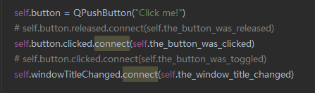

# PyQt6 学习笔记

## `QpushButton`信号

1. 先定义一个小部件

   ```python
   from PyQt6.QtWidgets import QApplication, QMainWindow, QPushButton
   
   # 创建按钮
   button = QPushButton("我是按钮")
   ```

2. 将按钮控件设置为可选中状态，使其可以切换选中状态

   ```python
   button.setCheckable(True)
   ```

3. 如果按钮变为点击状态则连接信号函数

   ```python
   button.clicked.connect(self.the_button_was_clicked)
   self.setCentralWidget(button)
   
   def the_button_was_clicked(self):
           print("Clicked!")
   ```

4. 创建`app`对象

   ```python\
   app = QApplication(sys.argv)
   ```

5. 创建主窗口

   ```python
   window = MainWindow()
   window.show()
   ```

6. 进入事件循环

   ```python
   app.exec()
   ```

7. 获取按钮自身状态

   ```python
   button.clicked.connect(self.the_button_was_toggled)
   def the_button_was_toggled(self, checked):
       print("Checked?", checked)
   ```

8. 使用变量存储按钮状态

   ```python
   self.button_status = True
   def the_button_was_toggled(self, checked):
       self.button_status = checked
       print(self.button_status)
   ```

9. 禁用按钮

   ```python
   self.button.setEnabled(False)
   ```

10. 点击后改变按钮文本

    ```python
        def the_button_was_clicked(self):
            self.button.setText("You clicked me!")
            self.button.setEnabled(False)
            self.setWindowTitle("SHEN'S App - Clicked")
    ```

11. 什么信号连接的函数，那么这个函数接收到的信号内容就是该信号相关的内容。例如，如果信号是clicked发出的，那么接收这个信号的函数就会得到布尔值，如果信号是`widowTitleChanged`，那么接收这个信号的函数就会是title内容

    >

## 常用控件和布局

### `QLabel`

-- 用于显示静态文本或图像的标签控件，用户不能与其交互。通常用于显示程序的标题、说明、状态信息等

`label = QLabel`属于`QtWidgets`

### `QLineEdit`

-- 用户可以在 `QLineEdit` 中输入文本，并且可以通过键盘或鼠标进行编辑。`QLineEdit` 主要用于获取用户输入的文本信息，例如用户名、密码、搜索关键词等

`input = QLineEdit()`属于`QtWidgets`

### `QVBoxLayout`

-- 垂直布局管理器会将添加到其中的窗口部件垂直地排列，依次放置在上方或下方

`layout = QVBoxLayout()`属于`QWidgets`

### `QHBoxLayout`

-- 用于创建水平布局管理器。水平布局管理器会将添加到其中的窗口部件水平地排列，依次放置在左侧或右侧。

`layout = QHBoxLayout()`属于`QWidgets`

### `QWidget`

-- 是 PyQt 中的一个类，代表用户界面中的一个可视窗口部件。它是所有用户界面控件的基类，可以包含其他窗口部件，如按钮、标签、文本框等。`QWidget()` 提供了一些基本的功能，例如绘制、事件处理、布局管理等，是构建用户界面的基础。

`widget = Qwidget()`

### `QComboBox`

`QComboBox`部件将一个按钮与一个下拉列表组合在一起。

**属性：**

- `count` - 组合框中项目的数量
- `currentData` - 当前项目的数据
- `currentIndex` - 当前项目在组合框中的索引
- `currentTex`t - 当前文本
- `duplicatesEnabled` - 用户是否可以在组合框中输入重复项目
- `editable` - 组合框是否可由用户编辑
- `frame` - 组合框是否绘制边框
- `iconSize` - 组合框中显示的图标大小
- `insertPolicy` - 用于确定用户插入的项目应在组合框中何处显示的策略
- `labelDrawingMode` - 组合框用于绘制其标签的模式
- `maxCount` - 组合框中允许的最大项目数
- `maxVisibleItems` - 组合框在屏幕上允许的最大尺寸，以项目数衡量
- `minimumContentsLength` - 应能放入组合框的最少字符数
- `modelColumn` - 模型中可见的列
- `placeholderText` - 设置当未设置有效索引时显示的占位符文本
- `sizeAdjustPolicy` - 描述当内容变化时组合框大小如何变化的策略

**方法：**

- def [`__init__()`](https://doc.qt.io/qtforpython-6/PySide6/QtWidgets/QComboBox.html#PySide6.QtWidgets.QComboBox.__init__)
- def [`addItem()`](https://doc.qt.io/qtforpython-6/PySide6/QtWidgets/QComboBox.html#PySide6.QtWidgets.QComboBox.addItem)
- def [`addItems()`](https://doc.qt.io/qtforpython-6/PySide6/QtWidgets/QComboBox.html#PySide6.QtWidgets.QComboBox.addItems)
- def [`completer()`](https://doc.qt.io/qtforpython-6/PySide6/QtWidgets/QComboBox.html#PySide6.QtWidgets.QComboBox.completer)
- def [`count()`](https://doc.qt.io/qtforpython-6/PySide6/QtWidgets/QComboBox.html#id0)
- def [`currentData()`](https://doc.qt.io/qtforpython-6/PySide6/QtWidgets/QComboBox.html#id2)
- def [`currentIndex()`](https://doc.qt.io/qtforpython-6/PySide6/QtWidgets/QComboBox.html#id3)
- def [`currentText()`](https://doc.qt.io/qtforpython-6/PySide6/QtWidgets/QComboBox.html#id4)
- def [`duplicatesEnabled()`](https://doc.qt.io/qtforpython-6/PySide6/QtWidgets/QComboBox.html#id5)
- def [`findData()`](https://doc.qt.io/qtforpython-6/PySide6/QtWidgets/QComboBox.html#PySide6.QtWidgets.QComboBox.findData)
- def [`findText()`](https://doc.qt.io/qtforpython-6/PySide6/QtWidgets/QComboBox.html#PySide6.QtWidgets.QComboBox.findText)
- def [`hasFrame()`](https://doc.qt.io/qtforpython-6/PySide6/QtWidgets/QComboBox.html#PySide6.QtWidgets.QComboBox.hasFrame)
- def [`iconSize()`](https://doc.qt.io/qtforpython-6/PySide6/QtWidgets/QComboBox.html#id6)
- def [`inputMethodQuery()`](https://doc.qt.io/qtforpython-6/PySide6/QtWidgets/QComboBox.html#PySide6.QtWidgets.QComboBox.inputMethodQuery)
- def [`insertItem()`](https://doc.qt.io/qtforpython-6/PySide6/QtWidgets/QComboBox.html#PySide6.QtWidgets.QComboBox.insertItem)
- def [`insertItems()`](https://doc.qt.io/qtforpython-6/PySide6/QtWidgets/QComboBox.html#PySide6.QtWidgets.QComboBox.insertItems)
- def [`insertPolicy()`](https://doc.qt.io/qtforpython-6/PySide6/QtWidgets/QComboBox.html#id7)
- def [`insertSeparator()`](https://doc.qt.io/qtforpython-6/PySide6/QtWidgets/QComboBox.html#PySide6.QtWidgets.QComboBox.insertSeparator)
- def [`isEditable()`](https://doc.qt.io/qtforpython-6/PySide6/QtWidgets/QComboBox.html#PySide6.QtWidgets.QComboBox.isEditable)
- def [`itemData()`](https://doc.qt.io/qtforpython-6/PySide6/QtWidgets/QComboBox.html#PySide6.QtWidgets.QComboBox.itemData)
- def [`itemDelegate()`](https://doc.qt.io/qtforpython-6/PySide6/QtWidgets/QComboBox.html#PySide6.QtWidgets.QComboBox.itemDelegate)
- def [`itemIcon()`](https://doc.qt.io/qtforpython-6/PySide6/QtWidgets/QComboBox.html#PySide6.QtWidgets.QComboBox.itemIcon)
- def [`itemText()`](https://doc.qt.io/qtforpython-6/PySide6/QtWidgets/QComboBox.html#PySide6.QtWidgets.QComboBox.itemText)
- def [`labelDrawingMode()`](https://doc.qt.io/qtforpython-6/PySide6/QtWidgets/QComboBox.html#id8)
- def [`lineEdit()`](https://doc.qt.io/qtforpython-6/PySide6/QtWidgets/QComboBox.html#PySide6.QtWidgets.QComboBox.lineEdit)
- def [`maxCount()`](https://doc.qt.io/qtforpython-6/PySide6/QtWidgets/QComboBox.html#id9)
- def [`maxVisibleItems()`](https://doc.qt.io/qtforpython-6/PySide6/QtWidgets/QComboBox.html#id10)
- def [`minimumContentsLength()`](https://doc.qt.io/qtforpython-6/PySide6/QtWidgets/QComboBox.html#id11)
- def [`model()`](https://doc.qt.io/qtforpython-6/PySide6/QtWidgets/QComboBox.html#PySide6.QtWidgets.QComboBox.model)
- def [`modelColumn()`](https://doc.qt.io/qtforpython-6/PySide6/QtWidgets/QComboBox.html#id12)
- def [`placeholderText()`](https://doc.qt.io/qtforpython-6/PySide6/QtWidgets/QComboBox.html#id13)
- def [`removeItem()`](https://doc.qt.io/qtforpython-6/PySide6/QtWidgets/QComboBox.html#PySide6.QtWidgets.QComboBox.removeItem)
- def [`rootModelIndex()`](https://doc.qt.io/qtforpython-6/PySide6/QtWidgets/QComboBox.html#PySide6.QtWidgets.QComboBox.rootModelIndex)
- def [`setCompleter()`](https://doc.qt.io/qtforpython-6/PySide6/QtWidgets/QComboBox.html#PySide6.QtWidgets.QComboBox.setCompleter)
- def [`setDuplicatesEnabled()`](https://doc.qt.io/qtforpython-6/PySide6/QtWidgets/QComboBox.html#PySide6.QtWidgets.QComboBox.setDuplicatesEnabled)
- def [`setEditable()`](https://doc.qt.io/qtforpython-6/PySide6/QtWidgets/QComboBox.html#PySide6.QtWidgets.QComboBox.setEditable)
- def [`setFrame()`](https://doc.qt.io/qtforpython-6/PySide6/QtWidgets/QComboBox.html#PySide6.QtWidgets.QComboBox.setFrame)
- def [`setIconSize()`](https://doc.qt.io/qtforpython-6/PySide6/QtWidgets/QComboBox.html#PySide6.QtWidgets.QComboBox.setIconSize)
- def [`setInsertPolicy()`](https://doc.qt.io/qtforpython-6/PySide6/QtWidgets/QComboBox.html#PySide6.QtWidgets.QComboBox.setInsertPolicy)
- def [`setItemData()`](https://doc.qt.io/qtforpython-6/PySide6/QtWidgets/QComboBox.html#PySide6.QtWidgets.QComboBox.setItemData)
- def [`setItemDelegate()`](https://doc.qt.io/qtforpython-6/PySide6/QtWidgets/QComboBox.html#PySide6.QtWidgets.QComboBox.setItemDelegate)
- def [`setItemIcon()`](https://doc.qt.io/qtforpython-6/PySide6/QtWidgets/QComboBox.html#PySide6.QtWidgets.QComboBox.setItemIcon)
- def [`setItemText()`](https://doc.qt.io/qtforpython-6/PySide6/QtWidgets/QComboBox.html#PySide6.QtWidgets.QComboBox.setItemText)
- def [`setLabelDrawingMode()`](https://doc.qt.io/qtforpython-6/PySide6/QtWidgets/QComboBox.html#PySide6.QtWidgets.QComboBox.setLabelDrawingMode)
- def [`setLineEdit()`](https://doc.qt.io/qtforpython-6/PySide6/QtWidgets/QComboBox.html#PySide6.QtWidgets.QComboBox.setLineEdit)
- def [`setMaxCount()`](https://doc.qt.io/qtforpython-6/PySide6/QtWidgets/QComboBox.html#PySide6.QtWidgets.QComboBox.setMaxCount)
- def [`setMaxVisibleItems()`](https://doc.qt.io/qtforpython-6/PySide6/QtWidgets/QComboBox.html#PySide6.QtWidgets.QComboBox.setMaxVisibleItems)
- def [`setMinimumContentsLength()`](https://doc.qt.io/qtforpython-6/PySide6/QtWidgets/QComboBox.html#PySide6.QtWidgets.QComboBox.setMinimumContentsLength)
- def [`setModelColumn()`](https://doc.qt.io/qtforpython-6/PySide6/QtWidgets/QComboBox.html#PySide6.QtWidgets.QComboBox.setModelColumn)
- def [`setPlaceholderText()`](https://doc.qt.io/qtforpython-6/PySide6/QtWidgets/QComboBox.html#PySide6.QtWidgets.QComboBox.setPlaceholderText)
- def [`setRootModelIndex()`](https://doc.qt.io/qtforpython-6/PySide6/QtWidgets/QComboBox.html#PySide6.QtWidgets.QComboBox.setRootModelIndex)
- def [`setSizeAdjustPolicy()`](https://doc.qt.io/qtforpython-6/PySide6/QtWidgets/QComboBox.html#PySide6.QtWidgets.QComboBox.setSizeAdjustPolicy)
- def [`setValidator()`](https://doc.qt.io/qtforpython-6/PySide6/QtWidgets/QComboBox.html#PySide6.QtWidgets.QComboBox.setValidator)
- def [`setView()`](https://doc.qt.io/qtforpython-6/PySide6/QtWidgets/QComboBox.html#PySide6.QtWidgets.QComboBox.setView)
- def [`sizeAdjustPolicy()`](https://doc.qt.io/qtforpython-6/PySide6/QtWidgets/QComboBox.html#id14)
- def [`validator()`](https://doc.qt.io/qtforpython-6/PySide6/QtWidgets/QComboBox.html#PySide6.QtWidgets.QComboBox.validator)
- def [`view()`](https://doc.qt.io/qtforpython-6/PySide6/QtWidgets/QComboBox.html#PySide6.QtWidgets.QComboBox.view)

具体文档见[Qt for Python](https://doc.qt.io/qtforpython-6/PySide6/QtWidgets/QComboBox.html#PySide6.QtWidgets.QComboBox)

## 接收信号的槽函数

<span style="color: red">信号定义的位置必须是在类变量，不能定义在构造函数内部，因为 Qt 的元对象系统在**类定义完成后、实例创建前**就已经完成了对类属性的扫描和信号注册。如果定义到构造函数内部，信号无法被注册</span>

槽函数可以是自定义也可以是`PyQt`定义的一些函数

如`setText`、`setTitle`、`deleteLater()`、`close()`等等

**示例：A类有个变量a， B类的按钮点击后需要修改变量a**

```python
import sys
from PySide6.QtCore import pyqtSignal  # PySide6版本的信号（PySide2类似，使用pyqtSignal）
from PySide6.QtWidgets import QApplication, QMainWindow, QWidget, QPushButton, QVBoxLayout, QLabel

# 类A：主窗口，包含变量a
class A(QMainWindow):
    def __init__(self):
        super().__init__()
        self.a = 0  # 初始变量a
        self.setWindowTitle("Class A")
        self.setGeometry(100, 100, 300, 200)

        # 创建类B的实例
        self.b_widget = B()
        
        # 连接类B的信号到类A的槽
        self.b_widget.valueChanged.connect(self.update_a)

        # 显示类A的UI，包括类B的widget和一个label显示a的值
        layout = QVBoxLayout()
        layout.addWidget(self.b_widget)
        self.label = QLabel(f"Current a: {self.a}")
        layout.addWidget(self.label)

        central_widget = QWidget()
        central_widget.setLayout(layout)
        self.setCentralWidget(central_widget)

    # 槽函数：接收信号，修改a并更新UI
    def update_a(self, new_value):
        self.a = new_value
        self.label.setText(f"Current a: {self.a}")
        print(f"Variable a updated to: {self.a}")  # 控制台输出确认

# 类B：自定义widget，包含按钮
class B(QWidget):
    # 定义自定义信号，可以携带int参数
    valueChanged = pyqtSignal(int)

    def __init__(self):
        super().__init__()
        layout = QVBoxLayout()
        self.button = QPushButton("Click to change a's value")
        layout.addWidget(self.button)
        self.setLayout(layout)

        # 按钮点击时发射信号（这里假设新值为42，你可以根据需要修改）
        self.button.clicked.connect(lambda: self.valueChanged.emit(42))

if __name__ == "__main__":
    app = QApplication(sys.argv)
    window = A()
    window.show()
    sys.exit(app.exec())
```

一、跨类的信号与槽：A 修改 B 的变量

同线程、最直接的做法: A 不直接改 B 的属性；而是 **A 发信号 → B 的槽里改自己**。这样解耦、可测、也便于跨线程迁移。

**关键点**

- A 不知道 B 的内部结构，只发“值”事件；B 自己决定如何更新。
- 这种方式在 GUI/业务分离中很常见（MVC/MVVM 风格）。

```python
from PySide6.QtCore import QObject, Signal, Slot

class AProducer(QObject):
    value_changed = Signal(int)  # A 只负责发“值变化”的事件

    def set_value(self, v: int):
        # ... A 自己的校验/计算 ...
        self.value_changed.emit(v)  # 通知外界

class BConsumer(QObject):
    def __init__(self):
        super().__init__()
        self.value = 0

    @Slot(int)  # 指明槽签名
    def apply_value(self, v: int):
        self.value = v
        print("B.value =", self.value)

# 组装
a = AProducer()
b = BConsumer()
a.value_changed.connect(b.apply_value)

a.set_value(42)   # 输出：B.value = 42

```

 跨线程：A 在工作线程，B 在主线程（UI 不可跨线程直接改）

**思想**：**跨线程只能传信号**，**UI 的改动必须在主线程的槽里做**。Qt 会自动把跨线程连接变成 **QueuedConnection**（排队到接收者线程的事件循环执行）。

**补充**

- 你也可以手动指定：`worker.progress.connect(b.on_progress, Qt.QueuedConnection)` 来**强制排队连接**（即便同线程）。
- **不要**在工作线程里直接改 UI（也不要直接改主线程对象的属性）——要通过信号把数据送回来。

```python
from PySide6.QtCore import QObject, Signal, Slot, QThread

class WorkerA(QObject):
    progress = Signal(int)

    def run_long_task(self):
        # 假装做耗时任务（工作线程中）
        for i in range(0, 101, 20):
            self.progress.emit(i)  # 线程安全地通知主线程

class MainB(QObject):
    def __init__(self):
        super().__init__()
        self.percent = 0

    @Slot(int)
    def on_progress(self, p: int):
        # 这里运行在 MainB 所在线程（通常主线程），可以安全改 UI/状态
        self.percent = p
        print("进度：", self.percent, "%")

# 组装线程
thread = QThread()
worker = WorkerA()
worker.moveToThread(thread)

b = MainB()
worker.progress.connect(b.on_progress)  # 不用强制指定，跨线程时 Qt 自动使用 Queued 连接

thread.started.connect(worker.run_long_task)
thread.start()

```

 A “请求”B 做事：带返回值的槽（少见但有用）

可以给槽声明 **返回值**，通过 **直接连接**（同线程或强制 `Qt.BlockingQueuedConnection`）得到返回。但**跨线程同步阻塞**要慎用。

```python
from PySide6.QtCore import QObject, Signal, Slot, Qt

class AskA(QObject):
    ask = Signal(str)   # 发出请求事件

class AnswerB(QObject):
    @Slot(str, result=str)
    def answer(self, q: str) -> str:
        return f"收到：{q}"

a = AskA()
b = AnswerB()

# 直接调用：需要用 invokeMethod 风格。PySide 里更常见是“发信号+单独拿回值”。
# 简化起见，通常建议改为：A 发问，B 在槽里再 emit 一个结果信号回 A。

```

@slot 注解槽函数的好处：

**作用与好处**

1. **显式注册为 Qt 槽**（尤其用于 QML/跨线程调用时更稳）。
2. **性能略好**（Qt 直接按签名派发，少做反射匹配）。
3. **签名检查**更严格，能提前暴露参数不匹配的问题。
4. **重载槽**：同名方法支持多签名（语法糖）：

### 案例

案例一

```python
from PySide6.QtWidgets import QApplication, QPushButton

app = QApplication([])

btn = QPushButton("点我")

# 内置信号 clicked -> 自定义槽函数
def on_clicked():
    print("按钮被点击了！")

btn.clicked.connect(on_clicked)
btn.show()

app.exec()

```

案例二：内置信号 + lambada

```python
from PySide6.QtWidgets import QApplication, QPushButton

app = QApplication([])

btn = QPushButton("点我")

btn.clicked.connect(lambda: print("按钮点击，传参：", 123))
btn.show()

app.exec()

```

案例三：内置信号 + 带参数

```python
from PySide6.QtWidgets import QApplication, QWidget, QPushButton, QVBoxLayout

class MainWindow(QWidget):
    def __init__(self):
        super().__init__()
        layout = QVBoxLayout(self)
        self.btn = QPushButton("点我")
        layout.addWidget(self.btn)
        # 信号 → 槽
        self.btn.clicked.connect(self.on_clicked)

    def on_clicked(self):
        print("类方法作为槽函数")

app = QApplication([])
win = MainWindow()
win.show()
app.exec()

```

案例四：自定义信号 → 自定义槽

```python
from PySide6.QtCore import QObject, Signal

class Worker(QObject):
    # 定义一个带字符串参数的信号
    finished = Signal(str)

    def run(self):
        print("任务执行中...")
        # 触发信号
        self.finished.emit("任务完成！")

def on_finished(msg):
    print("收到信号：", msg)

w = Worker()
w.finished.connect(on_finished)
w.run()

```

### 注意事项

**跨线程直接改 UI / 改主线程对象属性**

- **现象**：随机崩溃、警告、UI 异常。
- **原因**：Qt 的 GUI 只能在主线程操作。
- **做法**：在工作线程只 `emit` 数据；在主线程槽里更新 UI/状态。必要时强制 `Qt.QueuedConnection`。

**重复 connect，导致槽被调用多次**

- **现象**：同一点击触发多次槽。

- **原因**：多次 `connect` 叠加。

- **做法**：

  - 组件初始化时集中连接；

  - 或在重连前先 `disconnect(slot)`；

  - 或加布尔标志避免重复连接。

  ```python
  if not hasattr(self, "_wired"):
      btn.clicked.connect(self.on_click)
      self._wired = True
  ```

**对象被垃圾回收，信号无效**

- **现象**：之前还好用，过一会儿不触发了。
- **原因**：Python 层没有强引用，`QObject` 被回收。
- **做法**：把对象存成成员变量或设置父子关系（`parent`）

```python
self.worker = Worker(parent=self)   # 或 self.worker = Worker(); self.worker.setParent(self)
```

 **lambda/partial 参数不匹配**

- **现象**：连接不报错，触发时报类型错误或根本没调用。
- **原因**：信号有参数，lambda 没接收/接收错。
- **做法**：写清参数签名。

```python
edit.textChanged.connect(lambda text: self.on_text(text))
# 而不是 lambda: self.on_text(edit.text())（后者也行，但容易捕获时机不对）
```

**信号签名与槽签名不匹配**

- **现象**：不触发或运行时错误。
- **做法**：
  - 尽量在信号定义时用明确类型：`Signal(int, str)`；
  - 槽用 `@Slot(int, str)` 或 `@Slot(object)`；
  - 需要传任意 Python 对象时，信号用 `Signal(object)`。

**阻塞 UI：耗时任务写在槽里（主线程）**

- **现象**：窗口卡死、未响应。
- **做法**：把耗时逻辑放到 `QThread`/`QtConcurrent`，或 `asyncio` + 线程池，再用信号回主线程更新 UI。

**连接类型理解偏差（Direct/Queued/Auto）**

- **规则**：
  - **Auto**（默认）：同线程 → **Direct**；跨线程 → **Queued**。
  - **Direct**：在发送处同步调用槽；
  - **Queued**：把调用投递给 **接收者线程** 的事件循环；
  - **BlockingQueued**：与 Queued 类似，但**发送方阻塞等待完成**（仅限不同线程）。
- **建议**：绝大多数情况用默认 **Auto**；需要明确语义时才手动指定。

**disconnect 的用法**

- `signal.disconnect(slot)`：只断开这个槽；
- `signal.disconnect()`（无参）：**断开所有**连接；
- 未连接却断开会抛 `TypeError`，注意 try/except 或先判断标志。

**self.sender() 滥用**

**问题**：靠 `self.sender()` 判断谁触发，后期维护易错。

**做法**：

- 能分开就分开；
- 或者用 `functools.partial`/`lambda` 显式传入“来源标识”。

**环引用（lambda 捕获 self）**

- **现象**：对象无法释放、内存涨。
- **做法**：用弱引用（`weakref.ref(self)`）或把槽拆为普通方法，避免闭包长期持有大对象。

**在组件初始化流程中过早触发信号**

- **场景**：设置初值就触发 `textChanged` 等，导致未准备好的逻辑执行。
- **做法**：初始化阶段临时屏蔽信号：

```python
edit.blockSignals(True)
edit.setText("init")
edit.blockSignals(False)
```


## 事件

### 鼠标相关时间

| Event handler             | Event type moved       |
| ------------------------- | ---------------------- |
| `mouseMoveEvent()`        | 当鼠标移动时触发       |
| `mousePressEvent()`       | 当鼠标按钮被按下时触发 |
| `mouseReleaseEvent()`     | 当鼠标按钮被释放时触发 |
| `mouseDoubleClickEvent()` | 当鼠标按钮被双击时触发 |
| `Mouse Enter Event`       | 当鼠标进入窗口时触发   |
| `Mouse Leave Event`       | 当鼠标离开窗口时触发   |
| `Wheel Event`             | 滚轮事件               |

## UI线程

Qt 有一个重要的设计原则：只有创建 `QApplication` 的线程（主线程）才能直接操作 UI 组件。

```python
# 主线程（UI线程）
class MainWindow(QMainWindow):
    def __init__(self):
        super().__init__()
        self.label = QLabel("Hello")  # 在主线程中创建
        
# 子线程
class Md5Worker(QObject):
    def run(self, file_path: str):
        # 这里在子线程中执行
        # 如果直接调用回调函数更新UI，会出问题
        self.callback_func(result)  # ❌ 危险！
```

Qt 使用事件循环（Event Loop）来管理 UI 更新。每个线程都有自己的事件循环，但只有主线程的事件循环负责处理 UI 相关的事件。

```python
@dataclass
class Md5Result:
    """MD5 计算结果数据结构。"""

    file_path: str
    md5_hex: str


class Md5Worker(QObject):
    """在后台线程计算文件 MD5，避免阻塞 UI。"""

    progress_changed = Signal(int)
    finished = Signal(object)  # 传递 Md5Result 实例
    failed = Signal(str)
    canceled = Signal()

    def __init__(self) -> None:
        super().__init__()
        self._should_cancel = False

    @Slot()
    def cancel(self) -> None:
        self._should_cancel = True

    @Slot(str)
    def run(self, file_path: str) -> None:
        try:
            if not os.path.isfile(file_path):
                self.failed.emit("文件不存在或不可访问")
                return

            file_size = os.path.getsize(file_path)
            hasher = hashlib.md5()
            bytes_read = 0
            chunk_size = 1024 * 1024  # 1MB

            with open(file_path, "rb") as file_obj:
                while True:
                    if self._should_cancel:
                        self.canceled.emit()
                        return

                    chunk = file_obj.read(chunk_size)
                    if not chunk:
                        break

                    hasher.update(chunk)
                    bytes_read += len(chunk)

                    if file_size > 0:
                        progress = int(bytes_read * 100 / file_size)
                        self.progress_changed.emit(progress)

            self.progress_changed.emit(100)
            self.finished.emit(Md5Result(file_path=file_path, md5_hex=hasher.hexdigest()))
        except Exception as exc:  # noqa: BLE001
            self.failed.emit(f"计算失败：{exc}")

```


Qt 的多线程架构要求：Md5Worker 在后台线程中执行 MD5 计算，而 Qt 规定只有主线程才能直接操作 UI 组件。如果使用 return，子线程无法将结果安全地传回主线程来更新界面，会导致程序崩溃或 UI 无响应。通过信号-槽机制，子线程发送 finished 信号携带 Md5Result 对象，主线程接收信号后安全地更新 UI，同时还能实时传递进度信息、处理取消操作，实现了线程间的安全通信和良好的用户体验。

工作线程需要放到`QT`线程管理对象中

如工作线程`woker = Woker()`  通过`.moveToThread`放到`QT`线程管理对象中。

```python
class MainWindow(QMainWindow):
    def __init__(self) -> None:
        super().__init__()
        self.setWindowTitle("MD5 Caculator tool")
        self.setGeometry(100, 100, 400, 200)

        self.result_queue = Queue()

        central_widget = QWidget()
        self.setCentralWidget(central_widget)
        layout = QVBoxLayout(central_widget)
        self.status_label = QLabel("等待开始....")
        self.result_label = QLabel("MD5:")
        self.btn_calc = QPushButton("开始计算")

        layout.addWidget(self.status_label)
        layout.addWidget(self.result_label)
        layout.addWidget(self.btn_calc)
        self.btn_calc.clicked.connect(self.start_calc)

        self.thread = None  # 创建一个线程管理对象
        self.calculator = None # 工作对象

    def start_calc(self):
        self.status_label.setText("计算中....")
        self.btn_calc.setEnabled(False)

        self.thread = QThread()  # 实例化线程管理对象
        self.calculator = Md5Calculator(self.result_queue)
        self.calculator.moveToThread(self.thread) # 将工作对象添加到线程管理对象

        self.thread.started.connect(lambda: self.calculator.calculate_md5("demo.py"))
        self.calculator.finished.connect(self.on_finished)

        self.thread.start()

```

## 队列

**队列是引用传递，不是值传递**

```python
class MainWindow(QMainWindow):
    def __init__(self) -> None:
        # 创建队列对象
        self.result_queue = Queue()  # 队列对象在内存中的地址是唯一的
        
        # 将同一个队列对象传递给工作对象
        self.calculator = Md5Calculator(self.result_queue)

class Md5Calculator(QObject):
    def __init__(self, result_queue: Queue) -> None:
        super().__init__()
        # 这里接收的是队列对象的引用，不是副本
        self.result_queue = result_queue  # 指向同一个队列对象
```

