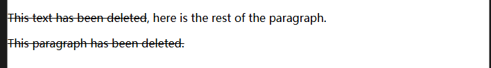
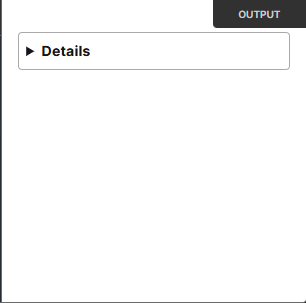
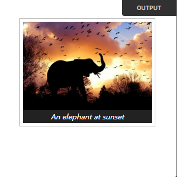
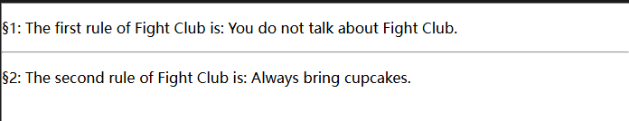

# 前端工程化学习路径

<font color="red"><b>提示词：</b>请针对上述内容展开详细的教学，要求除了上述的知识点外，如果有还有必要拓展的知识点，请拓展。详细的教学除了你给出的教学内容外，还需要在相关知识点附上学习网址（第一优先级为官方，其次是其他资源，但必须是免费的）</font>

本文档旨在帮助你系统化地学习前端工程化，从基础到进阶，并对各学习节点做出重点提示和可能的陷阱提示，助你在成长为资深前端工程师的道路上事半功倍。

---

## 1. 基础知识打牢

### 1.1 HTML / CSS / JavaScript
- **学习重点**:
  - **HTML/CSS**：语义化、响应式设计、Flex、Grid 布局
  - **JavaScript**：深入理解 ES6+ 新特性（箭头函数、解构、Promise、Async/Await、模块化）、DOM 操作、事件机制、闭包、原型链及异步编程原理
- **可能的陷阱**:
  - 忽视基础原理，依赖框架或库导致对原生机制缺乏了解
  - 过于追求新特性而忽略对传统机制（如原型继承）的理解

>## 1. HTML 和 CSS
>
>### 1.1 语义化 (HTML)
>
>#### 学习内容
>
>HTML5 引入了许多语义化标签，例如 <header>、<footer>、<article>、<section>、<nav> 等。使用语义化标签的好处包括：
>
>- **提高可读性**：代码结构清晰，便于开发者理解。
>- **提升可访问性**：屏幕阅读器等辅助技术能更好地解析页面。
>- **优化 SEO**：搜索引擎更青睐语义化结构。
>
>#### 注意事项
>
>- **陷阱**：随意使用 <div> 替代语义化标签，可能导致代码冗余且失去语义价值。
>- **建议**：根据内容选择合适的标签，例如用 <nav> 表示导航栏，而不是通用的 <div class="nav">。
>
>#### 学习资源
>
>- [MDN Web Docs - HTML5 语义化](https://developer.mozilla.org/en-US/docs/Web/Guide/HTML/Using_HTML_sections_and_outlines)
>
>------
>
>### 1.2 响应式设计 (HTML + CSS)
>
>#### 学习内容
>
>响应式设计使网页能在不同设备（如手机、平板、桌面）上良好显示。关键技术包括：
>
>- **媒体查询**：通过 @media 规则根据屏幕尺寸调整样式。
>- **弹性布局**：使用相对单位（如 %、vw、vh、rem、em）而非固定单位（如 px）。
>- **弹性图片**：设置 img { max-width: 100%; height: auto; } 确保图片自适应。
>
>#### 注意事项
>
>- **陷阱**：仅依赖框架（如 Bootstrap）而不理解底层原理，可能导致无法灵活调整设计。
>- **建议**：掌握原生 CSS 实现方式后再使用框架。
>
>#### 学习资源
>
>- [MDN Web Docs - 响应式设计](https://developer.mozilla.org/en-US/docs/Learn/CSS/CSS_layout/Responsive_Design)
>- [CSS Tricks - 响应式设计简介](https://css-tricks.com/a-complete-guide-to-responsive-web-design/)
>

#### **个人笔记**

>### [下载 Prettier](https://developer.mozilla.org/zh-CN/docs/Learn_web_development/Getting_started/Environment_setup/Command_line#下载_prettier),代码格式化工具 `npm install --global prettier` `prettier --check index.js` `prettier --write index.js`

##### HTML

> `<a>` 通过[它的 `href` 属性](https://developer.mozilla.org/zh-CN/docs/Web/HTML/Element/a#href)创建通向其他网页、文件、电子邮件地址、同一页面内的位置或任何其他 URL 的超链接。
>
> **属性**
>
> `download` 允许你设置一个**文件名**，当用户点击链接时，文件会被**下载**而不是直接打开。但只针对`同源URL`（与当前网页同一个域名）、`blob`协议、`data`协议（如Base64编码的文件），如果服务器的响应头有`Content-Disposition`，则会覆盖`download`。`Content-Disposition: inline`会强制在浏览器内打开文件（此属性优先级最高）
>
> `href`连接、邮箱、电话、媒体片段连接到哦媒体文件、文档片段连接到某页面的一段，使用文本片段连接到某一段文字
>
> `herflang` 指定所链接到的文档的人类语言。其仅提供建议，并没有内置的功能。其允许的值与[全局的 `lang` 属性](https://developer.mozilla.org/zh-CN/docs/Web/HTML/Global_attributes/lang)一致。
>
> `ping`当用户点击超链接时，**除了跳转到目标页面**，**浏览器还会偷偷发送一个请求**到 `ping` 指定的 URL，用于**追踪用户点击行为**。只有同源请求才生效
>
> ```html
> <a href="https://example.com/page" 
> ping="https://tracker.com/track">
> 点击跳转
> </a>
> ```
>
> [`referrerpolicy`](https://developer.mozilla.org/zh-CN/docs/Web/HTML/Element/a#referrerpolicy) 用来**控制**浏览器**发送多少信息**给目标服务器
>
> - `no-referrer`：[`Referer`](https://developer.mozilla.org/zh-CN/docs/Web/HTTP/Reference/Headers/Referer) 标头将不会被发送。
> - `no-referrer-when-downgrade`：如果没有 [TLS](https://developer.mozilla.org/zh-CN/docs/Glossary/TLS)（[HTTPS](https://developer.mozilla.org/zh-CN/docs/Glossary/HTTPS)），[`Referer`](https://developer.mozilla.org/zh-CN/docs/Web/HTTP/Reference/Headers/Referer) 头将不会被发送到[源](https://developer.mozilla.org/zh-CN/docs/Glossary/Origin)上。
> - `origin`：发送的 referrer 将被限制在其页面的来源：[协议](https://developer.mozilla.org/zh-CN/docs/Learn_web_development/Howto/Web_mechanics/What_is_a_URL)、[主机](https://developer.mozilla.org/zh-CN/docs/Glossary/Host)和[端口](https://developer.mozilla.org/zh-CN/docs/Glossary/Port)。
> - `origin-when-cross-origin`：发送到其他源的 referrer 将只包含协议、主机和端口，而导航到相同的源仍将包括路径。
> - `same-origin`：将向[同源](https://developer.mozilla.org/zh-CN/docs/Glossary/Same-origin_policy)地址发送 referrer，但跨源请求不包含 referrer 信息。
> - `strict-origin`：当协议安全级别保持不变（HTTPS→HTTPS）时，只将文档的来源作为 referrer 发送，但不要将其发送到安全性较低的目的地（HTTPS→HTTP）。
> - `strict-origin-when-cross-origin`（默认）：在执行同源请求时发送完整的 URL，在协议安全级别保持不变时只发送源（HTTPS→HTTPS），对安全性较低的目的地不发送标头（HTTPS→HTTP）。
> - `unsafe-url`：表示 referrer 将会包含源*和*路径（但是不包含[片段](https://developer.mozilla.org/zh-CN/docs/Web/API/HTMLAnchorElement/hash)、[密码](https://developer.mozilla.org/zh-CN/docs/Web/API/HTMLAnchorElement/password)或[用户名](https://developer.mozilla.org/zh-CN/docs/Web/API/HTMLAnchorElement/username)）。**此值是不安全的**，因为它可能会将受 TLS 保护的资源的源和路径泄露到不安全的源中。
>
> | 策略                                     | 发送的信息                                          | 安全性     | 常用场景     |
> | ---------------------------------------- | --------------------------------------------------- | ---------- | ------------ |
> | `no-referrer`                            | **不发送任何来源信息**                              | ✅ 最安全   | 隐私保护     |
> | `no-referrer-when-downgrade`             | **HTTPS → HTTPS** 正常发送，**HTTPS → HTTP** 不发送 | ✅ 比较安全 | 默认值       |
> | `origin`                                 | 只发送**域名**（不带路径）                          | ✅ 很安全   | 广告统计     |
> | `origin-when-cross-origin`               | 同源完整发送，跨域只发域名                          | ✅ 较安全   | 统计分析     |
> | `same-origin`                            | 只在同源时发送，跨域不发送                          | ✅ 高安全   | 内部页面跳转 |
> | `strict-origin`                          | HTTPS → HTTPS 发域名，HTTPS → HTTP 不发送           | ✅ 超安全   | 保护隐私     |
> | `strict-origin-when-cross-origin` (默认) | 同源完整发送，跨域只发域名（HTTP 降级不发送）       | ✅ 超安全   | 最常用       |
> | `unsafe-url`                             | 完整路径和参数都发出去                              | ❌ 不安全   | 调试测试     |
>
> `rel` 用来**描述当前页面和目标链接之间的关系**的属性。
>
> | rel 类型              | 含义                                     | 作用         |
> | --------------------- | ---------------------------------------- | ------------ |
> | `nofollow`            | **不传递权重**给目标页面                 | 防止垃圾外链 |
> | `noopener`            | **防止新页面访问原页面** `window.opener` | 防止恶意攻击 |
> | `noreferrer`          | **不发送 Referer 信息**                  | 保护隐私     |
> | `noopener noreferrer` | 防止新页面攻击 + 隐私保护                | 最常用       |
> | `noopener`            | 防止钓鱼攻击（强烈推荐）                 | 安全性提升   |
> | `nofollow`            | 告诉搜索引擎“别追踪这个链接”             | SEO优化      |
> | `external`            | 标识这个链接指向的是**外部网站**         | 无特殊效果   |
> | `canonical`           | 告诉搜索引擎“这是这个页面的官方版本”     | SEO去重      |
> | `license`             | 链接到版权信息                           | 开源项目常用 |
> | `help`                | 链接到帮助页面                           | 用户引导     |
> | `prev` / `next`       | 当前页面的“上一页”和“下一页”             | 分页导航     |
>
> `target` 决定了**点击链接时，网页在什么位置打开**。
>
> | 属性值    | 含义                                    | 使用场景           |
> | --------- | --------------------------------------- | ------------------ |
> | `_self`   | **在当前页面打开**（默认值）            | 普通跳转           |
> | `_blank`  | **在新标签页打开**（最常用）            | 新页面             |
> | `_parent` | **在父级窗口打开**（iframe 场景）       | 子页面跳转到父页面 |
> | `_top`    | **在最顶级页面打开**（跳出所有 iframe） | 深层嵌套页面       |
>
> 链接到相同页面的元素上
>
> ```html
> <!-- <a> 元素链接到下面部分 -->
> <p><a href="#Section_further_down"> 跳转到下方标题 </a></p>
> 
> <!-- 要链接到的标题 -->
> <h2 id="Section_further_down">更下面的部分</h2>
> ```
>
> 链接到邮箱
>
> `<a href="mailto:nowhere@mozilla.org">Send email to nowhere</a>`
>
> 链接到电话
>
> ```html
> <a href="tel:+49.157.0156">+49 157 0156</a>
> <a href="tel:+1(800)555-0123">(800) 555-0123</a>
> ```
>
> 要把canvas元素的内容保存为图片，你可以创建一个链接，其中 `href` 是用 JavaScript 创建的 `data:` URL 的 canvas 数据， `download` 属性提供了下载的 PNG 文件的文件名：
>
> ```html
> <p>
>   按下鼠标并移动来完成你的作画。
>   <a href="" download="my_painting.png">下载我的绘画</a>
> </p>
> <canvas width="300" height="300"></canvas>
> ```
>
> ```javascript
> const canvas = document.querySelector("canvas");
> const c = canvas.getContext("2d");
> c.fillStyle = "hotpink";
> 
> function draw(x, y) {
>   if (isDrawing) {
>     c.beginPath();
>     c.arc(x, y, 10, 0, Math.PI * 2);
>     c.closePath();
>     c.fill();
>   }
> }
> 
> canvas.addEventListener("mousemove", (event) =>
>   draw(event.offsetX, event.offsetY),
> );
> canvas.addEventListener("mousedown", () => (isDrawing = true));
> canvas.addEventListener("mouseup", () => (isDrawing = false));
> 
> document
>   .querySelector("a")
>   .addEventListener(
>     "click",
>     (event) => (event.target.href = canvas.toDataURL()),
>   );
> ```
>
> **跳转链接（Skip Link）** 是网页上的**隐藏链接**，用于**帮助键盘用户或屏幕阅读器用户**快速跳过页面的导航栏，直接跳到主要内容区域。
>
> ```html
> <a href="#main-content" class="skip-link">跳过导航，直接进入内容</a>
> 
> <nav>
>   <ul>
>     <li><a href="#">首页</a></li>
>     <li><a href="#">关于我们</a></li>
>     <li><a href="#">服务</a></li>
>     <li><a href="#">联系</a></li>
>   </ul>
> </nav>
> 
> <main id="main-content">
>   <h1>这是主要内容</h1>
>   <p>这里是页面的核心内容...</p>
> </main>
> .skip-link {
>   position: absolute;
>   top: -40px; /* 初始隐藏 */
>   left: 0;
>   background-color: #000;
>   color: #fff;
>   padding: 10px;
>   z-index: 100;
> }
> 
> .skip-link:focus {
>   top: 0; /* 聚焦时显示 */
> }
> 按下 Tab 键时，跳转链接会被聚焦并显示。
> 
> ```
>
> `<abbr>` 表示一个缩写词或首字母缩略词。 可以设置`title`属性值来描述这个缩写的具体含义，还可以为其设置特殊样式。
>
> `<address>` 表示其包含的 HTML 内容提供了与个人、团体或组织联系的信息。
>
> ```html
> <p>Contact the author of this page:</p>
> 
> <address>
>   <a href="mailto:jim@example.com">jim@example.com</a><br />
>   <a href="tel:+14155550132">+1 (415) 555‑0132</a>
> </address>
> ```
>
> `<area>` *在图片上定义一个热点区域，可以关联一个超链接。<area>元素仅在<map>元素内部使用。*
>
> ```html
> 
> 
> <map name="worldmap">
>   <area shape="rect" coords="50,50,150,150" href="china.html" alt="中国">
>   <area shape="circle" coords="300,200,50" href="usa.html" alt="美国">
>   <area shape="poly" coords="400,300,500,400,450,500" href="japan.html" alt="日本">
> </map>
> ```
>
> `<article>` 是 **HTML5 语义化标签**，表示页面中的 **独立的、自包含的内容块**。
>
> ```html
> <article class="forecast">
>   <h1>Weather forecast for Seattle</h1>
>   <article class="day-forecast">
>     <h2>03 March 2018</h2>
>     <p>Rain.</p>
>   </article>
>   <article class="day-forecast">
>     <h2>04 March 2018</h2>
>     <p>Periods of rain.</p>
>   </article>
>   <article class="day-forecast">
>     <h2>05 March 2018</h2>
>     <p>Heavy rain.</p>
>   </article>
> </article>
> ```
>
> ```css
> .forecast {
>   margin: 0;
>   padding: 0.3rem;
>   background-color: #eee;
> }
> 
> .forecast > h1,
> .day-forecast {
>   margin: 0.5rem;
>   padding: 0.3rem;
>   font-size: 1.2rem;
> }
> 
> .day-forecast {
>   background: right/contain content-box border-box no-repeat
>     url("/shared-assets/images/examples/rain.svg") white;
> }
> 
> .day-forecast > h2,
> .day-forecast > p {
>   margin: 0.2rem;
>   font-size: 1rem;
> }
> ```
>
> | 特点                 | `<article>`             | `<section>`                    |
> | -------------------- | ----------------------- | ------------------------------ |
> | 是否独立             | ✅ 独立存在              | ❌ 不能独立存在                 |
> | 可否被分享到外部平台 | ✅ 可以（例如 RSS 订阅） | ❌ 通常是页面中的一个结构模块   |
> | 常见场景             | 博客文章、新闻、评论    | 页面分区（头部、导航栏、页脚） |
>
> `<aside>` 表示一个和其余页面内容几乎无关的部分，被认为是独立于该内容的一部分并且可以被单独的拆分出来而不会使整体受影响。其通常表现为侧边栏或者标注框.注意 `<aside>` 不能是[``](https://developer.mozilla.org/zh-CN/docs/Web/HTML/Element/address) 元素的后代
>
> `<audio>` 在文档中嵌入音频内容。`<audio>` 元素可以包含一个或多个音频资源，这些音频资源可以使用 `src` 属性或者 [``](https://developer.mozilla.org/zh-CN/docs/Web/HTML/Element/source) 元素来进行描述：浏览器将会选择最合适的一个来使用。也可以使用 [`MediaStream`](https://developer.mozilla.org/zh-CN/docs/Web/API/MediaStream) 将这个元素用于流式媒体。
>
> | **类型** | **属性/事件**       | **作用**                               | **说明**                                                     | **示例**                                                     |
> | -------- | ------------------- | -------------------------------------- | ------------------------------------------------------------ | ------------------------------------------------------------ |
> | **属性** | `src`               | 设置音频文件的路径或URL。              | 指定音频资源的路径，通常是文件的相对路径或绝对路径。         | `<audio src="audio/song.mp3"></audio>`                       |
> |          | `controls`          | 显示音频控件（如播放、暂停、音量等）。 | 允许用户控制音频的播放。                                     | `<audio controls><source src="audio/song.mp3" type="audio/mp3"></audio>` |
> |          | `autoplay`          | 自动播放音频                           | 页面加载时自动开始播放音频。                                 | `<audio src="audio/song.mp3" autoplay></audio>`              |
> |          | `loop`              | 循环播放音频                           | 当音频播放结束后，从头开始重新播放。                         | `<audio src="audio/song.mp3" loop></audio>`                  |
> |          | `muted`             | 设置音频是否静音                       | 如果设置该属性，音频播放时将被静音。默认情况下，音频不静音。 | `<audio src="audio/song.mp3" muted></audio>`                 |
> |          | `preload`           | 设置音频的预加载行为。                 | 可设置为：`auto`（自动加载音频）、`metadata`（只加载元数据）、`none`（不加载音频）。 | `<audio src="audio/song.mp3" preload="auto"></audio>`        |
> |          | `poster`            | 音频的封面图（通常用于视频）           | 设置音频封面图，音频没有封面图时此属性无效。                 | `<audio src="audio/song.mp3" poster="audio-cover.jpg" controls></audio>` |
> |          | `volume` (JS)       | 设置或获取音频的音量（0到1之间）。     | 默认值为1，表示最大音量；0表示静音。                         | `audio.volume = 0.5;`                                        |
> |          | `duration` (JS)     | 获取音频的总时长（单位：秒）。         | 返回音频文件的总时长。                                       | `let duration = audio.duration;`                             |
> |          | `currentTime` (JS)  | 获取或设置当前播放时间（单位：秒）。   | 用来获取音频当前播放的位置，也可以设置新的播放时间。         | `let currentTime = audio.currentTime;`                       |
> |          | `playbackRate` (JS) | 设置或获取音频的播放速率。             | 默认值为1，可以设置大于1（加速播放）或小于1（减速播放）。    | `audio.playbackRate = 1.5;`                                  |
> |          | `networkState` (JS) | 获取音频的网络状态。                   | 返回当前音频的网络加载状态，返回值有 `NETWORK_EMPTY`, `NETWORK_IDLE`, `NETWORK_LOADING`, `NETWORK_NO_SOURCE`。 | `let state = audio.networkState;`                            |
> |          | `readyState` (JS)   | 获取音频的加载状态。                   | 返回当前音频的加载状态，值范围从0到4，表示不同的加载阶段。   | `let readyState = audio.readyState;`                         |
> |          | `audioTracks` (JS)  | 获取音频的音频轨道列表。               | 返回一个 `AudioTrackList` 对象，包含所有音频轨道（如语言、字幕等）。 | `let tracks = audio.audioTracks;`                            |
> | **事件** | `onplay`            | 当音频开始播放时触发。                 | 在音频开始播放时触发。                                       | `<audio onplay="alert('播放开始');"></audio>`                |
> |          | `onpause`           | 当音频暂停时触发。                     | 在音频暂停时触发。                                           | `<audio onpause="alert('播放暂停');"></audio>`               |
> |          | `onended`           | 当音频播放结束时触发。                 | 当音频播放结束时触发。                                       | `<audio onended="alert('播放结束');"></audio>`               |
> |          | `onvolumechange`    | 当音量变化时触发。                     | 当音量增减、静音或取消静音时触发。                           | `<audio onvolumechange="alert('音量变化');"></audio>`        |
> |          | `onerror`           | 当音频加载或播放时发生错误时触发。     | 当音频文件加载失败或播放过程中发生错误时触发。               | `<audio onerror="alert('加载失败');"></audio>`               |
> |          | `ontimeupdate`      | 当音频的播放时间发生变化时触发。       | 每次音频的播放时间发生变化时触发。                           | `<audio ontimeupdate="alert('播放时间更新');"></audio>`      |
> |          | `onseeked`          | 当音频跳跃（seek）操作完成时触发。     | 音频的播放进度被跳跃到新的位置时触发。                       | `<audio onseeked="alert('跳跃完成');"></audio>`              |
> |          | `onseeking`         | 当音频跳跃（seek）操作开始时触发。     | 用户开始拖动音频进度条时触发。                               | `<audio onseeking="alert('跳跃开始');"></audio>`             |
> |          | `onstalled`         | 当音频加载时因资源不可用而停止时触发。 | 当音频在加载时无法继续加载时触发。                           | `<audio onstalled="alert('加载停止');"></audio>`             |
> |          | `onwaiting`         | 当音频因等待更多数据而暂停时触发。     | 当音频缓冲时触发。                                           | `<audio onwaiting="alert('等待数据');"></audio>`             |
>
> 具体见 <a>https://developer.mozilla.org/zh-CN/docs/Web/HTML/Element/audio</a>
>
> `<b>`不要将 `<b>` 元素与 `<strong>`、`<em>` 或`<mark>` 元素混淆。<strong>元素表示具有某种重要性的文本，<em>元素强调文本，而 <mark>元素表示具有某种关联性的文本。`<b>` 元素不会传达这种特殊的语义信息；仅在其他元素都不适用时使用它。
>
> **`<strong>`**：用于表示文本具有某种重要性，通常会以加粗显示。
>
> **`<em>`**：用于强调文本，通常会以斜体显示。
>
> **`<mark>`**：表示文本具有某种关联性，通常用于标记和突出显示。
>
> `<base>` 指定用于一个文档中包含的所有相对 URL 的根 URL。一份中只能有一个 <base> 元素。
>
> `<bdi>` 用于防止嵌套文本中的双向文本（如从左到右和从右到左的文本）相互干扰。它确保该元素中的文本可以独立于周围的文本进行正确的方向处理。
>
> `<bdo>` 用于强制指定文本的显示方向，它允许开发者通过设置文本的方向来覆盖浏览器或父元素的默认方向。
>
> `<blockquote>` 用于表示从其他来源引用的文本。它通常用于标识长段落的引用内容，常见于引述、引用、新闻或文章中的引用部分。
>
> ```html
> <blockquote cite="https://www.example.com">
>   This is a quote from an external source.
> </blockquote>
> ```
>
> `<body>` 表示 HTML 文档的内容。文档中只能有一个 `<body>` 元素。
>
> <a href="https://developer.mozilla.org/zh-CN/docs/Web/HTML/Element/body">`<body>`事件属性</a>
>
> `<br>` 在文本中生成一个换行（回车）符号。此元素在写诗和地址时很有用，这些地方的换行都非常重要。可以给 `<br>` 元素设置 [`margin`](https://developer.mozilla.org/zh-CN/docs/Web/CSS/margin) 从而增加文本行之间的间距，但这是一种糟糕的做法——你应该使用为此目的而设计的 [`line-height`](https://developer.mozilla.org/zh-CN/docs/Web/CSS/line-height)。
>
> `<button>` 表示一个可点击的按钮，可以用在[表单](https://developer.mozilla.org/zh-CN/docs/Learn_web_development/Extensions/Forms)或文档其他需要使用简单标准按钮的地方。默认情况下，HTML 按钮的显示样式接近于 [user agent](https://developer.mozilla.org/zh-CN/docs/Glossary/User_agent) 所在的宿主系统平台（用户操作系统）的按钮，但你可以使用 [CSS](https://developer.mozilla.org/zh-CN/docs/Web/CSS) 来改变按钮的样貌。
>
> <a href="https://developer.mozilla.org/zh-CN/docs/Web/HTML/Element/button">`<button>`事件属性</a>
>
> `<canvas>` 可被用来通过 JavaScript（[Canvas](https://developer.mozilla.org/zh-CN/docs/Web/API/Canvas_API) API 或 [WebGL](https://developer.mozilla.org/zh-CN/docs/Web/API/WebGL_API) API）绘制图形及图形动画。
>
> - [`height`](https://developer.mozilla.org/zh-CN/docs/Web/HTML/Element/canvas#height)
>
>   该元素占用空间的高度，以 CSS 像素（px）表示，默认为 150。
>
> - [`moz-opaque` 非标准 已弃用](https://developer.mozilla.org/zh-CN/docs/Web/HTML/Element/canvas#moz-opaque)
>
>   通过设置这个属性，来控制 canvas 元素是否半透明。如果你不想 canvas 元素被设置为半透明，使用这个元素将可以优化浏览器绘图性能。
>
> - [`width`](https://developer.mozilla.org/zh-CN/docs/Web/HTML/Element/canvas#width)
>
>   该元素占用空间的宽度，以 CSS 像素（px）表示，默认为 300。
>
>   画布的最大的尺寸取决于浏览器
>
>   | 浏览器  | 最大高度      | 最大宽度      | 最大面积                                   |
>   | :------ | :------------ | :------------ | :----------------------------------------- |
>   | Chrome  | 32,767 pixels | 32,767 pixels | 268,435,456 pixels (i.e., 16,384 x 16,384) |
>   | Firefox | 32,767 pixels | 32,767 pixels | 472,907,776 pixels (i.e., 22,528 x 20,992) |
>   | Safari  | 32,767 pixels | 32,767 pixels | 268,435,456 pixels (i.e., 16,384 x 16,384) |
>   | IE      | 8,192 pixels  | 8,192 pixels  | ?                                          |
>
>   <a href="https://developer.mozilla.org/zh-CN/docs/Web/API/Canvas_API/Tutorial/Basic_usage">画布教程</a>
>
>
> `<caption>`展示一个表格的标题，它常常作为`<table>`的第一个子元素出现，同时显示在表格内容的最前面，但是，它同样可以被 CSS 样式化，所以，它同样可以出现在任何一个一个相对于表格的做任意位置。使用 [CSS](https://developer.mozilla.org/zh-CN/docs/Web/CSS) 属性 [`caption-side`](https://developer.mozilla.org/zh-CN/docs/Web/CSS/caption-side) 和 [`text-align`](https://developer.mozilla.org/zh-CN/docs/Web/CSS/text-align).设置内容样式
>
> 当 <table> 元素是<caption> 的父元素，caption 是<figure> 元素的唯一后代的时候，使用<figcaption>元素替代 caption 元素
>
> `<table>` *HTML 引用（Citation）标签* (**<cite>**) 表示一个作品的引用，且必须包含作品的标题。这个引用可能是一个根据适当的上下文约定关联引用的元数据的缩写。
>
> `<cite>`  表示一个作品的引用，且必须包含作品的标题。这个引用可能是一个根据适当的上下文约定关联引用的元数据的缩写。
>
> `<code>` 为其显示的内容添加用以表明其中的文本是一段简短的计算机代码的样式。默认情况下，内容文本使用[用户代理](https://developer.mozilla.org/zh-CN/docs/Glossary/User_agent)默认的等宽字体显示。
>
> `<col>` 在其父 <colgroup> 元素所代表的列组中定义一列或多列。<col> 元素只有作为没有定义 span 属性的 <colgroup> 元素的子元素才有效。元素可以设置特定列的样式（如宽度、背景色等），这比在每个 `<td>` 或 `<th>` 元素上设置样式更高效。通过 `<colgroup>` 和 `<col>` 元素，开发者可以将样式应用到整列，而不是单独的单元格。
>
> `span`属性指定 `<col>` 元素跨越的连续列数。该值必须是大于 0 的正整数。如果不存在，其默认值为 `1`。
>
> 
>
> `<colgroup>` 元素定义了表格中的一组列。
>
> `<data>` 将一个指定内容和机器可读的翻译联系在一起。但是，如果内容是与时间或者日期相关的，则一定要使用`<time>`。
>
> 
>
> `<datalist>` 元素用于提供一个预定义的选项列表，供用户在 `<input>` 元素中选择。当与 `<input>` 元素配合使用时，`<datalist>` 允许用户输入文本或从列表中选择匹配的值。它为表单输入提供了一个自动完成的功能，使得用户可以方便地选择已有选项。
>
> ```html
> <label for="ice-cream-choice">Choose a flavor:</label>
> <input list="ice-cream-flavors" id="ice-cream-choice" name="ice-cream-choice" />
> 
> <datalist id="ice-cream-flavors">
>   <option value="Chocolate"></option>
>   <option value="Coconut"></option>
>   <option value="Mint"></option>
>   <option value="Strawberry"></option>
>   <option value="Vanilla"></option>
> </datalist>
> ```
>
> `<dd>` 是 HTML 中定义列表的一部分，通常与 `<dl>`（定义列表）和 `<dt>`（定义项）元素一起使用。`<dd>` 用于表示一个定义或描述的内容，通常与 `<dt>` 一起形成键值对的结构，其中 `<dt>` 是定义的术语或项目，`<dd>` 是该术语的描述或定义。
>
> ```html
> <dl>
>   <dt>HTML</dt>
>   <dd>超文本标记语言，用于构建网页内容。</dd>
> 
>   <dt>CSS</dt>
>   <dd>层叠样式表，用于网页的样式设计。</dd>
> 
>   <dt>JavaScript</dt>
>   <dd>一种脚本语言，用于网页中的交互和动态效果。</dd>
> </dl>
> ```
>
> `<del>`
>
> ```html
> <p><del>This text has been deleted</del>, here is the rest of the paragraph.</p>
> <del><p>This paragraph has been deleted.</p></del>
> ```
>
> 
>
> `<details>`  元素可创建一个组件，仅在被切换成展开状态时，它才会显示内含的信息。<summary> 元素可为该部件提供概要或者标签。展现组件通常在屏幕上使用一个小三角形，旋转（或扭转）以表示打开/关闭的状态，三角形旁边有一个标签。<summary> 元素的内容被用来作为展示小部件的标签。
>
> `open`属性控制默认是否展开
>
> ```html
> <details>
>   <summary>Details</summary>
>   Something small enough to escape casual notice.
> </details>
> ```
>
> 
>
> ```js
> const details = document.getElementsByTagName('details')[0]; // 获取第一个 details 元素
> 
> details.addEventListener("toggle", (event) => {
>   if (details.open) {
>     console.log("打开了");
>   } else {
>     console.log("关闭了");
>   }
> });
> ```
>
> `<dfn>` 在 HTML 中用于定义术语。通常在文档中，第一次出现某个术语时使用 `<dfn>` 包裹它，并配合 `title` 属性或 `abbr` 元素，提供术语的详细说明。
>
> `<dialog>` 表示一个对话框或其他交互式组件，例如一个可关闭警告、检查器或者窗口。`open`指示这个对话框是激活的和能互动的。当没有设置 `open` 属性时，对话框*不应该*显示给用户。推荐使用 `.show()` 或 `.showModal()` 方法来渲染对话框，而不是使用 `open` 属性。
>
> <form> 元素可关闭含有属性 method="dialog" 的对话框。当提交表单时，对话框的 returnValue 属性将会等于表单中被使用的提交按钮的 value。
>
> ::backdrop CSS 伪元素可用于给使用 HTMLDialogElement.showModal() 显示的 <dialog> 元素背景添加样式，例如在对话框被打开激活时，调暗背景中不可访问的内容。
>
> `<div>` 是流式内容的通用容器。它对内容或布局没有影响。除非以某种方式使用 [CSS](https://developer.mozilla.org/zh-CN/docs/Glossary/CSS) 对其进行样式设置（例如，直接应用样式，或者对其父元素应用某种布局模型，如[弹性盒子](https://developer.mozilla.org/zh-CN/docs/Web/CSS/CSS_flexible_box_layout)），否则它对内容或布局没有影响。
>
> `<dl>`是一个包含术语定义以及描述的列表，通常用于展示词汇表或者元数据 (键 - 值对列表)。
>
> `<dt>` 指定描述或定义列表中的术语，因此必须在 <dl> 元素内部使用。它通常后面跟着一个 <dd> 元素；然而，多个连续的 <dt> 元素表示由紧随其后的一个 <dd> 元素定义的多个术语。
>
> `<em>` 将文本标记为强调（emphasis）格式。`<em>` 元素可以嵌套，嵌套层次越深，则强调的程度越深。常地，该元素会被浏览器展示为斜体文本，但是，它不应该仅仅用于应用斜体样式；为此目的，请使用 CSS [`font-style`](https://developer.mozilla.org/zh-CN/docs/Web/CSS/font-style) 样式。使用 [``](https://developer.mozilla.org/zh-CN/docs/Web/HTML/Element/cite) 元素标记作品的标题（书籍、戏剧、歌曲等）；它通常也采用斜体样式，但具有不同的含义。使用 [``](https://developer.mozilla.org/zh-CN/docs/Web/HTML/Element/strong) 元素标记比周围文本更重要的文本。
>
> `<embed>` 将外部内容嵌入文档中的指定位置。此内容由外部应用程序或其他交互式内容源（如浏览器插件）提供。
>
> | 属性名      | 描述                       | 示例值                    |
> | ----------- | -------------------------- | ------------------------- |
> | `src`       | 指定要嵌入的资源路径       | "video.mp4" 或 "file.pdf" |
> | `type`      | 指定资源的 MIME 类型       | "application/pdf"         |
> | `width`     | 设置嵌入内容的宽度（像素） | "600"                     |
> | `height`    | 设置嵌入内容的高度（像素） | "400"                     |
> | `autostart` | 是否自动播放（已被废弃）   | "true" 或 "false"         |
> | `loop`      | 是否循环播放               | "true" 或 "false"         |
>
> <font color="yellow">然而，**现代浏览器**（如 Chrome、Firefox、Edge 等）**已经移除了对这些插件的支持**</font>
>
> `<fencedframe>` 允许在 HTML 页面中嵌入第三方内容（如广告或小部件），**但不会与父页面共享数据**。它主要用于**保护用户隐私**，防止嵌入内容收集用户数据。
>
> | 特点       | `<iframe>`             | `<fencedframe>`            |
> | ---------- | ---------------------- | -------------------------- |
> | 数据共享   | 可以与父页面共享数据   | 完全隔离，不能共享数据     |
> | 安全性     | 安全性较低，容易被跟踪 | 高度安全，保护用户隐私     |
> | 使用场景   | 普通嵌入网页内容       | 广告嵌入、敏感内容嵌入     |
> | 浏览器支持 | 主流浏览器广泛支持     | 目前处于实验阶段，支持有限 |
>
> `<fieldset>` 元素用于**对表单中的相关元素进行分组**，通常用于**提高表单的可读性和可访问性**。它通常与 [`<legend>`](#legend) 标签一起使用，以为<a id="fieldset">`<fieldset>`</a> 提供标题。
>
> ```html
> <form>
>   <fieldset>
>     <legend>Choose your favorite monster</legend>
> 
>     <input type="radio" id="kraken" name="monster" value="K" />
>     <label for="kraken">Kraken</label><br />
> 
>     <input type="radio" id="sasquatch" name="monster" value="S" />
>     <label for="sasquatch">Sasquatch</label><br />
> 
>     <input type="radio" id="mothman" name="monster" value="M" />
>     <label for="mothman">Mothman</label>
>   </fieldset>
> </form>
> ```
>
> | 属性       | 描述                                                         | 可选/必需 |
> | ---------- | ------------------------------------------------------------ | --------- |
> | `disabled` | 禁用 `<fieldset>` 中的所有表单元素，使其无法编辑或交互。     | 可选      |
> | `form`     | 指定该 `<fieldset>` 归属于哪个 `<form>`（通过 `form` 元素的 `id` 进行关联）。 | 可选      |
> | `name`     | 指定 `<fieldset>` 的名称，便于通过 JavaScript 或 CSS 进行操作。 | 可选      |
>
> `<figcaption>` 是用来描述其父节点 <figure> 元素里的其余内容的标题或说明。为 <figure> 提供一个无障碍描述。
>
> ```html
> <figure>
>        src="/shared-assets/images/examples/elephant.jpg"
>     alt="Elephant at sunset" />
>   <figcaption>An elephant at sunset</figcaption>
> </figure>
> ```
>
> 
>
> `<figure>` 用于**对图像、图表、视频或代码片段等独立内容进行分组**，通常与 `<figcaption>` 标签一起使用，用于为内容添加描述或标题。
>
> `<footer>` 表示**页面或区块的页脚部分**，通常包含版权信息、作者信息、导航链接、联系方式等。在 Safari 13 发布之前，contentinfo 地标角色无法通过 VoiceOver 正确显示。如果需要支持传统的 Safari 浏览器，请在 footer 元素中添加 role="contentinfo" 以确保正确显示地标。
>
> `<form>` 用于创建**用户输入表单**，支持文本输入、文件上传、按钮提交等功能。
>
> | 属性           | 作用                       | 可选值                                                       |
> | -------------- | -------------------------- | ------------------------------------------------------------ |
> | `action`       | 表单提交的目标地址（URL）  | `/submit.php`, `/api/login` 等                               |
> | `method`       | 提交方式                   | `GET`, `POST`, `PUT`, `DELETE`                               |
> | `enctype`      | 编码类型（文件上传时必填） | `application/x-www-form-urlencoded`（默认） `multipart/form-data`（文件上传） `text/plain` |
> | `target`       | 提交后打开方式             | `_self`, `_blank`, `_parent`, `_top`                         |
> | `autocomplete` | 自动补全开关               | `on`, `off`                                                  |
> | `novalidate`   | 禁用表单的HTML5验证        | 无需赋值                                                     |
>
> | 输入类型 | 标签                      | 功能描述           |
> | -------- | ------------------------- | ------------------ |
> | 文本输入 | `<input type="text">`     | 输入单行文本       |
> | 密码输入 | `<input type="password">` | 输入密码，内容隐藏 |
> | 文件上传 | `<input type="file">`     | 上传文件           |
> | 单选框   | `<input type="radio">`    | 单选按钮           |
> | 复选框   | `<input type="checkbox">` | 复选框             |
> | 下拉选择 | `<select>`                | 选择列表           |
> | 多行文本 | `<textarea>`              | 多行输入           |
> | 提交按钮 | `<button type="submit">`  | 提交表单           |
> | 重置按钮 | `<button type="reset">`   | 重置表单内容       |
>
> `<h1>`
>
> `<head>` 位于 HTML 文档的开头部分，用于包含与文档本身有关的元数据（如标题、字符集、外部资源链接等）。这些内容通常不会在浏览器中直接显示，但对页面的加载和渲染非常重要。
>
> ```html
> <head>
>   <meta charset="UTF-8">
>   <meta name="description" content="网页描述">
>   <title>网页标题</title>
>   <link rel="stylesheet" href="styles.css">
>   <script src="script.js"></script>
> </head>
> ```
>
> `<header>` 代表文档或一个区域的头部内容，通常包含导航链接、标识、标题或其他重要的引导性内容。它用于标识页面或区块的开始部分，通常包含网站的标志、标题、搜索框等。
>
> `<hgroup>` 元素允许将一个标题与任意次要内容（例如子标题、副标题或口号）组合在一起。在 <hgroup> 中，这些类型的内容也表示为 <p> 元素。
>
> `<hr>` 表示段落级元素之间的主题转换（例如，一个故事中的场景的改变，或一个章节的主题的改变）。
>
> ```html
> <p>§1: The first rule of Fight Club is: You do not talk about Fight Club.</p>
> <hr />
> <p>§2: The second rule of Fight Club is: Always bring cupcakes.</p>
> ```
>
> 
>
> `<html>` 表示 HTML 文档的根（顶级元素），所以它也被称为*根元素*。其他所有元素必须是此元素的后代。`xmlns` 指定文档的 XML 命名空间。默认的值是 "http://www.w3.org/1999/xhtml"。这在由 XML 解析器解析的文档中是必需的，而在 text/html 文档中是可选的。
>
> `<i>` 用于表现因某些原因需要区分普通文本的一系列文本。例如技术术语、外文短语或是小说中人物的思想活动等，它的内容通常以斜体显示。
>
> `<iframe>` 表示嵌套的[浏览上下文](https://developer.mozilla.org/zh-CN/docs/Glossary/Browsing_context)。它能够将另一个 HTML 页面嵌入到当前页面中。<a href="https://developer.mozilla.org/zh-CN/docs/Web/HTML/Element/iframe">具体使用方法</a>
>
> `` 
>
> 以下是 HTML `` 标签属性的表格形式，包含属性名称、描述、示例和必需性：
>
> | **属性名**    | **描述**                                             | **示例**                                                     | **必需性** |
> | ------------- | ---------------------------------------------------- | ------------------------------------------------------------ | ---------- |
> | `src`         | 指定图像的来源（URL 或文件路径）                     | ``                                    | 必需       |
> | `alt`         | 图像的替代文本，用于无法加载时显示或屏幕阅读器       | ``                     | 强烈推荐   |
> | `width`       | 设置图像宽度（单位：px 或 %）                        | ``                        | 可选       |
> | `height`      | 设置图像高度（单位：px 或 %）                        | ``                       | 可选       |
> | `title`       | 鼠标悬停时显示的提示文本                             | ``               | 可选       |
> | `id`          | 为图像指定唯一标识符，用于 CSS 或 JavaScript         | ``                    | 可选       |
> | `class`       | 指定类名，用于应用 CSS 样式                          | ``                  | 可选       |
> | `style`       | 直接应用内联 CSS 样式                                | ``         | 可选       |
> | `loading`     | 控制图像加载方式（`eager` 或 `lazy`）                | ``                     | 可选       |
> | `usemap`      | 将图像与客户端图像映射（`<map>`）关联                | ``                | 可选       |
> | `ismap`       | 表示图像是服务器端图像映射的一部分（需配合 `<a>`）   | `<a href="map.cgi"></a>`        | 可选       |
> | `crossorigin` | 指定跨域请求行为（`anonymous` 或 `use-credentials`） | ``            | 可选       |
> | `sizes`       | 与 `srcset` 配合，指定不同视口下图像尺寸             | `` | 可选       |
> | `srcset`      | 提供一组图像源，供浏览器根据分辨率或视口选择         | ``         | 可选       |
>
> ### 说明
> - **必填属性**: 只有 `src` 是必须的，但 `alt` 被视为最佳实践。
> - **单位**: `width` 和 `height` 默认以像素 (px) 为单位。
> - **浏览器支持**: `loading`、`sizes` 和 `srcset` 等属性在旧浏览器中可能不受支持。
>
> `<input>` 接受来自用户的数据，其工作方式相当程度上取决于`type`属性的值
>
> | 类型                                                         | 描述                                                         | 基本示例                                                     |
> | :----------------------------------------------------------- | :----------------------------------------------------------- | :----------------------------------------------------------- |
> | [button](https://developer.mozilla.org/zh-CN/docs/Web/HTML/Element/input/button) | 没有默认行为的按钮，上面显示 [`value`](https://developer.mozilla.org/zh-CN/docs/Web/HTML/Element/input#value) 属性的值，默认为空。 |  |
> | [checkbox](https://developer.mozilla.org/zh-CN/docs/Web/HTML/Element/input/checkbox) | 复选框，可将其值设为选中或未选中。                           |  |
> | [color](https://developer.mozilla.org/zh-CN/docs/Web/HTML/Element/input/color) | 用于指定颜色的控件；在支持的浏览器中，激活时会打开取色器。   |  |
> | [date](https://developer.mozilla.org/zh-CN/docs/Web/HTML/Element/input/date) | 输入日期的控件（年、月、日，不包括时间）。在支持的浏览器激活时打开日期选择器或年月日的数字滚轮。 |  |
> | [datetime-local](https://developer.mozilla.org/zh-CN/docs/Web/HTML/Element/input/datetime-local) | 输入日期和时间的控件，不包括时区。在支持的浏览器激活时打开日期选择器或年月日的数字滚轮。 |  |
> | [email](https://developer.mozilla.org/zh-CN/docs/Web/HTML/Element/input/email) | 编辑邮箱地址的字段。类似 `text` 输入，但在支持的浏览器和带有动态键盘的设备上会有验证参数和相应的键盘。 |  |
> | [file](https://developer.mozilla.org/zh-CN/docs/Web/HTML/Element/input/file) | 让用户选择文件的控件。使用 [`accept`](https://developer.mozilla.org/zh-CN/docs/Web/HTML/Element/input#accept) 属性规定控件能选择的文件类型。 |  |
> | [hidden](https://developer.mozilla.org/zh-CN/docs/Web/HTML/Element/input/hidden) | 不显示的控件，其值仍会提交到服务器。举个例子，右边就是一个隐形的控件。 |  |
> | [image](https://developer.mozilla.org/zh-CN/docs/Web/HTML/Element/input/image) | 图形化 `submit` 按钮。显示的图像由 `src` 属性决定。如果 [`src`](https://developer.mozilla.org/zh-CN/docs/Web/HTML/Element/input#src) 属性缺失，就会显示 [`alt`](https://developer.mozilla.org/zh-CN/docs/Web/HTML/Element/input#alt) 的内容。 |  |
> | [month](https://developer.mozilla.org/zh-CN/docs/Web/HTML/Element/input/month) | 输入年和月的控件，没有时区。                                 |  |
> | [number](https://developer.mozilla.org/zh-CN/docs/Web/HTML/Element/input/number) | 用于输入数字的控件。如果支持的话，会显示滚动按钮并提供缺省验证（即只能输入数字）。拥有动态键盘的设备上会显示数字键盘。 |  |
> | [password](https://developer.mozilla.org/zh-CN/docs/Web/HTML/Element/input/password) | 单行的文本区域，其值会被遮盖。如果站点不安全，会警告用户。   |  |
> | [radio](https://developer.mozilla.org/zh-CN/docs/Web/HTML/Element/input/radio) | 单选按钮，允许在多个拥有相同 [`name`](https://developer.mozilla.org/zh-CN/docs/Web/HTML/Element/input#name) 值的选项中选中其中一个。 |                       |
> | [range](https://developer.mozilla.org/zh-CN/docs/Web/HTML/Element/input/range) | 此控件用于输入不需要精确的数字。控件是一个范围组件，默认值为正中间的值。同时使用 [`min`](https://developer.mozilla.org/zh-CN/docs/Web/HTML/Element/input#min) 和 [`max`](https://developer.mozilla.org/zh-CN/docs/Web/HTML/Element/input#max) 来规定可接受值的范围。 |  |
> | [reset](https://developer.mozilla.org/zh-CN/docs/Web/HTML/Element/input/reset) | 此按钮将表单的所有内容重置为默认值。不推荐使用该类型。       |  |
> | [search](https://developer.mozilla.org/zh-CN/docs/Web/HTML/Element/input/search) | 用于搜索字符串的单行文字区域。输入文本中的换行会被自动去除。在支持的浏览器中可能有一个删除按钮，用于清除整个区域。拥有动态键盘的设备上的回车图标会变成搜索图标。 |  |
> | [submit](https://developer.mozilla.org/zh-CN/docs/Web/HTML/Element/input/submit) | 用于提交表单的按钮。                                         |  |
> | [tel](https://developer.mozilla.org/zh-CN/docs/Web/HTML/Element/input/tel) | 用于输入电话号码的控件。拥有动态键盘的设备上会显示电话数字键盘。 |  |
> | [text](https://developer.mozilla.org/zh-CN/docs/Web/HTML/Element/input/text) | 默认值。单行的文本字段，输入值中的换行会被自动去除。         |  |
> | [time](https://developer.mozilla.org/zh-CN/docs/Web/HTML/Element/input/time) | 用于输入时间的控件，不包括时区。                             |  |
> | [url](https://developer.mozilla.org/zh-CN/docs/Web/HTML/Element/input/url) | 用于输入 URL 的控件。类似 `text` 输入，但有验证参数，在支持动态键盘的设备上有相应的键盘。 |  |
> | [week](https://developer.mozilla.org/zh-CN/docs/Web/HTML/Element/input/week) | 用于输入以年和周数组成的日期，不带时区。                     |  |
> | 废弃的值                                                     |                                                              |                                                              |
> | `datetime` 已弃用                                            | 用于输入基于 UTC 时区的日期和时间（时、分、秒及秒的小数部分）。 | play                                                         |
>
> `<ins>` 表示插入的文本，一般有下划线
>
> `<kbd>` 表示用户输入，它将产生一个行内元素，以浏览器的默认 monospace 字体显示。
>
> `<label>` 表示用户界面中某个元素的说明。
>
> ```html
> <div class="preference">
>   <label for="cheese">Do you like cheese?</label>
>   <input type="checkbox" name="cheese" id="cheese" />
> </div>
> 
> <div class="preference">
>   <label for="peas">Do you like peas?</label>
>   <input type="checkbox" name="peas" id="peas" />
> </div>
> ```
>
> 将一个 `<label>` 和一个 [`input`](https://developer.mozilla.org/zh-CN/docs/Web/HTML/Element/input) 元素相关联主要有这些优点：
>
> - 标签文本不仅与其相应的文本输入元素在视觉上相关联，程序中也是如此。这意味着，当用户聚焦到这个表单输入元素时，屏幕阅读器可以读出标签，让使用辅助技术的用户更容易理解应输入什么数据。
> - 你可以点击关联的标签来聚焦或者激活这个输入元素，就像直接点击输入元素一样。这扩大了元素的可点击区域，让包括使用触屏设备在内的用户更容易激活这个元素。
>
> 将一个 `<label>` 和一个 `<input>` 元素匹配在一起，你需要给 `<input>` 一个 `id` 属性。而 `<label>` 需要一个 `for` 属性，其值和 `<input>` 的 `id` 一样。
>
> 另外，你也可以将 `<input>` 直接放在 `<label>` 里，此时则不需要 `for` 和 `id` 属性
>
> <a id="legend">`<legend>` </a>表示其父元素[`fieldset`](#fieldset)内容的标题
>
> `<li>` 表示列表中的项目。它必须包含在一个父元素中：有序列表（[`<ol>`](#ol)）、无序列表（[`<ul>`](#ul)）或菜单（[`<menu>`](#menu)）
>
> `<link>` 规定了当前文档与某个外部资源的关系。该元素最常用于链接[样式表](https://developer.mozilla.org/zh-CN/docs/Glossary/CSS)，此外也可以被用来创建站点图标（比如 PC 端的“favicon”图标和移动设备上用以显示在主屏幕的图标) 。
>
> ```html
> <link href="/shared-assets/misc/link-element-example.css" rel="stylesheet" />
> 
> <p>This text will be red as defined in the external stylesheet.</p>
> <p style="color: blue">
>   The <code>style</code> attribute can override it, though.
> </p>
> ```
>
> [详细说明](https://developer.mozilla.org/zh-CN/docs/Web/HTML/Element/link)
>
> `<main>` 呈现了文档的 [``](https://developer.mozilla.org/zh-CN/docs/Web/HTML/Element/body) 或应用的主体部分。主体部分由与文档直接相关，或者扩展于文档的中心主题、应用的主要功能部分的内容组成。
>
> `<map>` 它是一个包裹 <area> 的容器，通过 name 属性给图像映射命名，然后通过  的 usemap 属性与图片关联起来。**<area>**：定义图片上的具体可点击区域，指定形状（矩形、圆形、多边形等）、坐标位置和对应的链接地址。
>
> `<mark>` 高亮文本
>
> <a id="menu">`<menu>`</a> 在 HTML 规范中被描述为`<ul>`的语义替代，但浏览器将其视为与 [``](https://developer.mozilla.org/zh-CN/docs/Web/HTML/Element/ul) 没有区别（并通过无障碍树暴露）。它表示一个无序列表（由`<li>元素表示）。
>
> `<meta>` 用于提供关于网页的元信息（Metadata）。这些信息不会直接显示在页面上，而是供浏览器、搜索引擎或其他 Web 服务使用。它通常位于 <head> 标签内，是单标签（自闭合标签），不需要闭合标签 </meta>。

> **描述页面信息**：如字符编码、页面描述、关键词等。
>
> **控制浏览器行为**：如设置视口（viewport）以适配移动设备。
>
> **提供搜索引擎优化（SEO）数据**：帮助搜索引擎理解页面内容。
>
> **定义刷新或重定向**：控制页面自动行为。
>
> ```html
> <head>
> <meta name="description" content="这是一个关于 HTML 的教程页面。">
> <meta name="keywords" content="HTML, Meta, 教程">
> <meta name="author" content="Grok">
> <meta name="viewport" content="width=device-width, initial-scale=1.0">
> </head>
> ```
>
> `<meter>` HTML5 引入的语义化标签，用于表示一个**范围内的测量值**，比如进度、百分比或某个量的程度。它通常以可视化的方式展示（类似进度条），适用于显示已知范围内的数值，例如磁盘使用率、投票结果或任务完成度。
>
> 通过以下属性定义其范围和值：
>
> - **value**：当前值（必须指定）。
> - **min**：范围的最小值（默认 0）。
> - **max**：范围的最大值（默认 1）。
> - **low**：表示“较低”阈值（可选）。
> - **high**：表示“较高”阈值（可选）。
> - **optimum**：表示“最佳”值（可选）
>
> `<nav> ` 是 HTML5 引入的一个**语义化标签**，用于定义页面的**导航区域**。它表示页面中包含导航链接的部分，通常用于帮助用户快速访问网站的主要内容或页面之间的跳转。它不直接影响页面样式，但通过语义化结构提升代码的可读性、可访问性和搜索引擎优化（SEO）
>
> `<noscript>` 一个 HTML 标签，用于定义当浏览器不支持 JavaScript 或 JavaScript 被禁用时显示的替代内容。它通常与 JavaScript 配合使用，提供一种后备机制，确保页面在无脚本环境下仍能正常传达信息或功能。
>
> `<object>` 用于在网页中嵌入外部资源，例如图像、视频、音频、PDF 文件、Flash 动画（已过时）或其他 HTML 页面。它是一个通用的多媒体嵌入工具，支持多种类型的内容，具体取决于 type 属性和浏览器支持。主要属性
>
> - **data**：指定嵌入资源的 URL（必须）。
> - **type**：指定资源的 MIME 类型（如 application/pdf）。
> - **width 和 height**：设置对象的显示尺寸（单位为像素）。
> - **name**：为对象命名，便于脚本引用。
> - **form**：关联到一个表单（较少用）。
>
> <a id="ol">`<ol>`</a> 表示有序列表，通常渲染为一个带编号的列表。
>
> `<var>` 示数学表达式或编程上下文中的变量名称。它通常使用当前字体的斜体版本来显示，不过这种行为取决于浏览器。
>
> `<u> `表示行内文本拥有一个非文本形式的注释，该注释需要以某种方式渲染出来。默认情况下渲染为一个实线下划线，可以用 CSS 替换
>
> `<video>` 用于在文档中嵌入媒体播放器，用于支持文档内的视频播放。你也可以将 `<video>` 标签用于音频内容，但是`<audio>`元素可能在用户体验上更合适。[详细知道说明](https://developer.mozilla.org/zh-CN/docs/Web/HTML/Element/video )
>
> 在video中间加<p>有助于在不支持h5的video浏览器下，通过超链接访问视频资源
>
> ```html
> <video src="rabbit320.webm" controls>
>       <p>Your browser doesn't support HTML5 video. Here is a <a href="rabbit320.webm">link to the video</a> instead.</p> 
>     </video>
> ```
>
> ```html
> <video controls>
>   <source src="rabbit320.mp4" type="video/mp4" />
>   <source src="rabbit320.webm" type="video/webm" />
>   <p>你的浏览器不支持此视频。可点击<a href="rabbit320.mp4">此链接</a>观看</p>
> </video>
> ```
>
> 将 src 属性从 <video> 元素中移除，转而将它放在几个单独的 <source> 元素当中，这些元素分别指向各自的资源。在本例当中，浏览器会检查 <source> 元素，并且播放第一个与其自身 codec 相匹配的媒体。WebM 和 MP4 这两种格式在目前已经足够，只要视频支持这两种格式，那么其在大多数平台和浏览器上都能正确播放。
>
> ```html
> <video controls>
>   <source src="example.mp4" type="video/mp4" />
>   <source src="example.webm" type="video/webm" />
>   <track kind="subtitles" src="subtitles_es.vtt" srclang="es" label="Spanish" />
> </video>
> ```
>
> 
>
> <a href="https://developer.mozilla.org/zh-CN/docs/Web/API/WebVTT_API"><font color="red">视频显示字母，或转录</font></a>
>
> `<wbr>`  是 HTML 中的一个标签，全称是 **Word Break Opportunity**（单词断开机会）。它是一个**单标签**（无需闭合），用于提示浏览器在特定位置可以换行，但只有在需要时（例如容器宽度不足）才会实际断行。它不会强制换行，而是提供一个“可选的断点”。
>
> **`<thead>`** 元素定义了一组定义表格的列头的行。
>
> `<textarea> `是一个多行纯文本编辑控件，适用于允许用户输入大量自由格式文本的场景，例如评论或反馈表单。
>
> `<template>` <template> 是 HTML5 引入的一个标签，用于定义一段**内容模板**，这些内容在页面加载时不会直接渲染，而是存储在文档中供 JavaScript 动态使用。它本质上是一个“内容容器”，里面的 HTML 片段可以在需要时被克隆和插入到页面中。
>
> - **核心功能**：保存可重用的 HTML 结构，延迟渲染。
>
> - **语义作用**：提供一种声明式的方式管理动态内容。
>
> - ### <template> 的作用
>
>   1. 延迟加载
>
>      ：
>
>      - <template> 内的内容不会立即显示，也不会被浏览器解析或执行（例如其中的 <script> 不会运行）。
>
>   2. 内容复用
>
>      ：
>
>      - 可以用 JavaScript 克隆模板内容，重复插入到页面中。
>
>   3. 动态 DOM 操作
>
>      ：
>
>      - 配合 JS 实现动态生成列表、卡片等功能。
>
>   4. 性能优化
>
>      ：
>
>      - 避免不必要的初始渲染，提升页面加载速度。
>
> `<slot>` <slot> 是 Web Components 技术的一部分，通常与 <template> 和自定义元素（Custom Elements）一起使用。用于在 Web Components 中定义一个**占位符**，允许外部内容注入到自定义元素的内部结构中。它是 Shadow DOM（影子 DOM）的重要组成部分，提供了一种机制，让开发者可以将自定义元素的使用者提供的内容插入到预定义的位置。
>
> `<head>` 使用`<meta charset="utf-8">`指定编码格式、使用 <meta name="viewport" content="width=device-width">控制网页在移动设备上的显示方式，将视口的宽度设置为设备的实际宽度。这意味着网页的宽度将根据设备屏幕的大小自动调整、使用<script>是指脚本、使用`<link rel="stylesheet" href="style.css">`设置样式
>
> `<span>` 是一个行内元素，用于包裹文本的一部分，以便对其应用样式或脚本操作。常用于对文本中的特定部分进行高亮、添加类、ID 或其他属性，而不影响整个块级元素。
>
> 如果一个块级内容（一个段落、多个段落、一个列表等）从其他地方被引用，你应该把它用 <blockquote> 元素包裹起来表示，并且在 cite 属性里用 URL 来指向引用的资源。例如，下面的示例代码就是引用的 MDN 的 <blockquote> 元素页面：
>
> ```html
> <p>
>   The <strong>HTML <code>&lt;blockquote&gt;</code> Element</strong> (or
>   <em>HTML Block Quotation Element</em>) indicates that the enclosed text is an
>   extended quotation.
> </p>
> ```
>
> ```html
> <p>Here is a blockquote:</p>
> <blockquote
>   cite="https://developer.mozilla.org/zh-CN/docs/Web/HTML/Element/blockquote">
>   <p>
>     The <strong>HTML <code>&lt;blockquote&gt;</code> Element</strong> (or
>     <em>HTML Block Quotation Element</em>) indicates that the enclosed text is
>     an extended quotation.
>   </p>
> </blockquote>
> ```
>
> cite 属性的内容看起来很有用，但不幸的是，浏览器、屏幕阅读器并没有充分利用它。如果不使用 JavaScript 或 CSS 编写自己的解决方案，就没有办法让浏览器显示 cite 的内容。如果你想在页面上提供引文的来源，你需要在文本中通过链接或其他适当的方式来提供它
>
> ```html
> <p>
>   According to the
>   <a href="/zh-CN/docs/Web/HTML/Element/blockquote">
>     <cite>MDN blockquote page</cite></a
>   >:
> </p>
> ```
>

##### **CSS**

> <font color="red">浏览器工作的简单流程：</font>
>
> 
>
> <a id="cendie" href="#cendieTitle">样式的优先级：浏览器默认样式 < 外部样式表 < 内部样式表 < 行内样式 < `!important`</a>
>
> 继承是指子元素可以自动继承父元素的某些 CSS 属性：`color`、`font`、`visibility`、`letter-spacing`
>
> 当多个 CSS 规则作用于同一元素时，浏览器会计算每条规则的 **优先级（权重）** 来决定最终应用哪个规则。计算方法如下：
>
> | 选择器类型                                                   | 计算权重 | 示例                        |
> | ------------------------------------------------------------ | -------- | --------------------------- |
> | **行内样式**                                                 | 1000     | `<p style="color:red">`     |
> | **ID 选择器** (`#id`)                                        | 100      | `#main { color: blue; }`    |
> | **类、伪类、属性选择器** (`.class`, `:hover`, `[type="text"]`) | 10       | `.button { color: green; }` |
> | **元素、伪元素选择器** (`div`, `p`, `h1`, `::before`)        | 1        | `p { color: yellow; }`      |
> | **通配符、继承、默认值** (`*`, `inherit`)                    | 0        | `* { margin: 0; }`          |
>
> ```html
> li.special {
> color: orange;
> font-weight: bold;
> }
> 选中每个 special 类的 li 元素
> li.special,
> span.special {
> color: orange;
> font-weight: bold;
> }
> li和span
> ```
>
> ```html
> li em {
> color: rebeccapurple;
> }
> 表示li里面的em应用这个样式
> ```
>
> ```html
> h1 + p {
> font-size: 200%;
> }
> 设置直接出现在标题后面并且与标题具有相同层级的段落样式，
> ```
>
> ```html
> a:link {
> color: pink;
> }
> 
> a:visited {
> color: green;
> }
> 根据标签的状态设置样式如 没有被访问的链接颜色变为粉色、访问过的链接变为绿色
> ```
>
> 同时使用选择器和选择符
>
> ```html
> /* selects any <span> that is inside a <p>, which is inside an <article>  */
> article p span { ... }
> 
> /* selects any <p> that comes directly after a <ul>, which comes directly after an <h1>  */
> h1 + ul + p { ... }
> 
> body h1 + p .special {
> color: yellow;
> background-color: black;
> padding: 5px;
> }
> 
> ```
>
> `[attr~=value]` 匹配带有一个*attr*属性的元素，其值有一个或者更多，至少有一个和*value*匹配
>
> `[attr|=value]` 匹配带有一个名为*attr*的属性的元素，其值可正为*value*，或者开始为*value*，后面紧随着一个连字符。
>
> `[attr^=value]` 匹配带有一个名为*attr*的属性的元素，其值开头为*value*子字符串。
>
> `[attr$=value]` 匹配带有一个名为*attr*的属性的元素，其值结尾为*value*子字符串
>
> `[attr*=value]` 匹配带有一个名为*attr*的属性的元素，其值的字符串中的任何地方，至少出现了一次*value*子字符串。
>
> 如果你想在大小写不敏感的情况下，匹配属性值的话，你可以在闭合括号之前，使用`i`值 `li[class^="a" i]`
>
> 伪类是选择器的一种，它用于选择处于特定状态的元素
>
> ### **1. 动态伪类**
>
> | 伪类             | 作用                                                       |
> | ---------------- | ---------------------------------------------------------- |
> | `:hover`         | 当用户鼠标悬停在元素上时应用样式                           |
> | `:active`        | 当元素被用户激活（如按钮被点击时）应用样式                 |
> | `:focus`         | 当元素获得焦点（如输入框被选中）时应用样式                 |
> | `:focus-visible` | 当元素因键盘或辅助技术获得焦点时应用样式（不包括鼠标点击） |
> | `:focus-within`  | 当元素本身或其子元素获得焦点时应用样式                     |
>
> ### **2. 结构性伪类**
>
> | 伪类                   | 作用                                                      |
> | ---------------------- | --------------------------------------------------------- |
> | `:first-child`         | 选择某个父元素的第一个子元素                              |
> | `:last-child`          | 选择某个父元素的最后一个子元素                            |
> | `:nth-child(n)`        | 选择某个父元素的第 n 个子元素（支持 `odd`、`even`、公式） |
> | `:nth-last-child(n)`   | 选择某个父元素的倒数第 n 个子元素                         |
> | `:only-child`          | 选择父元素下唯一的子元素                                  |
> | `:first-of-type`       | 选择同类型元素中的第一个                                  |
> | `:last-of-type`        | 选择同类型元素中的最后一个                                |
> | `:nth-of-type(n)`      | 选择同类型元素中的第 n 个                                 |
> | `:nth-last-of-type(n)` | 选择同类型元素中的倒数第 n 个                             |
> | `:only-of-type`        | 选择父元素下唯一的该类型的元素                            |
> | `:empty`               | 选择没有子元素的元素（没有内容、没有子标签）              |
>
> ### **3. 否定伪类**
>
> | 伪类             | 作用                             |
> | ---------------- | -------------------------------- |
> | `:not(selector)` | 选择不匹配指定选择器的元素       |
> | `:has(selector)` | 选择包含特定子元素的元素（CSS4） |
>
> ### **4. 用户界面伪类**
>
> | 伪类                 | 作用                                                         |
> | -------------------- | ------------------------------------------------------------ |
> | `:enabled`           | 选择可用的表单元素                                           |
> | `:disabled`          | 选择禁用的表单元素                                           |
> | `:checked`           | 选择被选中的复选框、单选按钮等                               |
> | `:indeterminate`     | 选择部分选中的复选框（如 `checkbox` 的 `indeterminate` 状态） |
> | `:default`           | 选择表单中默认选中的元素                                     |
> | `:valid`             | 选择内容合法的输入框                                         |
> | `:invalid`           | 选择内容非法的输入框                                         |
> | `:in-range`          | 选择值在规定范围内的输入框                                   |
> | `:out-of-range`      | 选择值超出规定范围的输入框                                   |
> | `:read-only`         | 选择只读的输入框                                             |
> | `:read-write`        | 选择可编辑的输入框                                           |
> | `:placeholder-shown` | 选择显示 `placeholder` 的输入框                              |
> | `:autofill`          | 选择由浏览器自动填充的输入框                                 |
>
> ### **5. 目标伪类**
>
> | 伪类      | 作用                                 |
> | --------- | ------------------------------------ |
> | `:target` | 选择当前 URL 片段（`#id`）匹配的元素 |
>
> ### **6. 语言伪类**
>
> | 伪类              | 作用                   |
> | ----------------- | ---------------------- |
> | `:lang(language)` | 选择匹配特定语言的元素 |
>
> ### **7. 其他伪类**
>
> | 伪类            | 作用                                |
> | --------------- | ----------------------------------- |
> | `:root`         | 选择文档的根元素（通常是 `<html>`） |
> | `:fullscreen`   | 选择当前处于全屏模式的元素          |
> | `:before`       | 选择元素的 `before` 伪元素          |
> | `:after`        | 选择元素的 `after` 伪元素           |
> | `:first-letter` | 选择元素的第一个字母                |
> | `:first-line`   | 选择元素的第一行                    |
>
> 伪元素以类似方式表现。不过表现得是像你往标记文本中加入全新的 HTML 元素一样，而不是向现有的元素上应用类。伪元素开头为双冒号 `::`。比如，`::before` 就是一个伪元素的示例。
>
> 有一组特别的伪元素，它们和[`content`](https://developer.mozilla.org/zh-CN/docs/Web/CSS/content)属性一同使用，使用 CSS 将内容插入到你的文档中。
>
> ```html
> .box::before {
> content: "这应该显示在其他内容之前。";
> }
> ```
>
> 后代选择器是 **CSS 选择器** 的一种，它使用**空格（`" "`）\**来表示选择\**某个元素内部的所有符合条件的后代元素**，无论它们相隔多少层级
>
> ```html
> 祖先选择器 后代选择器 {
> /* 样式 */
> }
> 
> <div>
> <p>我是 div 里的 p 标签</p>
> <section>
>   <p>我是 div 里的 section 里的 p 标签</p>
> </section>
> </div>
> 
> <p>我不在 div 里，我不会被选中</p>
> 
> div p {
> color: red;
> }
> 
> ```
>
> 子代关系选择器是个大于号（`>`），只会在选择器选中直接子元素的时候匹配。继承关系上更远的后代则不会匹配。即爷爷的子代是父亲，孙子不是其子代，而是其后代
>
> `article > p`
>
> 邻接兄弟选择器（`+`）用来选中恰好处于另一个在继承关系上同级的元素旁边的物件。例如，选中所有紧随`<p>`元素之后的``元素：
>
> `p + img`
>
> 如果你想选中一个元素的兄弟元素，即使它们不直接相邻，你还是可以使用通用兄弟关系选择器（`~`）。要选中所有的`<p>`元素后*任何地方*的``元素，我们会这样做：
>
> `p ~ img`
>
> **盒模型**
>
> CSS中的盒子通过`display`属性控制元素的显示类型，常见的有**块级元素**（占据整行）和**行内元素**（只占内容空间）。盒子有内部显示和外部显示
>
> **外部显示类型** 决定这个元素本身在页面上的行为（比如，它是占满一行还是与其他元素并排）。
>
> 一个拥有 `block` 外部显示类型的盒子会表现出以下行为：
>
> - 盒子会产生换行。
> - [`width`](https://developer.mozilla.org/zh-CN/docs/Web/CSS/width) 和 [`height`](https://developer.mozilla.org/zh-CN/docs/Web/CSS/height) 属性可以发挥作用。
> - 内边距、外边距和边框会将其他元素从当前盒子周围“推开”。
> - 如果未指定 [`width`](https://developer.mozilla.org/zh-CN/docs/Web/CSS/width)，方框将沿行向扩展，以填充其容器中的可用空间。在大多数情况下，盒子会变得与其容器一样宽，占据可用空间的 100%。
>
> 常见的块级元素包括：`<div>, <p>, <h1>, <h2>, <h3>, <h4>, <h5>, <h6>, <ul>, <ol>, <li>, <section>, <article>, <header>, <footer>, <form>, <nav>, <blockquote>, <table>, <tr>, <th>, <td>`
>
> 一个拥有 `inline` 外部显示类型的盒子会表现出以下行为：
>
> - 盒子不会产生换行。
> - [`width`](https://developer.mozilla.org/zh-CN/docs/Web/CSS/width) 和 [`height`](https://developer.mozilla.org/zh-CN/docs/Web/CSS/height) 属性将不起作用。
> - 垂直方向的内边距、外边距以及边框会被应用但是不会把其他处于 `inline` 状态的盒子推开。
> - 水平方向的内边距、外边距以及边框会被应用且会把其他处于 `inline` 状态的盒子推开。
>
> 常见的行内元素：`<span>, <a>, <strong>, <em>, , <br>, <i>, <b>, <u>, <mark>, <code>, <sub>, <sup>, <time>, <small>`
>
> **内部显示类型** 决定这个元素内部的子元素如何排列和布局。
>
> 盒子还有*内部*显示类型，它决定了盒子内元素的布局方式。
>
> 当你给一个元素设置 display: flex：
>
> - **外部显示类型**：这个元素仍然表现为“区块”（block），也就是说，它还是占满一行。
> - **内部显示类型**：它的直接子元素会变成“弹性项”（flex items），按照弹性盒子（flexbox）的规则排列，比如可以水平排列、自动调整间距等。
>
> CSS 中组成一个区块盒子需要：
>
> - **内容盒子**：显示内容的区域；使用 [`inline-size`](https://developer.mozilla.org/zh-CN/docs/Web/CSS/inline-size) 和 [`block-size`](https://developer.mozilla.org/zh-CN/docs/Web/CSS/block-size) 或 [`width`](https://developer.mozilla.org/zh-CN/docs/Web/CSS/width) 和 [`height`](https://developer.mozilla.org/zh-CN/docs/Web/CSS/height) 等属性确定其大小。
> - **内边距盒子**：填充位于内容周围的空白处；使用 [`padding`](https://developer.mozilla.org/zh-CN/docs/Web/CSS/padding) 和相关属性确定其大小。
> - **边框盒子**：边框盒子包住内容和任何填充；使用 [`border`](https://developer.mozilla.org/zh-CN/docs/Web/CSS/border) 和相关属性确定其大小。
> - **外边距盒子**：外边距是最外层，其包裹内容、内边距和边框，作为该盒子与其他元素之间的空白；使用 [`margin`](https://developer.mozilla.org/zh-CN/docs/Web/CSS/margin) 和相关属性确定其大小。
>
> 
>
> 在替代盒模型中，任何宽度都是页面上可见方框的宽度。内容区域的宽度是该宽度减去填充和边框的宽度
>
> 
>
> 要在所有元素中使用替代方框模型（这是开发人员的常见选择），请在 `<html>` 元素上设置 `box-sizing` 属性，并将所有其他元素设置为继承该值：
>
> ```html
> html {
>   box-sizing: border-box;
> }
> 
> *,
> *::before,
> *::after {
>   box-sizing: inherit;
> }
> ```
>
> **层叠、优先级与继承**
>
> CSS 代表**层叠样式表**（Cascading Style Sheets），理解第一个词*层叠*（cascade）很重要——层叠的表现方式是理解 CSS 的关键。在某些时候，在做一个项目过程中你会发现一些应该产生效果的样式没有生效。通常的原因是你创建了两个应用于同一个元素的规则。与[**层叠**](https://developer.mozilla.org/zh-CN/docs/Web/CSS/CSS_cascade/Cascade)密切相关的概念是[**优先级**（specificity）](https://developer.mozilla.org/zh-CN/docs/Web/CSS/CSS_cascade/Specificity)，决定在发生冲突的时候应该使用哪条规则。
>
> <a id="cendieTitle">规则参照`优先级`](#cendie)</a>
>
> CSS 为控制继承提供了五个特殊的通用属性值。每个 CSS 属性都接收这些值。
>
> `inherit`
>
> 设置该属性会使子元素属性和父元素相同。实际上，就是“开启继承”。
>
> `initial`
>
> 将应用于选定元素的属性值设置为该属性的初始值。
>
> `revert`
>
> 将应用于选定元素的属性值重置为浏览器的默认样式，而不是应用于该属性的默认值。在许多情况下，此值的作用类似于 unset。
>
> `revert-layer`
>
> 将应用于选定元素的属性值重置为在上一个层叠层中建立的值。
>
> `unset`
>
> 将属性重置为自然值，也就是如果属性是自然继承那么就是 inherit，否则和 initial 一样
>
> 简写属性 all，它是一个很强大的工具，可以一次性控制（几乎）所有 CSS 属性的行为。
>
> 这段话提到 all 的值可以是以下几种：
>
> 1. **inherit**：让所有属性都继承父元素的值。
> 2. **initial**：让所有属性都恢复到它们的初始值（浏览器默认值）。
> 3. **unset**：对于可继承的属性，使用父元素的值；对于不可继承的属性，使用初始值。
> 4. **revert**：将属性恢复到浏览器或用户定义的样式表中的值（更接近“撤销”到之前的状态）。
>
> 层叠如何定义在不止一个元素的时候怎么应用 CSS 规则。
>
> 有三个因素需要考虑，根据重要性排序如下，后面的更重要：
>
> 1. **资源顺序**
> 2. **优先级**
> 3. **重要程度**
>
> 如果你有超过一条规则，而且都是相同的权重，那么最后面的规则会应用。可以理解为后面的规则覆盖前面的规则，直到最后一个开始设置样式。资源顺序仅在规则的优先级相同时才体现出来
>
> | 选择器                                    | ID   | 类   | 元素 | 优先级（百-十-个） |
> | :---------------------------------------- | :--- | :--- | :--- | :----------------- |
> | `h1`                                      | 0    | 0    | 1    | 0-0-1              |
> | `h1 + p::first-letter`                    | 0    | 0    | 3    | 0-0-3              |
> | `li > a[href*="en-US"] > .inline-warning` | 0    | 2    | 2    | 0-2-2              |
> | `#identifier`                             | 1    | 0    | 0    | 1-0-0              |
> | `button:not(#mainBtn, .cta)`              | 1    | 0    | 1    | 1-0-1              |
>
> **CSS值和单位**
>
> ```html
> :root {
>   color-scheme: light dark;
> }
> body {
>   color: light-dark(#333b3c, #efefec);
>   background-color: light-dark(#efedea, #223a2c);
> }
> ```
>
> 要启用对 color 函数的支持，[`颜色方案`](https://developer.mozilla.org/en-US/docs/Web/CSS/color-scheme)的值必须为 ，通常在 [`：root`](https://developer.mozilla.org/en-US/docs/Web/CSS/:root) [伪类](https://developer.mozilla.org/en-US/docs/Web/CSS/Pseudo-classes)上设置
>
> | 单位 | 名称         | 等价换算                 |
> | :--- | :----------- | :----------------------- |
> | `cm` | 厘米         | 1cm = 37.8px = 25.2/64in |
> | `mm` | 毫米         | 1mm = 1/10th of 1cm      |
> | `Q`  | 四分之一毫米 | 1Q = 1/40th of 1cm       |
> | `in` | 英寸         | 1in = 2.54cm = 96px      |
> | `pc` | 派卡         | 1pc = 1/6th of 1in       |
> | `pt` | 磅           | 1pt = 1/72th of 1in      |
> | `px` | 像素         | 1px = 1/96th of 1in      |
>
> #### 相对长度单位
>
> 相对长度单位是相对于其他某些东西的。例如：
>
> - `em` 相对于本元素的字体大小，或者在用于 [`font-size`](https://developer.mozilla.org/zh-CN/docs/Web/CSS/font-size) 时相对于父元素的字体大小。`rem` 相对于根元素的字体大小。
>
> **在排版属性中 `em` 单位的意思是“父元素的字体大小”**每一个连续的嵌套级别都会逐渐变大
>
> **rem 单位的意思是“根元素的字体大小”**这意味着每一个连续的嵌套层都不会不断变大
>
> `百分比`
>
> 如果将元素的字体大小设置为百分比，那么它将是元素父元素字体大小的百分比。如果使用百分比作为宽度值，那么它将是父值宽度的百分比。
>
> `图片`
>
> <image> 数据类型用于图像为有效值的任何地方。它可以是一个通过 url() 函数指向的实际图像文件，也可以是一个渐变。
>
> ```html
> <div class="box image"></div>
> <div class="box gradient"></div>
> ```
>
> ```css
> .box {
>   height: 150px;
>   width: 300px;
>   margin: 20px auto;
>   border-radius: 0.5em;
> }
> .image {
>   background-image: url(https://mdn.github.io/shared-assets/images/examples/big-star.png);
> }
> 
> .gradient {
>   background-image: linear-gradient(
>     90deg,
>     rgb(119 0 255 / 39%),
>     rgb(0 212 255 / 100%)
>   );
> }
> ```
>
> `位置`
>
> <position> 数据类型表示一组 2D 坐标，用于定位一个元素，如背景图像（通过 background-position）。它可以使用关键字（如 top、left、bottom、right 以及 center）将元素与 2D 框的特定边界对齐，以及表示框的顶部和左侧边缘偏移量的长度。
>
> `函数` 
>
> ```css
> calc(20% + 100px)
> ```
>
> 位置属性的单位如果用百分比，那么都是基于其父元素（包含块）的宽度进行计算的
>
> ## [min- 和 max-](https://developer.mozilla.org/zh-CN/docs/Learn_web_development/Core/Styling_basics/Sizing#min-_和_max-_尺寸)
>
> 定义一个最大和最小的值
>
> **背景样式** 
>
> `background-image`属性可以在一个元素的背景中显示一个图像。图片不会主动缩小以适应容器，但是会以平铺的方式填充容器
>
> 
>
> `background-repeat` 属性用于控制图像的平铺行为。可用的值是：
>
> - `no-repeat`——阻止背景重复平铺。
> - `repeat-x`——仅水平方向上重复平铺。
> - `repeat-y`——仅垂直方向上重复平铺。
> - `repeat`——默认值，在水平和垂直两个方向重复平铺。
>
> `background-size` 它可以设置[长度](https://developer.mozilla.org/zh-CN/docs/Web/CSS/length)或[百分比](https://developer.mozilla.org/zh-CN/docs/Web/CSS/percentage)值，来调整图像的大小以适应背景。也可以使用`cover`、`contain`
>
> `background-position` 最常见有两个单独的值——一个水平值后面跟着一个垂直值。还可以使用四值语法来指示到盒子的某些边的距离
>
> ```css
> .box {
>   background-image: url(image.png);
>   background-repeat: no-repeat;
>   background-position: top 20px right 10px;
> }
> ```
>
> **渐变背景**
>
> `background-image`的`gradient`属性，其值分别有一个线性渐变，它延伸到整个盒子上，还有一个径向渐变，它有一个固定的大小，因此会重复。
>
> ```css
> .a {
>   background-image: linear-gradient(
>     105deg,
>     rgb(0 249 255 / 100%) 39%,
>     rgb(51 56 57 / 100%) 96%
>   );
> }
> 
> .b {
>   background-image: radial-gradient(
>     circle,
>     rgb(0 249 255 / 100%) 39%,
>     rgb(51 56 57 / 100%) 96%
>   );
>   background-size: 100px 50px;
> }
> 
> ```
>
> 线性渐变会在一个假想的直线上过渡颜色。线性渐变是由 [`linear-gradient()`](https://developer.mozilla.org/zh-CN/docs/Web/CSS/gradient/linear-gradient) 函数产生的。
>
> 径向渐变从一个中间点（原点）开始过渡颜色。径向渐变是由 [`radial-gradient()`](https://developer.mozilla.org/zh-CN/docs/Web/CSS/gradient/radial-gradient) 函数产生的。
>
> 重复渐变可根据需要复制渐变，以填充指定区域。重复渐变是使用 [`repeating-linear-gradient()`](https://developer.mozilla.org/zh-CN/docs/Web/CSS/gradient/repeating-linear-gradient) 和 [`repeating-radial-gradient()`](https://developer.mozilla.org/zh-CN/docs/Web/CSS/gradient/repeating-radial-gradient) 函数生成的。
>
> 锥形渐变会沿着一个圆过渡颜色。锥形渐变是由 [`conic-gradient()`](https://developer.mozilla.org/zh-CN/docs/Web/CSS/gradient/conic-gradient) 函数产生的。
>
> 也可以有**多个背景图像**——在单个属性值中指定多个 `background-image` 值，用逗号分隔每个值
>
> `background-attachment` 为背景提供的另一个选项是指定内容滚动时的滚动方式
>
> - `scroll`：使元素的背景在页面滚动时滚动。如果滚动了元素内容，则背景不会移动。实际上，背景被固定在页面的相同位置，所以它会随着页面的滚动而滚动。
> - `fixed`：使元素的背景固定在视口上，这样当页面或元素内容滚动时，它就不会滚动。它将始终保持在屏幕上相同的位置。
> - `local`：将背景固定在它所设置的元素上，所以当你滚动该元素时，背景也随之滚动。
>
> <font color="red">这里有一些规则，需要在简写背景图像属性时遵循，例如：</font>
>
> - `background-color` 只能在最后一个逗号之后指定。
> - `background-size` 值只能立即包含在 `background-position` 之后，用“/”字符分隔，例如：`center/80%`。
>
> ```css
> .box {
>   width: 500px;
>   height: 300px;
>   padding: 0.5em;
>   background:
>     linear-gradient(
>         105deg,
>         rgb(255 255 255 / 20%) 39%,
>         rgb(51 56 57 / 100%) 96%
>       )
>       center center / 400px 200px no-repeat,
>     url(https://mdn.github.io/shared-assets/images/examples/big-star.png) center
>       no-repeat,
>     rebeccapurple;
> }
> ```
>
> 屏幕阅读器不能解析背景图像，因此背景图片应该只是纯粹的装饰；任何重要的内容都应该是 HTML 页面的一部分，而不是包含在背景中。
>
> **边框**
>
> 
>
> **益出内容**
>
> `overflow` 属性控制 值有hidden、scroll（overflow-y: scroll、overflow-x: scroll）、`overflow: auto`
>
> **图像、媒体和表单元素**
>
> 图像和视频被描述为**可替换元素**。这意味着CSS 不能影响它们的内部布局——而仅影响它们在页面上相对于其他元素的位置。一个常用的方法是将一张图片的 [`max-width`](https://developer.mozilla.org/zh-CN/docs/Web/CSS/max-width) 设为 100%
>
> 通过`object-fit`控制：object-fit: cover;object-fit: contain
>
> <font style="color: red;">替换元素在成为网格或者弹性布局的一部分时，有不同的默认行为就好了</font>
>
> 在一些浏览器中，表单元素默认不会继承字体样式，要继承就要使用`font-family: inherit;`
>
> `text-decoration`是 [`text-decoration-line`](https://developer.mozilla.org/zh-CN/docs/Web/CSS/text-decoration-line)、[`text-decoration-color`](https://developer.mozilla.org/zh-CN/docs/Web/CSS/text-decoration-color)、[`text-decoration-style`](https://developer.mozilla.org/zh-CN/docs/Web/CSS/text-decoration-style) 和较新的 [`text-decoration-thickness`](https://developer.mozilla.org/zh-CN/docs/Web/CSS/text-decoration-thickness) 属性的缩写。
>
> 
>
> 字体设置：
>
> `font-style`:
>
> - `normal`: 将文本设置为普通字体 (将存在的斜体关闭)
> - `italic`: 如果当前字体的斜体版本可用，那么文本设置为斜体版本；如果不可用，那么会利用 oblique 状态来模拟 italics。
> - `oblique`: 将文本设置为斜体字体的模拟版本，也就是将普通文本倾斜的样式应用到文本中。
>
> `font-weight`：
>
> - `normal`, `bold`: 普通或者**加粗**的字体粗细
> - `lighter`, `bolder`: 将当前元素的粗体设置为比其父元素粗体更细或更粗一步。`100`–`900`: 数值粗体值，如果需要，可提供比上述关键字更精细的粒度控制。
>
> `text-transform`: 允许你设置要转换的字体。值包括
>
> - `none`: 防止任何转型。
> - `uppercase`: 将所有文本转为大写。
> - `lowercase`: 将所有文本转为小写。
> - `capitalize`: 转换所有单词让其首字母大写。
> - `full-width`: 将所有字形转换成全角，即固定宽度的正方形，类似于等宽字体，允许拉丁字符和亚洲语言字形（如中文，日文，韩文）对齐。
>
> `text-decoration`：
>
> - `none`: 取消已经存在的任何文本装饰。
> - `underline`: 文本下划线。
> - `overline`: 文本上划线
> - `line-through`: 穿过文本的线。
>
> 文字阴影
>
> `text-shadow`：`text-shadow: 4px 4px 5px red;`
>
> 4 个属性如下：
>
> 1. 阴影与原始文本的水平偏移，可以使用大多数的 CSS 单位 [length and size units](https://developer.mozilla.org/zh-CN/docs/Learn_web_development/Core/Styling_basics/Values_and_units#length_and_size), 但是 px 是比较合适的。这个值必须指定。
> 2. 阴影与原始文本的垂直偏移;效果基本上就像水平偏移，除了它向上/向下移动阴影，而不是左/右。这个值必须指定。
> 3. 模糊半径 - 更高的值意味着阴影分散得更广泛。如果不包含此值，则默认为 0，这意味着没有模糊。可以使用大多数的 CSS 单位 [length and size units](https://developer.mozilla.org/zh-CN/docs/Learn_web_development/Core/Styling_basics/Values_and_units#length_and_size).
> 4. 阴影的基础颜色，可以使用大多数的 CSS 颜色单位 [CSS color unit](https://developer.mozilla.org/zh-CN/docs/Learn_web_development/Core/Styling_basics/Values_and_units#colors). 如果没有指定，默认为 `black`.
>
> 文本布局：
>
> `text-align`: 
>
> - `left`: 左对齐文本。
> - `right`: 右对齐文本。
> - `center`: 居中文字
> - `justify`: 使文本展开，改变单词之间的差距，使所有文本行的宽度相同。你需要仔细使用，它可以看起来很可怕。特别是当应用于其中有很多长单词的段落时。如果你要使用这个，你也应该考虑一起使用别的东西，比如 [`hyphens`](https://developer.mozilla.org/zh-CN/docs/Web/CSS/hyphens)，打破一些更长的词语。
>
> 行高：
>
> `line-height`：可以接受大多数单位 [length and size units](https://developer.mozilla.org/zh-CN/docs/Learn_web_development/Core/Styling_basics/Values_and_units#length_and_size)，不过也可以设置一个无单位的值，作为乘数，通常这种是比较好的做法。无单位的值乘以 [`font-size`](https://developer.mozilla.org/zh-CN/docs/Web/CSS/font-size) 来获得 `line-height`。当行与行之间拉开空间，正文文本通常看起来更好更容易阅读。推荐的行高大约是 1.5–2 (双倍间距。)
>
> 字母和单词间距：
>
> [`letter-spacing`](https://developer.mozilla.org/zh-CN/docs/Web/CSS/letter-spacing) 和 [`word-spacing`](https://developer.mozilla.org/zh-CN/docs/Web/CSS/word-spacing) 属性允许你设置你的文本中的字母与字母之间的间距、或是单词与单词之间的间距。
>
> 列表：
>
> [`list-style-image`](https://developer.mozilla.org/zh-CN/docs/Web/CSS/list-style-image) 属性允许对于项目符号使用自定义图片。然而，这个属性在控制项目符号的位置，大小等方面是有限的。最好使用 [`background`](https://developer.mozilla.org/zh-CN/docs/Web/CSS/background) 系列属性，
>
> ```css
> ul {
>   list-style-image: url(star.svg);
> }
> ```
>
> [`list-style`](https://developer.mozilla.org/zh-CN/docs/Web/CSS/list-style)
>
> ```css
> ul {
>   list-style-type: square;
>   list-style-image: url(example.png);
>   list-style-position: inside;
> }
> 等同于
> ul {
>   list-style: square url(example.png) inside;
> }
> ```
>
> [`start`](https://developer.mozilla.org/zh-CN/docs/Web/HTML/Element/ol#start) 属性允许你从 1 以外的数字开始计数
>
> ```css
> <ol start="4">
>   <li>Toast pita, leave to cool, then slice down the edge.</li>
>   <li>
>     Fry the halloumi in a shallow, non-stick pan, until browned on both sides.
>   </li>
>   <li>Wash and chop the salad.</li>
>   <li>Fill pita with salad, hummus, and fried halloumi.</li>
> </ol>
> ```
>
> **Web字体**
>
> 在 CSS 的<font style: color=red>开始处</font>有一个[`@font-face`](https://developer.mozilla.org/zh-CN/docs/Web/CSS/@font-face)块   `@font-face` 不仅可以放在在 CSS 的最顶层，也可以放在 @规则 的[条件规则组](https://developer.mozilla.org/zh-CN/docs/Web/CSS/CSS_syntax/At-rule#条件规则组)中。
>
> ```css
> @font-face {
>   font-family: "Open Sans";
>   src:
>     url("/fonts/OpenSans-Regular-webfont.woff2") format("woff2"),
>     url("/fonts/OpenSans-Regular-webfont.woff") format("woff");
> }
> ```
>
> **<span style="color: red">注意：</span>**:
>
> - 这里使用的 Web fonts 仍然受到同域限制 (字体文件必须和调用它的网页同一域), 但可以使用 [HTTP access controls](https://developer.mozilla.org/zh-CN/docs/Web/HTTP/Guides/CORS) 解除这一限制。
> - 因为这里没有为 TrueType(ttf), OpenType(otf) 和 Web Open File Format(WOFF) 字体定义 MIME，因此不能为这些字体类型设置特定的 MIME（实际上 WOFF 的 MIME 将会是 application/font-woff，但浏览器对此 MIME 的识别还不统一，其他字体情况也类似，可暂时使用 application/octet-stream）。
> - 你不能在一个 CSS 选择器中定义 @font-face。例如，这样写是无效的：
>
> - 免费的字体经销商：这是一个可以下载免费字体的网站 (可能还有一些许可条件，比如对字体创建者的信赖)。比如： [Font Squirre](https://www.fontsquirrel.com/)，[dafont](http://www.dafont.com/) 和 [Everything Fonts](https://everythingfonts.com/)。
> - 收费的字体经销商：这是一个收费则字体可用的网站，例如[fonts.com](http://www.fonts.com/)或[myfonts.com](http://www.myfonts.com/)。你也可以直接从字体铸造厂中购买字体，例如[Linotype](https://www.linotype.com/)，[Monotype](http://www.monotype.com/) 或 [Exljbris](http://www.exljbris.com/)。
> - 在线字体服务：这是一个存储和为你提供字体的网站，它使整个过程更容易。更多细节见[使用在线字体服务](https://developer.mozilla.org/zh-CN/docs/Learn_web_development/Core/Text_styling/Web_fonts#使用在线字体服务)。
>
> **CSS布局**
>
> [CSS](https://developer.mozilla.org/zh-CN/docs/Web/CSS) **布局模式**，有时简称为布局，是一种基于盒子与其兄弟和祖辈盒子的交互方式来确定盒子的位置和大小的算法。有以下几种形式：
>
> - **块布局**：用来布置文件。块布局包含以文档为中心的功能，例如 [浮动](https://developer.mozilla.org/zh-CN/docs/Web/CSS/float)元素或将其放置在[多列](https://developer.mozilla.org/zh-CN/docs/Web/CSS/CSS_multicol_layout/Using_multicol_layouts)上的功能。
> - **行内布局**：用来布置文本。
> - **表格布局**：用来布置表格。
> - **定位布局**：用来对那些与其他元素无交互的定位元素进行布置。
> - [**弹性盒子布局**](https://developer.mozilla.org/zh-CN/docs/Web/CSS/CSS_flexible_box_layout/Basic_concepts_of_flexbox)：用来布置那些可以顺利调整大小的复杂页面。实验性
> - [**网格布局**](https://developer.mozilla.org/zh-CN/docs/Web/CSS/CSS_grid_layout)：用来布置那些与一个固定网格相关的元素。实验性
>
> CSS 页面布局技术允许我们拾取网页中的元素，并且控制它们相对正常布局流、周边元素、父容器或者主视口/窗口的位置。在这个模块中将涉及更多关于页面布局技术的细节：
>
> - 正常布局流  是指在不对页面进行任何布局控制时，浏览器默认的 HTML 布局方式。当你使用 css 创建一个布局时，你正在离开**正常布局流**，但是对于页面上的多数元素，**正常布局流**将完全可以创建你所需要的布局。
> - [`display`](https://developer.mozilla.org/zh-CN/docs/Web/CSS/display)属性
> - 弹性盒子
> - 网格
> - 浮动
> - 定位
> - CSS 表格布局
> - 多列布局
>
> 正常布局流下列布局技术会覆盖默认的布局行为：
>
> - **display 属性**
>
>   - 默认情况下，HTML 元素有自己的显示方式，比如 block（块级，像 <div> 占满一行）、inline（内联，像 <span> 只占内容宽度）或 inline-block（内联块，结合两者特点）。
>
>   - 通过改变 
>
>     display
>
>      的值，可以完全改变布局行为。例如：
>
>     - display: grid：使用 CSS 网格布局，元素可以按行列精确排列。
>     - display: flex：使用弹性盒布局，元素可以灵活地在一行或一列中排列。
>
>   **浮动 (float)**
>
>   - 默认情况下，块级元素会一个接一个垂直堆叠。
>   - 设置 float: left 或 float: right，块级元素会“浮”起来，靠左或靠右排列，其他内容会环绕它。比如图片旁边放文字的布局就常用浮动。
>
>   **position 属性**
>
>   - 默认值是 position: static，元素按正常顺序排列。
>   - 改成其他值会改变布局：
>     - position: absolute：元素脱离正常流，相对于最近的定位父元素摆放。
>     - position: fixed：元素固定在浏览器窗口的某个位置，比如固定导航栏。
>     - position: relative：元素相对自己原来的位置偏移。
>
>   **表格布局 (display: table)**
>
>   - 本来是为 <table> 设计的布局，但可以用在其他元素上。
>   - 设置 display: table，可以让非表格元素像表格一样排列，比如平均分配列宽。
>
>   **多列布局 (Multi-column)**
>
>   - 通过设置 column-count 或 column-width，内容会像报纸一样分成多列，而不是默认的单列垂直流动。
>
> Flexbox 是 CSS 弹性盒子布局模块（[Flexible Box Layout](https://developer.mozilla.org/zh-CN/docs/Web/CSS/CSS_flexible_box_layout) Module）的缩写，它被专门设计出来用于创建横向或是纵向的一维页面布局。要使用 flexbox，你只需要在想要进行 flex 布局的父元素上应用`display: flex` ，所有直接子元素都将会按照 flex 进行布局。
>
> `flex`容器的默认值是：`flex-direction: row`，`align-items`默认值是：`stretch`
>
> 大多数情况下，开发者需要将 `flex` 设置为以下值之一： `auto`，`initial`，`none`，或一个无单位正数。
>
> `flex`是`flex-grow`、`flex-shrink`、`flex-basis`的缩写
>
> **flex-grow: 0**
>
> - **含义**：定义元素在弹性容器中有多余空间时是否会增长（拉伸）以填充空间。
> - **值 0**：表示元素不会增长。即使容器有多余空间，这个元素会保持它原本的大小，不会扩展。
> - **例子**：如果三个元素并排在一个 Flex 容器中，空间不够用，flex-grow: 0 的元素不会抢占多余空间，其他设置了 flex-grow: 1 的元素可能会平分多余空间。
>
> **flex-shrink: 1**
>
> - **含义**：定义元素在弹性容器中空间不足时是否会缩小。
> - **值 1**：表示元素会按比例缩小。如果容器放不下所有元素，这个元素会根据它的基础大小按比例压缩。
> - **例子**：假设两个元素，一个 flex-shrink: 1，另一个 flex-shrink: 2，空间不够时，后者会缩得比前者多一倍。
>
> **flex-basis: auto**
>
> - **含义**：定义元素在分配多余空间或缩减前的基础大小（初始尺寸）。
> - **值 auto**：表示元素的基础大小由它的内容或宽度/高度属性（比如 width 或 height）决定。如果没有设置宽度，它会根据内容自动调整。
> - **例子**：如果一个元素有文字内容，flex-basis: auto 就会让它以文字的宽度作为起点，然后根据 flex-grow 或 flex-shrink 决定是否拉伸或压缩。
>
> Flexbox 用于设计横向或纵向的布局，而 Grid 布局则被设计用于同时在两个维度上把元素按行和列排列整齐。
>
> `display: grid` 
>
> ```css
> .wrapper {
>   display: grid;
>   grid-template-columns: 1fr 1fr 1fr;
>   grid-template-rows: 100px 100px;
>   grid-gap: 10px;
> }
> ```
>
> `grid-column`、`grid-row` 设置元素占据的行空间和列空间
>
> ```css
> .box1 {
>   grid-column: 2 / 4;    /* 从第2条列线到第4条列线 */
>   grid-row: 1;          /* 在第1行（从第1条行线到第2条行线） */
> }
> ```
>
> **浮动** 把一个元素“浮动”(float) 起来，会改变该元素本身和在正常布局流（normal flow）中跟随它的其他元素的行为。这一元素会浮动到左侧或右侧，并且从正常布局流 (normal flow) 中移除，这时候其他的周围内容就会在这个被设置浮动 ([`float`](https://developer.mozilla.org/zh-CN/docs/Web/CSS/float)) 的元素周围环绕。
>
> [`float`](https://developer.mozilla.org/zh-CN/docs/Web/CSS/float) 属性有四个可能的值：
>
> - `left` — 将元素浮动到左侧。
> - `right` — 将元素浮动到右侧。
> - `none` — 默认值，不浮动。
> - `inherit` — 继承父元素的浮动属性。
>
> **定位技术** 能够让我们把一个元素从它原本在正常布局流 (normal flow) 中应该在的位置移动到另一个位置。
>
> 有五种主要的定位类型需要我们了解：
>
> - **静态定位**（Static positioning）是每个元素默认的属性——它表示“将元素放在文档布局流的默认位置——没有什么特殊的地方”。
> - **相对定位**（Relative positioning）允许我们相对于元素在正常的文档流中的位置移动它——包括将两个元素叠放在页面上。这对于微调和精准设计（design pinpointing）非常有用。
> - **绝对定位**（Absolute positioning）将元素完全从页面的正常布局流（normal layout flow）中移出，类似将它单独放在一个图层中。我们可以将元素相对于页面的 `<html>` 元素边缘固定，或者相对于该元素的*最近被定位祖先元素*（nearest positioned ancestor element）。绝对定位在创建复杂布局效果时非常有用，例如通过标签显示和隐藏的内容面板或者通过按钮控制滑动到屏幕中的信息面板。
> - **固定定位**（Fixed positioning）与绝对定位非常类似，但是它是将一个元素相对浏览器视口固定，而不是相对另外一个元素。这在创建类似在整个页面滚动过程中总是处于屏幕的某个位置的导航菜单时非常有用。<span style="color: red">将元素从文档流 (document flow) 当中移出了</span>
> - **粘性定位**（Sticky positioning）是一种新的定位方式，它会让元素先保持和 `position: static` 一样的定位，当它的相对视口位置（offset from the viewport）达到某一个预设值时，它就会像 `position: fixed` 一样定位。
>
> **表格布局** 使用 CSS 表格来进行布局，在现在这个时间点应该被认为是一种传统方法，它通常会被用于兼容一些不支持 Flexbox 和 Grid 的浏览器。
>
> ```html
> <form>
>   <p>First of all, tell us your name and age.</p>
>   <div>
>     <label for="fname">First name:</label>
>     <input type="text" id="fname" />
>   </div>
>   <div>
>     <label for="lname">Last name:</label>
>     <input type="text" id="lname" />
>   </div>
>   <div>
>     <label for="age">Age:</label>
>     <input type="text" id="age" />
>   </div>
> </form>
> ```
>
> ```css
> html {
>   font-family: sans-serif;
> }
> 
> form {
>   display: table;
>   margin: 0 auto;
> }
> 
> form div {
>   display: table-row;
> }
> 
> form label,
> form input {
>   display: table-cell;
>   margin-bottom: 10px;
> }
> 
> form label {
>   width: 200px;
>   padding-right: 5%;
>   text-align: right;
> }
> 
> form input {
>   width: 300px;
> }
> 
> form p {
>   display: table-caption;
>   caption-side: bottom;
>   width: 300px;
>   color: #999;
>   font-style: italic;
> }
> ```
>
> 
>
> **多列布局**
>
> 使用 [`column-count`](https://developer.mozilla.org/zh-CN/docs/Web/CSS/column-count)属性来告诉浏览器我们需要多少列，也可以使用[`column-width`](https://developer.mozilla.org/zh-CN/docs/Web/CSS/column-width)来告诉浏览器以至少某个宽度的尽可能多的列来填充容器。
>
> ```html
> <div class="container">
>   <h1>Multi-column layout</h1>
> 
>   <p>Paragraph 1.</p>
>   <p>Paragraph 2.</p>
> </div>
> ```
>
> ```css
> .container {
>   column-width: 200px;
> }
> ```
>
> **BFC** 块格式化上下文（Block Formatting Context，简称 BFC）是 Web 页面中盒模型布局的一种环境。当一个元素触发了 BFC，它会成为一个独立的容器，其内部元素的布局不会影响到外部，反之亦然。简单来说，BFC 就像一个“隔离舱”，里面的布局规则自成体系。
>
> 一个元素可以通过以下 CSS 属性触发 BFC：
>
> - **overflow** 不为 visible（如 hidden、scroll、auto）
> - **display** 设置为 flow-root（现代推荐方式）、inline-block、table、flex、grid 等
> - **float** 设置为 left 或 right
> - **position** 设置为 absolute 或 fixed
>
> **Flex Box**
>
> **Flex 容器**（Flex Container）：设置了 display: flex 或 display: inline-flex 的父元素。
>
> **Flex 项目**（Flex Items）：Flex 容器内的直接子元素。
>
> #### (1) display
>
> - display: flex: 块级 Flex 容器，占据整行。
> - display: inline-flex: 行内级 Flex 容器，宽度由内容决定。
>
> #### (2) flex-direction
>
> 定义主轴方向（即项目排列方向）。
>
> - row（默认）：水平从左到右。
> - row-reverse：水平从右到左。
> - column：垂直从上到下。
> - column-reverse：垂直从下到上。
>
> #### (3) flex-wrap
>
> 控制是否换行。
>
> - nowrap（默认）：单行/列，不换行，可能会压缩项目。
> - wrap：多行/列，溢出时换行。
> - wrap-reverse：多行/列，溢出时换行且行序反转。
>
> #### (4) flex-flow
>
> flex-direction 和 flex-wrap 的简写。
>
> - 语法：flex-flow: <flex-direction> <flex-wrap>;
>
> 使用`display:felx`将块状元素设置为flex布局，`flex-direction` 设置排列方向
>
> #### (5) justify-content
>
> 定义主轴上项目的对齐方式。
>
> - flex-start（默认）：靠主轴起点对齐。
> - flex-end：靠主轴终点对齐。
> - center：居中对齐。
> - space-between：两端对齐，项目间距相等。
> - space-around：项目周围间距相等（两端间距是内部间距一半）。
> - space-evenly：所有间距完全相等。
>
> #### (6) align-items
>
> 定义交叉轴上项目的对齐方式（单行时）。
>
> - stretch（默认）：拉伸填充交叉轴（需无固定高度/宽度）。
> - flex-start：靠交叉轴起点对齐。
> - flex-end：靠交叉轴终点对齐。
> - center：居中对齐。
> - baseline：按项目的第一行基线对齐。
>
> #### (7) align-content
>
> 定义多行/列时交叉轴上的对齐方式（需 flex-wrap: wrap）。
>
> - stretch（默认）：拉伸填充。
> - flex-start：靠交叉轴起点。
> - flex-end：靠交叉轴终点。
> - center：居中。
> - space-between：两端对齐。
> - space-around：周围间距相等。
> - space-evenly：间距完全相等。
>
> #### (8) gap（CSS3 新增）
>
> 设置项目之间的间距。
>
> - gap: <row-gap> <column-gap>; 或单独 row-gap / column-gap。
>
> **flex 项目属性**（flex盒子内部项目的属性）
>
> #### (1) flex-grow
>
> 定义项目在主轴上的增长因子（分配剩余空间）。
>
> - 默认值：0（不增长）。
> - 取值：正数，表示增长比例。
>
> 如果所有项目 flex-grow: 1，剩余空间平分。
>
> #### (2) flex-shrink
>
> 定义项目在主轴上的收缩因子（空间不足时）。
>
> - 默认值：1（允许收缩）。
> - 取值：正数，表示收缩比例；0 表示不收缩。
>
> #### (3) flex-basis
>
> 定义项目的基准尺寸（主轴方向的初始大小）。
>
> - 默认值：auto（由内容或宽度/高度决定）。
> - 取值：长度单位（如 px、%）、auto。
>
> #### (4) flex
>
> flex-grow、flex-shrink、flex-basis 的简写。
>
> - 语法：flex: <grow> <shrink> <basis>;
> - 常见值：
>   - flex: 1（等价于 1 1 0%）：等比例伸缩。
>   - flex: auto（等价于 1 1 auto）：根据内容自动调整。
>   - flex: none（等价于 0 0 auto）：不伸缩。
>
> #### (5) align-self
>
> 单独控制某个项目在交叉轴上的对齐方式，覆盖容器的 align-items。
>
> - 取值：auto（默认，继承 align-items）、flex-start、flex-end、center、stretch、baseline。
>
> #### (6) order
>
> 控制项目的排列顺序。
>
> - 默认值：0。
> - 取值：整数，值越小越靠前。
>
> 
>
> ```css
> flex-direction: row;
> flex-wrap: wrap;
> 等同于
> flex-flow: row wrap;
> 
> article {
>   flex: 1 200px;
> }   -- 表示每个 flex 项将首先给出 200px 的可用空间，然后，剩余的可用空间将根据分配的比例共享
> ```
>
> [`flex`](https://developer.mozilla.org/zh-CN/docs/Web/CSS/flex) 是一个可以指定最多三个不同值的缩写属性：
>
> - 第一个就是无单位比例。可以单独指定全写 [`flex-grow`](https://developer.mozilla.org/zh-CN/docs/Web/CSS/flex-grow) 属性的值。
> - 第二个无单位比例——[`flex-shrink`](https://developer.mozilla.org/zh-CN/docs/Web/CSS/flex-shrink)——一般用于溢出容器的 flex 项。这指定了从每个 flex 项中取出多少溢出量，以阻止它们溢出它们的容器。这是一个相当高级的弹性盒子功能，我们不会在本文中进一步说明。
> - 第三个是最小值。可以单独指定全写 [`flex-basis`](https://developer.mozilla.org/zh-CN/docs/Web/CSS/flex-basis) 属性的值。
>
> 弹性盒子也有可以改变 flex 项的布局位置的功能，而不会影响到源顺序（即 dom 树里元素的顺序）。这也是传统布局方式很难做到的一点。
>
> ```css
> button:first-child {
>   order: 1;
> }
> ```
>
> - 所有 flex 项默认的 [`order`](https://developer.mozilla.org/zh-CN/docs/Web/CSS/order) 值是 0。
> - order 值大的 flex 项比 order 值小的在显示顺序中更靠后。
> - 相同 order 值的 flex 项按源顺序显示。所以假如你有四个元素，其 order 值分别是 2，1，1 和 0，那么它们的显示顺序就分别是第四，第二，第三，和第一。
> - 第三个元素显示在第二个后面是因为它们的 order 值一样，且第三个元素在源顺序中排在第二个后面。
>
> 也可以给 order 设置负值使它们比值为 0 的元素排得更前面。
>
> **grid 网格布局**
>
> 定义网格：grid-template-columns` 和 `grid-template-rows
>
> ```css
> .container {
>   display: grid;
>   grid-template-columns: 100px 200px auto;
>   grid-template-rows: 150px auto;
> }
> ```
>
> `grid-template-columns: 100px 200px auto;` 定义 **三列**：
>
> - 第一列 100px
> - 第二列 200px
> - 第三列自动填充剩余空间
>
> `grid-template-rows: 150px auto;` 定义 **两行**：
>
> - 第一行 150px
> - 第二行自动填充
>
> 可以用 `repeat()` 让代码更简洁：第一个参数表示后面的即可参数重复几次
>
> ```css
> .container {
>   display: grid;
>   grid-template-columns: repeat(3, 1fr);
> }
> ```
>
> `repeat(3, 1fr)` 创建 **3 列，每列占 1fr（等份单位）**
>
> `fr` 代表**网格的可用空间分配单位**，类似于 `flex-grow`。
>
> 显式网格是我们用 `grid-template-columns` 或 `grid-template-rows` 属性创建的。而隐式网格则是当有内容被放到网格外时才会生成的。显式网格与隐式网格的关系与弹性盒子的 main 和 cross 轴的关系有些类似。
>
> 隐式网格中生成的行/列大小是参数默认是 `auto` ，大小会根据放入的内容自动调整。
>
> grid-auto-rows 和 grid-auto-columns 用于定义**额外**生成的行或列：
>
> ```css
> .container {
>   display: grid;
>   grid-template-columns: repeat(2, 1fr);
>   grid-auto-rows: 100px;
> }
> ```
>
> 如果有多余的内容超出 `grid-template-rows`，新行的高度会自动变为 `100px`。
>
> 控制单元格内容的对齐：
>
> justify-items: center; /* 水平方向居中 */
> align-items: center;   /* 垂直方向居中 */
>
> `start`：起始对齐
>
> `center`：居中对齐
>
> `end`：末尾对齐
>
> `stretch`（默认）：拉伸填充整个单元格
>
> justify-content & align-content  控制**整个网格容器**内部的网格排列方式：
>
> justify-content: center; /* 水平居中 */
>   align-content: center;   /* 垂直居中 */
>
> ```
> start`、`center`、`end`、`space-between`、`space-around`、`space-evenly
> ```
>
> grid-column 和 grid-row： 控制 Grid 项跨行或跨列
>
> ```css
> .item {
>   grid-column: 1 / 3; /* 从第1列跨到第3列 */
>   grid-row: 2 / 4;    /* 从第2行跨到第4行 */
> }
> ```
>
> 可以用 `span` 关键字：
>
> ```css
> .item {
>   grid-column: span 2; /* 跨两列 */
> }
> ```
>
> `grid-area `可以合并 `grid-column` 和 `grid-row`：
>
> ```css
> .item {
>   grid-area: 2 / 1 / 4 / 3; /* row-start / column-start / row-end / column-end */
> }
> ```
>
> 可以使用 `grid-template-areas` 进行布局， 就不需要指定内容跨列和跨行了
>
> `grid-template-areas`属性的使用规则如下：
>
> - 你需要填满网格的每个格子
> - 对于某个横跨多个格子的元素，重复写上那个元素`grid-area`属性定义的区域名字
> - 所有名字只能出现在一个连续的区域，不能在不同的位置出现
> - 一个连续的区域必须是一个矩形
> - 使用`.`符号，让一个格子留空
>
> ```css
> .container {
>   display: grid;
>   grid-template-areas: 
>     "header header"
>     "sidebar content"
>     "footer footer";
>   grid-template-columns: 1fr 3fr;
>   grid-template-rows: auto 1fr auto;
> }
> 
> .header { grid-area: header; }
> .sidebar { grid-area: sidebar; }
> .content { grid-area: content; }
> .footer { grid-area: footer; }
> ```
>
> 可以使用 `grid` 进行简写：
>
> ```css
> .container {
>   display: grid;
>   grid: auto-flow dense / repeat(3, 1fr);
> }
> ```
>
> - `auto-flow dense`：密集填充
> - `repeat(3, 1fr)`：三列，每列 `1fr`
>
> 利用minmax()函数设置列或行的最小值和最大值：
>
> ```css
> .container {
>   display: grid;
>   grid-template-columns: repeat(3, minmax(100px, 1fr));
> }
> ```
>
> auto-fit vs auto-fill
>
> ```css
> .container {
>   display: grid;
>   grid-template-columns: repeat(auto-fit, minmax(100px, 1fr));
> }
> ```
>
> `auto-fit`：填充可用空间
>
> `auto-fill`：即使空间不够也预留位置
>
> `grid-auto-flow` 控制 Grid 项的排列方向：
>
> 可选值：
>
> - `row`（默认）
> - `column`
> - `dense`（尽可能紧凑排列）
>
> **分割线**
>
> - [`grid-column-start`](https://developer.mozilla.org/en-US/docs/Web/CSS/grid-column-start)
> - [`grid-column-end`](https://developer.mozilla.org/en-US/docs/Web/CSS/grid-column-end)
> - [`grid-row-start`](https://developer.mozilla.org/en-US/docs/Web/CSS/grid-row-start)
> - [`grid-row-end`](https://developer.mozilla.org/en-US/docs/Web/CSS/grid-row-end)
>
> 这些属性的值均为分隔线序号，你也可以用以下缩写形式来同时指定开始与结束的线。
>
> - [`grid-column`](https://developer.mozilla.org/zh-CN/docs/Web/CSS/grid-column)
> - [`grid-row`](https://developer.mozilla.org/zh-CN/docs/Web/CSS/grid-row)
>
> 注意开始与结束的线的序号要使用`/`符号分开。
>
> ```css
> header {
>   grid-column: 1 / 3;
>   grid-row: 1;
> }
> 
> article {
>   grid-column: 2;
>   grid-row: 2;
> }
> 
> aside {
>   grid-column: 1;
>   grid-row: 2;
> }
> 
> footer {
>   grid-column: 1 / 3;
>   grid-row: 3;
> }
> 
> ```
>
> **媒体查询与响应式布局**
>
> ```css
> @media (max-width: 600px) {
>   .container {
>     grid-template-columns: 1fr;
>   }
> }
> ```
>
> 当屏幕宽度小于 `600px` 时，所有内容变为 **单列布局**。
>
> <meta name="viewport" content="width=device-width,initial-scale=1" />
>
> 这个元标签告诉移动端浏览器，它们应该将视口宽度设定为设备的宽度，将文档放大到其预期大小的 100%，在移动端以你所希望的为移动优化的大小展示文档。
>
> 视口元标签一起，你可以使用另外几个设定，但大体说来，上面那行就是你想要使用的。
>
> - `initial-scale`：设定了页面的初始缩放，我们设定为 1。
> - `height`：特别为视口设定一个高度。
> - `minimum-scale`：设定最小缩放级别。
> - `maximum-scale`：设定最大缩放级别。
> - `user-scalable`：如果设为`no`的话阻止缩放。
>
> 最简单的媒体查询语法看起来是像这样的：
>
> ```css
> @media media-type and (media-feature-rule) {
>   /* CSS rules go here */
> }
> ```
>
> 它由以下部分组成：
>
> - 一个媒体类型，告诉浏览器这段代码是用在什么类型的媒体上的（例如印刷品或者屏幕）；
> - 一个媒体表达式，是一个被包含的 CSS 生效所需的规则或者测试；
> - 一组 CSS 规则，会在测试通过且媒体类型正确的时候应用。
>
> 你可以指定的媒体类型为：
>
> - `all`
> - `print`
> - `screen`
> - `speech`
>
> 下面的媒体查询将会在页面被打印的时候把 body 设定为只有 12pt 大小。当页面在浏览器中载入的时候，它将不会生效。
>
> ```css
> @media print {
>   body {
>     font-size: 12pt;
>   }
> }
> ```
>
> 为了建立响应式设计（已经广受浏览器支持），我们一般最常探测的特征是视口宽度，而且我们可以使用`min-width`、`max-width`和`width`媒体特征，在视口宽度大于或者小于某个大小——或者是恰好处于某个大小——的时候，应用 CSS。
>
> ```css
> @media screen and (width: 600px) {
>   body {
>     color: red;
>   }
> }
> 在视口正好是 600 像素的时候，让 body 的文本变为红色
> ```
>
> 一个受到良好支持的媒体特征是`orientation`，我们可以用它测得竖放（portrait mode）和横放（landscape mode）模式。要在设备处于横向的时候改变 body 文本颜色的话，可使用下面的媒体查询。
>
> ```css
> @media (orientation: landscape) {
>   body {
>     color: rebeccapurple;
>   }
> }
> ```
>
> 为了混合媒体特征，你可以以与在上面使用`and`很相同的方式，用`and`来混合媒体类型和特征。
>
> 如果你有一组查询，且要其中的任何一个都可以匹配的话，那么你可以使用逗号分开这些查询。
>
> ```css
> @media screen and (min-width: 400px), screen and (orientation: landscape) {
>   body {
>     color: blue;
>   }
> }
> ```
>
> 你可以用`not`操作符让整个媒体查询失效。这就直接反转了整个媒体查询的含义。
>
> ```css
> @media not all and (orientation: landscape) {
>   body {
>     color: blue;
>   }
> }
> ```
>
> 


##### 全局属性（所有标签都可以有）

>>- `accesskey` 给元素绑定快捷键  alt + 绑定的键                               
>
>>- `autocapitalize`
>
>>  - `off` 或 `none`，不应用自动大写（所有字母都默认为小写字母）。
>>  - `on` 或 `sentences`，每个句子的第一个字母默认为大写字母，所有其他字母都默认为小写字母。
>>  - `words`，每个单词的第一个字母默认为大写字母，所有其他字母都默认为小写字母。
>>  - `characters`，所有的字母都应该默认为大写
>
>>- `autofocus` 页面加载时自动聚焦
>
>>- `class`
>
>>- `contenteditable`
>
>>  - `true` 或者*空字符串*，表明元素是可被编辑的；
>>  - `false`，表明元素不能被编辑。
>
>>- `data-*`自定义属性，`js`可以访问自定义属性
>
>>- `dir`
>
>>  - `ltr`，指从*左*到*右*，用于那种从左向右书写的语言（比如英语）；
>>  - `rtl`，指从*右*到*左*，用于那种从右向左书写的语言（比如阿拉伯语）；
>>  - `auto`，指由用户代理决定方向。它在解析元素中字符时会运用一个基本算法，直到发现一个具有强方向性的字符，然后将这一方向应用于整个元素。
>
>>- `draggable`
>
>>  - `true`, 这表明元素可被拖动；
>>  - `false`, 这表明元素不可被拖动。
>
>>- `enterkeyhint` 让移动端的搜索按钮显示对应的值。如值为next， 回车键就显示为`下一步`
>
>>  `enter` - 回车（默认）
>
>>  `done` - 完成 ✅
>
>>  `go` - 前往 🚀
>
>>  `next` - 下一步 ➡️
>
>>  `previous` - 上一步 ⬅️
>
>>  `search` - 搜索 🔍
>
>>  `send` - 发送 📩
>
>>- `exportparts` 用于将隐藏部分从一个嵌套的影子树（shadow tree）中过渡性地导出到一个包含该树的常规树（light tree）中。
>
>>  ## ✅ **什么是 Shadow DOM？**
>
>>  - Shadow DOM 是一种**“封闭的 DOM 树”**
>>>  - 外部页面**无法直接访问**里面的元素和样式
>>  - 但 `exportparts` 可以**打破这个封闭性**，让外部页面访问特定部分
>
>>  ```html
>>  <custom-button></custom-button>
>>>  ```
>
>>>  `custom-button` 是一个 Web 组件，里面封装了一些按钮元素。
>>  外部 CSS 无法直接给它的按钮设置样式。
>
>>  ```
>>>  ::before 在元素前面插入内容  被插队的元素必须有内容(即被加载这个标签里面的内容)
>>  ::after	在元素后面插入内容
>>  ::part()	选中 Web 组件内部的“导出部分”
>>>  ::placeholder	选中 input 的占位符
>>  ::selection	选中文本时的样式
>>>  ```
>
>>>  ✅ **如何导出 Shadow DOM 内部的样式？**
>
>>  ```html
>>  <custom-button></custom-button>
>
>>  <style>
>>>  /* 外部样式可以直接修改导出的 part , :: 是伪元素选择器*/
>>  custom-button::part(btn) { 
>>    background-color: red;
>>>    color: white;
>>  }
>>>  </style>
>
>>>  ```
>
>>>  🎁 **Web 组件内部**
>
>>>  ```html
>>  <template id="btn-template">
>>>  <button part="btn">我是按钮</button>
>>  </template>
>
>>  <script>
>>>  /*创建自定义的元素*/    
>>  class CustomButton extends HTMLElement {
>>>    constructor() {
>>      super();
>>>      const shadow = this.attachShadow({ mode: 'open' });
>>      const template = document.getElementById('btn-template').content.cloneNode(true); // 克隆模板的内容 true表示深度克隆，包括子元素
>>>      shadow.appendChild(template); //将克隆的内容插到影子DOM  
>>    }
>>  }
>>  /*告诉浏览器这是自定义的元素*/ 
>>>  customElements.define('custom-button', CustomButton);
>>  </script>
>
>>  ```
>
>>- `hidden`隐藏页面中的元素，这些元素在登录过程完成之前不能使用。浏览器不会渲染这样的元素。这个属性不能用来隐藏可以合法显示的内容。
>
>>>- `id`
>
>>- `inert`一个布尔值，使浏览器忽略该元素的用户输入事件(即该元素不可交互)
>
>>- `inputmode`告诉浏览器使用哪种虚拟键盘
>
>>  `none` - 不显示键盘
>
>>>  `text` - 标准文本键盘（默认）
>
>>>  `decimal` - 数字键盘，带小数点
>
>>  `numeric` - 数字键盘（不带小数点）
>
>>  `tel` - 电话键盘（带 + - * 等符号）
>
>>  `email` - 邮箱键盘（带 @ 和 .com 等符号）
>
>>  `url` - URL 键盘（带 `/` 和 `.`）
>
>>- `is` 允许指定标准 HTML 元素的行为如同已注册的自定义内置元素一样。应用场景是在不想创建自定义的元素情况下，使用现有的元素，但是应用自定义的样式
>
>>  ```html
>>>  <!DOCTYPE html>
>>  <html lang="en">
>>>  <head>
>>  <meta charset="UTF-8">
>>  <title>is属性示例</title>
>>  </head>
>>  <body>
>>  >  <button is="fancy-button">我是一个高级按钮</button>
>
>>    <script>
>>      class FancyButton extends HTMLButtonElement {
>>        constructor() {
>>          super();
>>          this.style.color = 'white';
>>          this.style.backgroundColor = 'purple';
>>          this.innerText = '高级按钮已激活';
>>        }
>>      }
>
>>      // 注册自定义元素，并指定继承的是按钮
>>      customElements.define('fancy-button', FancyButton, { extends: 'button' });
>>  >      </script>
>>      </body>
>>>      </html>
>
>>>  ```
>
>>>  原本的 `<button>` 变成了**紫色按钮**
>
>>>  文本变成了：`高级按钮已激活`
>
>>>  <font color="red">**需要在 HTML 文件里设置 `doctype`**，否则不会生效！</font>
>
>>>- `itemid` 项的唯一全局标识符。
>
>>>- `itemprop` 用于向项添加属性。每个 HTML 元素都可以指定一个 `itemprop` 属性，其中 `itemprop` 由一个名称和值对组成。
>
>>>- `itemref` 只有不是具有 `itemscope` 属性的元素的后代，它的属性才可以与使用 `itemref` 项目相关联。它提供了元素 ID 列表（而不是 `itemid`）以及文档中其他位置的其他属性。
>
>>>- `itemscope` `itemscope`（通常）与 [`itemtype`](https://developer.mozilla.org/zh-CN/docs/Web/HTML/Global_attributes/itemtype) 一起使用，以指定包含在关于特定项目代码块中的 HTML。`itemscope` 创建数据项并定义与之关联的 `itemtype` 的范围。`itemtype` 是描述项及其属性上下文的词汇表（例如 [schema.org](https://schema.org/)）的有效 URL。
>
>>>- `itemtype` 指定将用于在数据结构中定义 `itemprops`（项属性）的词汇表的 URL。[`itemscope`](https://developer.mozilla.org/zh-CN/docs/Web/HTML/Global_attributes/itemscope) 用于设置数据结构中按 `itemtype` 设置的词汇表的生效范围。
>
>>>- `lang` 属性用于指定一个 HTML 元素的语言，它告诉浏览器和开发者该元素内容的语言是什么。这个属性特别有用，当有多语言内容时，可以帮助浏览器做出相应的语言处理，如语法高亮、拼写检查、文本方向等。
>
>>>  **语言代码**：例如 `en`（英语）、`zh`（中文）。
>
>>>  **区域代码**（可选）：例如 `en-US`（美国英语）、`zh-CN`（简体中文）。
>
>>- `nonce` 
>
>>- `nonce` 的主要用途是防止 **跨站脚本攻击（XSS）**。它通过确保页面上的脚本只能从特定的、经过授权的源运行，来增强安全性。
>
>>  当为 CSP（Content Security Policy）添加 `nonce` 时，只有拥有正确 `nonce` 值的脚本才会被允许执行。这样，攻击者即使能注入恶意脚本，也无法在页面上执行，因为他们无法获取有效的 `nonce`。
>
>>  设置 CSP（在 HTTP 头部或 `<meta>` 标签中）：
>
>>  >  ```html
>>  <meta http-equiv="Content-Security-Policy" content="script-src 'nonce-abc123'">
>>  ```
>
>>  在 HTML 中使用 `nonce`：
>
>>  ```html
>>  <script nonce="abc123">
>>  // 这是允许执行的脚本
>>  console.log("This script is allowed to run.");
>>  >  </script>
>
>>  <script nonce="xyz789">
>>  // 这是不允许执行的脚本，因为它的 nonce 值与 CSP 中定义的不匹配
>>  console.log("This script will be blocked.");
>>  </script>
>
>>  ```
>
>>- `part` 元素的部件名称的空格分隔列表。Part 名称允许 CSS 通过 [`::part`](https://developer.mozilla.org/zh-CN/docs/Web/CSS/::part) 伪元素选择和设置影子树中的特定元素。
>
>>- `popover` 是一种 **弹出层**（类似于提示框)，它默认是 **隐藏的**，只有在被触发时才会显示，触发方式可以通过按钮或其他元素触发，也可以使用 JavaScript 手动控制。
>
>>  ```html
>>>  <button popovertarget="myPopover">打开弹出层</button>
>
>>>  <div popover id="myPopover">
>> 🎉 这是一个弹出层！
>>>  </div>
>>
>> ```
>
>>- `role` 是 HTML 中的一个**辅助属性**，它的主要作用是**增强网页的可访问性**。它的功能是 **告诉屏幕阅读器**（比如盲人用的读屏软件）或其他辅助工具，**某个元素的具体用途**，从而让网页更加友好。
>
>>- `slot` 它的作用是 **为 Web 组件中的“空白区域”预留位置**，方便外部插入内容。
>
>>  ```html
>>>  <my-card>
>>  <h1>我是标题</h1>
>>>  <p>我是内容</p>
>>  </my-card>
>>>  ```
>
>>>  你希望：
>
>>>  - 标题插到卡片头部
>>  - 内容插到卡片正文
>
>>  但如果没有 `<slot>`，这些内容根本插不进去！
>
>>  ## 🚀 **使用 `slot` 来实现：**
>
>>  ### 🔥 创建一个自定义组件 `my-card`：
>
>>  ```html
>>>  <template id="myCard">
>>  <div class="card">
>>    <header>
>>      <slot name="header">默认标题</slot>
>>    </header>
>>    <main>
>>  >      <slot>默认内容</slot>  // 匿名插槽
>>    </main>
>>  </div>
>>  </template>
>>  ```
>
>>  ✅ 在 HTML 页面使用：
>
>>  ```html
>>>  <my-card>
>>  <h1 slot="header">我是标题</h1>
>>>  <p>我是内容</p>
>>  </my-card>
>>  ```
>
>>  🔍 如果不指定 `name`，默认所有没有 `slot` 属性的内容都插入这个位置。
>
>>- `spellcheck` 定义是否可以检查元素是否存在拼写错误。它可能具有以下值：
>
>>>  - `true` 或空字符串，表示如果可能，应检查元素是否存在拼写错误；
>>  - `false`，表示不应检查元素的拼写错误。
>
>>- `style` 含有要应用于元素的 [CSS](https://developer.mozilla.org/zh-CN/docs/Web/CSS) 样式声明。请注意，建议在单独的文件中定义样式。该属性和 [``](https://developer.mozilla.org/zh-CN/docs/Web/HTML/Element/style) 元素主要用于快速添加样式，例如用于测试目的。
>
>>- `tabindex` **控制用户在按下键盘上的 "Tab" 键时，页面上元素的聚焦顺序**。
>
>>- `title` 是用来给元素**添加额外的说明信息**的。鼠标悬浮其上会有提示说明
>
>>- `translate` 是 HTML5 引入的一个**控制网页内容是否允许被翻译**的属性。
>
>>>- `virtualkeyboardpolicy` 是 HTML5 中**控制虚拟键盘显示行为**的属性。auto 点击输入框自动弹出键盘， manual 点击输入框时不弹出键盘，手动触发
>
>>CSS 基础
>
>​	**CSS选择器**
>
>> 多元素选择应用单个规则集：
>
>> ```css
>>> p,
>> li,
>>> h1 {
>> color: red;
>> }
>
>> ```
>
>> | 选择器名称                           | 选择的内容                                                   | 示例                                                         |
>> | :----------------------------------- | :----------------------------------------------------------- | :----------------------------------------------------------- |
>> | 元素选择器（也称作标签或类型选择器） | 所有指定类型的 HTML 元素                                     | `p` 选择 `<p>`                                               |
>> | ID 选择器                            | 具有特定 ID 的元素。单一 HTML 页面中，每个 ID 只对应一个元素，一个元素只对应一个 ID | `#my-id` 选择 `<p id="my-id">` 或 `<a id="my-id">`           |
>> | 类选择器                             | 具有特定类的元素。单一页面中，一个类可以有多个实例           | `.my-class` 选择 `<p class="my-class">` 和 `<a class="my-class">` |
>> | 属性选择器                           | 拥有特定属性的元素                                           | `img[src]` 选择 `` 但不是 ``     |
>> | 伪类选择器                           | 特定状态下的特定元素（比如鼠标指针悬停在链接上时）           | `a:hover` 选择仅在鼠标指针悬停在链接上时的 `<a>` 元素        |
>
>> <font color="red">`:`选择的时元素本身。`::`选择的时元素的子元素 </font>
>
>> <font color="red">`>`运算符可以选择元素的初代子元素</font>
>
>> ```css
>> article > p {
>> } /*选择了<article>元素的初代子元素。*/
>> ```

>​	**属性选择器**
>
>>input[`attr`=`value`]
>>
>>p[class~="special"] 匹配一个带有class属性的元素，其值为special，或者匹配带有一个 class 属性，但是有多个值
>>
>>[`attr`^=`value`] 匹配带有一个名为*`attr`*的属性的元素，其值开头为*value*子字符串。
>>
>>[`attr`$=`value`] 匹配带有一个名为*attr*的属性的元素，其值结尾为*value*子字符串
>>
>>[`attr`*=`value`] 匹配带有一个名为*attr*的属性的元素，其值的字符串中的任何地方，至少出现了一次*value*子字符串。
>>
>>在闭合括号`]`前添加`i`可以忽略大小写
>
>**伪类和伪元素**
>
>>伪类是选择器的一种，它用于选择处于特定状态的元素，比如当它们是这一类型的第一个元素时，或者是当鼠标指针悬浮在元素上面的时候。
>>
>>比如我有这样的需求，我要第一行的内容字号放大加粗，这种情况如果使用一般的做法就是在这行应用加粗样式，但是如果有新的内容在这行前面增加就得需要重新把这个选择器挪给现在的第一行。使用伪类就不需要
>>
>>伪类有：
>>
>>- [`:last-child`](https://developer.mozilla.org/zh-CN/docs/Web/CSS/:last-child)
>>- [`:only-child`](https://developer.mozilla.org/zh-CN/docs/Web/CSS/:only-child)
>>- [`:invalid`](https://developer.mozilla.org/zh-CN/docs/Web/CSS/:invalid)
>>- [`:first-child`](https://developer.mozilla.org/zh-CN/docs/Web/CSS/:first-child)
>>
>>[伪元素 - CSS：层叠样式表 | MDN](https://developer.mozilla.org/zh-CN/docs/Web/CSS/Pseudo-elements)
>>
>>一些伪类只会在用户以某种方式和文档交互的时候应用。这些**用户行为伪类**，有时叫做**动态伪类**，表现得就像是一个类在用户和元素交互的时候加到了元素上一样。案例包括：
>>
>>- [`:hover`](https://developer.mozilla.org/zh-CN/docs/Web/CSS/:hover)——上面提到过，只会在用户将指针挪到元素上的时候才会激活，一般就是链接元素。
>>- [`:focus`](https://developer.mozilla.org/zh-CN/docs/Web/CSS/:focus)——只会在用户使用键盘控制，选定元素的时候激活。
>>
>>伪元素以类似方式表现。不过表现得是像你往标记文本中加入全新的 HTML 元素一样，而不是向现有的元素上应用类。
>>
>>伪元素开头为双冒号 `::`。比如，`::before` 就是一个伪元素的示例。
>
>------
>
>### 1.3 Flex 布局 (CSS)
>
>#### 学习内容
>
>Flexbox 是一种一维布局模式，适合处理行或列的排列。主要属性包括：
>
>- **容器属性**：display: flex;、justify-content、align-items、flex-wrap。
>- **子项属性**：flex、order、flex-grow、flex-shrink。
>
>#### 注意事项
>
>- **陷阱**：过度依赖 Flex 而忽略其他布局方式，可能在复杂场景下效率低下。
>- **建议**：结合实际项目练习，例如实现导航栏或卡片布局。
>
>#### 学习资源
>
>- [MDN Web Docs - Flexbox](https://developer.mozilla.org/en-US/docs/Web/CSS/CSS_Flexible_Box_Layout/Basic_Concepts_of_Flexbox)
>- [Flexbox Froggy - 互动练习](https://flexboxfroggy.com/)（免费游戏化学习）
>
>------
>
>### 1.4 Grid 布局 (CSS)
>
>#### 学习内容
>
>CSS Grid 是一种二维布局系统，适合复杂页面布局。主要属性包括：
>
>- **容器属性**：display: grid;、grid-template-columns、grid-template-rows、gap。
>- **子项属性**：grid-column、grid-row。
>
>#### 注意事项
>
>- **陷阱**：初学者可能因属性繁多而感到困惑。
>- **建议**：从简单网格开始，例如创建 2x3 的布局，逐步增加复杂度。
>
>#### 学习资源
>
>- [MDN Web Docs - Grid Layout](https://developer.mozilla.org/en-US/docs/Web/CSS/CSS_Grid_Layout)
>- [Grid Garden - 互动练习](https://cssgridgarden.com/)（免费游戏化学习）
>
>------
>
>## 2. JavaScript
>
>### 2.1 ES6+ 新特性
>
>#### 学习内容
>
>ES6（ECMAScript 2015）及后续版本引入了许多现代化特性，包括：
>
>- **箭头函数**：简洁语法，绑定 this 到定义时的上下文。
>- **解构赋值**：从对象或数组中提取值，例如 const { name } = obj;。
>- **模板字符串**：使用反引号 ``` 和 ${} 拼接字符串。
>- **Promise**：处理异步操作，避免回调地狱。
>- **Async/Await**：基于 Promise 的更优雅异步语法。
>- **模块化**：使用 import 和 export 组织代码。
>
>#### 注意事项
>
>- **陷阱**：只学习新特性而忽略传统 JavaScript（如函数声明、this 绑定），可能导致调试困难。
>- **建议**：对比 ES5 和 ES6 写法，理解升级的意义。
>
>#### 学习资源
>
>- [MDN Web Docs - JavaScript](https://developer.mozilla.org/en-US/docs/Web/JavaScript)
>- [ES6 入门 - 阮一峰](http://es6.ruanyifeng.com/)（免费中文资源）
>
>------
>
>### 2.2 DOM 操作
>
>#### 学习内容
>
>DOM（文档对象模型）是 JavaScript 操作网页的核心。关键技能包括：
>
>- **选择元素**：document.querySelector()、getElementById()。
>- **修改元素**：更改内容（innerHTML）、样式（style）、属性（setAttribute）。
>- **创建和删除**：createElement()、appendChild()、remove()。
>
>#### 注意事项
>
>- **陷阱**：过度依赖 jQuery 等库，可能忽视原生 DOM 操作。
>- **建议**：实现一个动态 TODO 列表，练习增删改查。
>
>#### 学习资源
>
>- [MDN Web Docs - DOM](https://developer.mozilla.org/en-US/docs/Web/API/Document_Object_Model)
>
>------
>
>### 2.3 事件机制
>
>#### 学习内容
>
>事件是用户与页面的交互基础。核心概念包括：
>
>- **事件监听**：addEventListener()。
>- **事件冒泡和捕获**：事件传播的两种阶段。
>- **事件委托**：将事件监听器绑定到父元素，提升性能。
>
>#### 注意事项
>
>- **陷阱**：为每个子元素单独绑定事件，可能导致内存浪费。
>- **建议**：练习事件委托，例如在一个 <ul> 上监听所有 <li> 的点击。
>
>#### 学习资源
>
>- [MDN Web Docs - 事件](https://developer.mozilla.org/en-US/docs/Web/Events)
>
>------
>
>### 2.4 闭包
>
>#### 学习内容
>
>闭包是指函数能够访问其定义时所在作用域的变量，即使外部函数已执行完毕。应用场景包括：
>
>- 数据私有化。
>- 回调函数。
>
>#### 注意事项
>
>- **陷阱**：误解闭包可能导致内存泄漏。
>- **建议**：编写一个计数器函数，体会闭包的作用。
>
>#### 学习资源
>
>- [MDN Web Docs - 闭包](https://developer.mozilla.org/en-US/docs/Web/JavaScript/Closures)
>
>------
>
>### 2.5 原型链
>
>#### 学习内容
>
>JavaScript 通过原型链实现继承。核心概念包括：
>
>- **原型对象**：每个对象都有 __proto__ 属性指向其原型。
>- **构造函数和原型**：prototype 属性定义共享方法。
>- **继承**：通过原型链访问上层属性。
>
>#### 注意事项
>
>- **陷阱**：忽视原型链会导致对对象行为理解不足。
>- **建议**：手动实现一个简单的类继承，观察原型链变化。
>
>#### 学习资源
>
>- [MDN Web Docs - 继承与原型链](https://developer.mozilla.org/en-US/docs/Web/JavaScript/Inheritance_and_the_prototype_chain)
>
>------
>
>### 2.6 异步编程
>
>#### 学习内容
>
>JavaScript 的单线程特性依赖异步编程。主要模型包括：
>
>- **回调函数**：基础但易形成回调地狱。
>- **Promise**：链式调用，状态管理（pending、resolved、rejected）。
>- **Async/Await**：语法糖，使异步代码更像同步。
>
>#### 注意事项
>
>- **陷阱**：不理解事件循环（Event Loop）可能导致异步代码执行顺序混乱。
>- **建议**：实现一个从 API 获取数据的函数，依次使用回调、Promise 和 Async/Await。
>
>#### 学习资源
>
>- [MDN Web Docs - 异步 JavaScript](https://developer.mozilla.org/en-US/docs/Learn/JavaScript/Asynchronous)
>
>------
>
>## 3. 拓展知识点
>
>### 3.1 Web Accessibility (无障碍访问)
>
>#### 学习内容
>
>确保网页对所有用户（包括残障人士）可访问。关键点包括：
>
>- 使用 ARIA 属性。
>- 确保键盘导航。
>- 添加替代文本（alt）。
>
>#### 学习资源
>
>- [MDN Web Docs - Accessibility](https://developer.mozilla.org/en-US/docs/Web/Accessibility)
>
>------
>
>### 3.2 性能优化
>
>#### 学习内容
>
>提升网页加载速度和运行效率：
>
>- 减少 DOM 操作。
>- 压缩资源（CSS、JS、图片）。
>- 使用懒加载。
>
>#### 学习资源
>
>- [Google Developers - Web Performance](https://developers.google.com/web/fundamentals/performance)
>
>------
>
>### 3.3 安全性
>
>#### 学习内容
>
>防范常见 Web 安全问题：
>
>- **XSS**：防止脚本注入。
>- **CSRF**：验证请求来源。
>
>#### 学习资源
>
>- [OWASP - Web Security](https://owasp.org/www-project-web-security-testing-guide/)

### 1.2 TypeScript
- **学习重点**:
  - 类型系统、接口、泛型、装饰器等高级特性
  - 如何利用类型系统提高代码的可维护性和健壮性
- **可能的陷阱**:
  - 配置和类型报错调试可能较复杂，初学时易陷入困境
  - q过度追求类型严谨性可能影响开发效率，要平衡灵活性

>## 1. TypeScript 学习重点
>
>### 1.1 类型系统
>
>**学习内容**
> 类型系统是 TypeScript 的核心，允许开发者为变量、函数参数和返回值指定类型，从而在开发阶段捕获错误。需要掌握的主要类型包括：
>
>- **基本类型**：number、string、boolean、null、undefined。
>   示例：let age: number = 25;
>- **数组**：number[] 或 Array<number>。
>   示例：let scores: number[] = [90, 85, 88];
>- **元组**：固定长度和类型的数组，如 [string, number]。
>   示例：let pair: [string, number] = ["Alice", 30];
>- **枚举**：定义一组命名常量，如 enum Direction { Up, Down, Left, Right }。
>- **any**：表示任意类型，但应慎用以避免削弱类型检查。
>- **unknown**：表示未知类型，使用前需进行类型检查或断言。
>   示例：let value: unknown; if (typeof value === "string") { console.log(value.length); }
>- **void**：表示函数无返回值，如 function log(): void { console.log("Hi"); }。
>- **never**：表示永不返回的函数，如抛出错误或无限循环。
>
>**如何利用类型系统**
>
>- **可维护性**：通过类型注解明确代码意图，IDE 可提供自动补全和错误提示。
>- **健壮性**：启用 strictNullChecks 避免 null 或 undefined 引起的运行时错误。
>
>**学习资源**
>
>- [TypeScript 官方文档 - 基本类型](https://www.typescriptlang.org/docs/handbook/2/basic-types.html)
>- [TypeScript Deep Dive - 类型系统](https://basarat.gitbook.io/typescript/type-system)
>
>------
>
>### 1.2 接口 (Interfaces)
>
>**学习内容**
> 接口用于定义对象的结构，指定属性和方法的类型。核心特性包括：
>
>- 基本用法
>
>  ：
>
>  typescript
>
>  
>
>  `interface User {  name: string;  age: number; } const user: User = { name: "Bob", age: 28 };`
>
>- **可选属性**：name?: string 表示属性可选。
>
>- **只读属性**：readonly id: number 防止属性被修改。
>
>- 函数类型
>
>  ：
>
>  typescript
>
>  
>
>  `interface SearchFunc {  (source: string, subString: string): boolean; }`
>
>- **索引签名**：允许动态属性，如 [key: string]: number。
>
>**如何利用接口**
>
>- 定义 API 响应或 React 组件的 props，提升代码一致性和可读性。
>- 与类型别名结合使用，处理复杂类型场景。
>
>**学习资源**
>
>- [TypeScript 官方文档 - 接口](https://www.typescriptlang.org/docs/handbook/2/objects.html)
>
>------
>
>### 1.3 泛型 (Generics)
>
>**学习内容**
> 泛型通过类型参数实现类型安全和代码复用。核心用法包括：
>
>- 泛型函数
>
>  ：
>
>  typescript
>
>  
>
>  `function identity<T>(arg: T): T {  return arg; } let output = identity<string>("hello"); // 类型为 string`
>
>- 泛型接口
>
>  ：
>
>  typescript
>
>  
>
>  `interface GenericIdentityFn<T> {  (arg: T): T; }`
>
>- 泛型类
>
>  ：
>
>  typescript
>
>  
>
>  `class GenericNumber<T> {  zeroValue: T;  constructor(zero: T) {    this.zeroValue = zero;  } }`
>
>- **泛型约束**：限制类型范围，如 T extends { length: number }。
>
>**如何利用泛型**
>
>- 在工具函数或库开发中提高灵活性，例如数组操作或数据处理函数。
>- 避免重复代码，同时保持类型安全。
>
>**学习资源**
>
>- [TypeScript 官方文档 - 泛型](https://www.typescriptlang.org/docs/handbook/2/generics.html)
>
>------
>
>### 1.4 装饰器 (Decorators)
>
>**学习内容**
> 装饰器是一种实验性特性（需在 tsconfig.json 中启用 "experimentalDecorators": true），用于修改类、方法或属性的行为。常见用法包括：
>
>- 类装饰器
>
>  ：
>
>  typescript
>
>  
>
>  `function sealed(constructor: Function) {  Object.seal(constructor);  Object.seal(constructor.prototype); } @sealed class Greeter {  greeting: string; }`
>
>- **方法装饰器**：修改方法行为，如日志记录。
>
>- **属性装饰器**：验证属性值。
>
>**如何利用装饰器**
>
>- 在框架（如 Angular）中实现元编程，提升代码复用性。
>- 用于 AOP（面向切面编程），如日志、权限控制。
>
>**学习资源**
>
>- [TypeScript 官方文档 - 装饰器](https://www.typescriptlang.org/docs/handbook/decorators.html)
>
>------
>
>### 1.5 如何利用类型系统提高代码的可维护性和健壮性
>
>- 可维护性
>
>  - 类型注解使代码意图清晰，重构时编译器会提示所有受影响的代码。
>  - 示例：更改函数参数类型，IDE 自动高亮调用处。
>
>- 健壮性
>
>  - 类型守卫
>
>    ：使用 
>
>    typeof
>
>    、
>
>    instanceof
>
>     或自定义函数，确保运行时类型安全。
>
>    typescript
>
>    
>
>    `function isString(value: unknown): value is string {  return typeof value === "string"; }`
>
>  - **严格模式**：在 tsconfig.json 中启用 strict 选项，强制检查空值和类型兼容性。
>
>**学习资源**
>
>- [TypeScript 官方文档 - 类型守卫和类型缩小](https://www.typescriptlang.org/docs/handbook/2/narrowing.html)
>- [TypeScript Deep Dive - 类型守卫](https://basarat.gitbook.io/typescript/type-system/typeguard)
>
>------
>
>## 2. 学习 TypeScript 时的可能陷阱与解决建议
>
>### 2.1 配置和类型报错调试复杂
>
>**陷阱**
>
>- tsconfig.json 配置选项繁多（如 target、module、strict），初学者容易配置错误。
>- 类型错误信息有时晦涩难懂，如 “Type 'X' is not assignable to type 'Y'”。
>
>**解决建议**
>
>- 从官方推荐的默认配置开始，逐步调整。
>
>  示例配置：
>
>  json
>
>  
>
>  `{  "compilerOptions": {    "target": "es5",    "module": "commonjs",    "strict": true  } }`
>
>- 使用 VS Code 等支持 TypeScript 的 IDE，鼠标悬停即可查看详细错误信息。
>
>- 查阅官方文档或 Stack Overflow 解决具体问题。
>
>**学习资源**
>
>- [TypeScript 官方文档 - tsconfig.json](https://www.typescriptlang.org/tsconfig)
>
>------
>
>### 2.2 过度追求类型严谨性影响开发效率
>
>**陷阱**
>
>- 为每个变量添加显式类型可能导致代码冗长。
>- 在快速原型开发中，严格类型检查可能拖慢进度。
>
>**解决建议**
>
>- **利用类型推断**：TypeScript 会自动推断类型，减少显式声明。
>   示例：let name = "Alice"; // 自动推断为 string
>- 在核心逻辑和接口处严格检查类型，其他部分适度放宽。
>- 平衡阶段性需求：初期探索时可用 any，后期优化时替换为具体类型。
>
>------
>
>## 3. 拓展知识点
>
>### 3.1 类型断言 (Type Assertions)
>
>**学习内容**
> 类型断言允许开发者手动指定类型，常见场景是处理 any 或 unknown 类型。
>
>- 语法：
>
>  typescript
>
>  
>
>  `let someValue: any = "this is a string"; let strLength: number = (someValue as string).length; // 或 let strLength2: number = (<string>someValue).length;`
>
>**注意**：仅在确定类型时使用，避免滥用。
>
>**学习资源**
>
>- [TypeScript 官方文档 - 类型断言](https://www.typescriptlang.org/docs/handbook/2/basic-types.html#type-assertions)
>
>------
>
>### 3.2 高级类型
>
>**学习内容**
> TypeScript 提供高级类型工具，提升类型操作能力：
>
>- **联合类型**：string | number。
>
>- **交叉类型**：TypeA & TypeB。
>
>- 条件类型
>
>  ：
>
>  T extends U ? X : Y
>
>  ，常用于类型推导。
>
>  示例：
>
>  typescript
>
>  
>
>  `type NonNullable<T> = T extends null | undefined ? never : T;`
>
>**学习资源**
>
>- [TypeScript 官方文档 - 高级类型](https://www.typescriptlang.org/docs/handbook/2/types-from-types.html)
>

### 1.3 JavaScript

​	JavaScript 是一种脚本编程语言，它可以在网页上实现复杂的功能，网页展现给你的不再是简单的静态信息，而是实时的内容更新——交互式的地图、2D/3D 动画、滚动播放的视频等等——JavaScript 就在其中。它是标准 Web 技术蛋糕的第三层


**API**

- [文档对象模型 API](https://developer.mozilla.org/zh-CN/docs/Web/API/Document_Object_Model) 能通过创建、移除和修改 HTML，为页面动态应用新样式等手段来操作 HTML 和 CSS。比如当某个页面出现了一个弹窗，或者显示了一些新内容（像上文小演示中看到那样），这就是 DOM 在运行。
- [地理位置 API](https://developer.mozilla.org/zh-CN/docs/Web/API/Geolocation) 获取地理信息。这就是为什么[谷歌地图](https://www.google.com/maps)可以找到你的位置，而且标示在地图上。
- [画布（Canvas）](https://developer.mozilla.org/zh-CN/docs/Web/API/Canvas_API) 和 [WebGL](https://developer.mozilla.org/zh-CN/docs/Web/API/WebGL_API) API 可以创建生动的 2D 和 3D 图像。人们正运用这些 web 技术制作令人惊叹的作品。参见 [Chrome Experiments](https://experiments.withgoogle.com/collection/chrome) 以及 [webglsamples](https://webglsamples.org/)。
- 诸如 [`HTMLMediaElement`](https://developer.mozilla.org/zh-CN/docs/Web/API/HTMLMediaElement) 和 [WebRTC](https://developer.mozilla.org/zh-CN/docs/Web/API/WebRTC_API) 等[影音类 API](https://developer.mozilla.org/en-US/docs/Web/Media/Guides/Audio_and_video_delivery) 让你可以利用多媒体做一些非常有趣的事，比如在网页中直接播放音乐和影片，或用自己的网络摄像头获取录像，然后在其他人的电脑上展示（试用简易版[截图演示](http://chrisdavidmills.github.io/snapshot/)以理解这个概念）。

**第三方 API** 并没有默认嵌入浏览器中，一般要从网上取得它们的代码和信息。比如：

- [Twitter API](https://developer.twitter.com/en/docs)、[新浪微博 API](https://open.weibo.com/) 可以在网站上展示最新推文之类。
- [谷歌地图 API](https://developers.google.cn/maps/)、[OpenStreetMap API](https://wiki.openstreetmap.org/wiki/API)、[高德地图 API](https://lbs.amap.com/) 可以在网站嵌入定制的地图等等。

每个浏览器标签页就是其自身用来运行代码的独立容器（这些容器用专业术语称为“运行环境”）。大多数情况下，每个标签页中的代码完全独立运行，而且一个标签页中的代码不能直接影响另一个标签页（或者另一个网站）中的代码。

JavaScript 是轻量级解释型语言。浏览器接受到 JavaScript 代码，并以代码自身的文本格式运行它。技术上，几乎所有 JavaScript 转换器都运用了一种叫做**即时编译**（just-in-time compiling）的技术；当 JavaScript 源代码被执行时，它会被编译成二进制的格式，使代码运行速度更快。尽管如此，JavaScript 仍然是一门解释型语言，因为编译过程发生在代码运行中，而非之前。

客户端代码是在用户的电脑上运行的代码，在浏览一个网页时，它的客户端代码就会被下载，然后由浏览器来运行并展示。而服务器端代码在服务器上运行，然后运行结果才由浏览器下载并展示出来。流行的服务器端 web 语言包括：PHP、Python、Ruby、ASP.NET，甚至有 JavaScript！JavaScript 也可用作服务器端语言，比如现在流行的 Node.js 环境，

可以像添加 CSS 那样将 JavaScript 添加到 HTML 页面中。CSS 使用 `link`元素链接外部样式表，使用 `style`元素向 HTML 嵌入内部样式表，而 JavaScript 这里只需一个元素——`script`。

通过把 JavaScript 放在底部，来确保所有的 HTML 元素完成加载

#### [外部 JavaScript](https://developer.mozilla.org/zh-CN/docs/Learn_web_development/Core/Scripting/What_is_JavaScript#外部_javascript)

在结束标签 `</head>` 之前添加以下内容：`<script type="module" src="script.js"></script>`

注意这行代码会报错：检查浏览器控制台，会看见类似 `Cross-origin request blocked` 的错误。

<span style="color: red">JavaScript 模块需要从与 HTML 同源的地方加载，浏览器通常将使用 `file://` 协议加载资源的请求视为跨域请求。所以，如果你加载了一个引用了其他本地文件的本地文件，就有可能会导致 [CORS](https://developer.mozilla.org/zh-CN/docs/Glossary/CORS) 的问题。</span>

如果你直接打开 `index.html`（本地文件）运行网页，而不是通过服务器（如 `http://localhost`），浏览器会认为 **访问本地资源（如 `file://` 路径的 JSON 文件）可能存在安全风险**，所以会阻止请求。

例如，`fetch("data.json")` 可能会报 **CORS（跨域请求）错误** 或 **阻止访问**。

- 我们推荐的解决方案是按照指南[设置本地测试服务器](https://developer.mozilla.org/zh-CN/docs/Learn_web_development/Howto/Tools_and_setup/set_up_a_local_testing_server)。运行服务器程序并且在 `8000` 端口提供文件 `apply-javascript-external.html` 和 `script.js`，打开浏览器并访问 `http://localhost:8000`。
- 如果无法运行本地服务器，也可以使用 `<script defer src="script.js"></script>` 代替 `<script type="module" src="script.js"></script>`。了解更多信息请参阅下面的[脚本加载策略](https://developer.mozilla.org/zh-CN/docs/Learn_web_development/Core/Scripting/What_is_JavaScript#脚本加载策略)。但是注意，本教程其他部分使用的特性可能需要本地 HTTP 服务器。

**解决方法**

- **使用本地服务器** 运行网页，例如：
  - 在项目目录运行 `npx http-server`（需安装 `http-server`）
  - 使用 `python -m http.server`（Python 内置服务器）
  - 使用 VS Code 的 **Live Server** 插件
- 这样，网页会从 `http://localhost:8080/` 之类的地址运行，而不是 `file://`，就不会被安全策略阻止。

**内联`JavaScript`处理器**

```js
function createParagraph() {
  const para = document.createElement("p");
  para.textContent = "你点击了按钮！";
  document.body.appendChild(para);
}
```

```html
<button onclick="createParagraph()">点我！</button>
```

**然而请不要这样做**。这将使 JavaScript 污染了 HTML，而且效率低下。对于每个需要应用 JavaScript 的按钮，你都得手动添加 `onclick="createParagraph()"` 属性。

#### [请使用 addEventListener](https://developer.mozilla.org/zh-CN/docs/Learn_web_development/Core/Scripting/What_is_JavaScript#请使用_addeventlistener)

与其在 HTML 中包含 JavaScript，不如使用纯 JavaScript 构造。通过 `querySelectorAll()` 函数，可以选择页面上的所有按钮。然后可以循环遍历这些按钮，使用 `addEventListener()` 为每个按钮分配一个处理器。代码如下所示：

```js
const buttons = document.querySelectorAll("button");

for (let i = 0; i < buttons.length; i++) {
  buttons[i].addEventListener("click", createParagraph);
}
```

有几种不同的策略来确保 JavaScript 只在 HTML 解析之后运行：

- 在上面的内部 JavaScript 示例中，脚本元素放在文档正文的底部，因此只能在 HTML 正文的其他部分被解析以后运行。

- 在上面的外部 JavaScript 实例中，脚本元素放在文档的头部，在解析 HTML 正文之前解析。但是由于我们使用了 `<script type="module">`，代码被视为一个[模块](https://developer.mozilla.org/zh-CN/docs/Web/JavaScript/Guide/Modules)，并且浏览器在执行 JavaScript 模块之前会等待所有的 HTML 代码都处理完毕（也可以把外部脚本放在正文的底部，但是如果 HTML 内容较多且网络较慢，在浏览器开始获取并加载脚本之前可能需要大量的时间，因此将外部脚本放在头部通常会更好一些）。

- 如果仍然想在文档头部使用非模块脚本，可能阻塞整个页面的显示，并且可能出现错误，因为脚本在文档解析之前执行：

  - 对于外部脚本，应该在元素上添加 `defer`（或者如果不需要 HTML 解析完成，则可以使用 `async`）属性。
  - 对于内部脚本，应该将代码封装在 [`DOMContextLoaded` 事件监听器](https://developer.mozilla.org/zh-CN/docs/Web/API/Document/DOMContentLoaded_event)中。<span style="color: red">当 HTML 文档完全解析，且所有延迟脚本(<script defer src="..."> 和 <script type="module">)和下载和执行完毕后，会触发 **`DOMContentLoaded`** 事件。它不会等待图片、子框架和异步脚本等其他内容完成加载。`DOMContentLoaded` 不会等待样式表加载，但延迟脚本*会*等待样式表，而且 `DOMContentLoaded` 事件排在延迟脚本之后。此外，非延迟或异步的脚本（如 `<script>`）将等待已解析的样式表加载。</span>

  **`DOMContentLoaded`**

  - **触发时间早**：HTML 解析完成，所有 `defer` 和 `type="module"` 脚本执行完毕。
  - **不会等待**：图片、iframe、异步脚本等资源。
  - **不会等 CSS 加载完**，但 `defer` 脚本会等待 CSS 解析。

  **`load`**

  - **触发时间晚**：整个页面，包括所有资源（CSS、图片、iframe）都加载完毕。
  - **适用于**：页面完全加载后执行的代码，例如 **分析工具、广告脚本** 等。

**函数**

`function name() { //do something }`

| 运算符 | 作用                                                   |
| ------ | ------------------------------------------------------ |
| `==`   | **宽松（抽象）相等**，会进行类型转换后再比较           |
| `===`  | **严格相等**，不进行类型转换，要求 **类型和值** 都相同 |

**事件（Event）**

`guessSubmit.addEventListener("click", checkGuess);`

这里为 `guessSubmit` 按钮添加了一个事件监听器。`addEventListener()` 方法包含两个可输入值（称为“*参数*”（argument）），监听事件的类型（本例中为 `click`），和当事件发生时我们想要执行的代码（本例中为 `checkGuess()` 函数）。注意，`addEventListener()` 中作为参数的函数名不加括号。

**引用**

使用 [`document`](https://developer.mozilla.org/zh-CN/docs/Web/API/Document) 对象的 [`querySelector()`](https://developer.mozilla.org/zh-CN/docs/Web/API/Document/querySelector) 方法可以获得这个元素引用。`querySelector()` 需要一个信息——用一个 [CSS 选择器](https://developer.mozilla.org/zh-CN/docs/Learn_web_development/Core/Styling_basics/Basic_selectors) 可以选中需要引用的元素。

**变量**

1. `var`、`let` 和 `const` 的基本区别

| 关键字  | 作用域         | 变量提升（Hoisting）             | 可否重复声明       | 可否重新赋值       | 是否绑定到 `window`                   |
| ------- | -------------- | -------------------------------- | ------------------ | ------------------ | ------------------------------------- |
| `var`   | **函数作用域** | **会提升（但值是 `undefined`）** | ✅ **可重复声明**   | ✅ **可以重新赋值** | ✅ **绑定到 `window`**（在全局作用域） |
| `let`   | **块作用域**   | **会提升（但不会初始化）**       | ❌ **不能重复声明** | ✅ **可以重新赋值** | ❌ **不会绑定到 `window`**             |
| `const` | **块作用域**   | **会提升（但不会初始化）**       | ❌ **不能重复声明** | ❌ **不可重新赋值** | ❌ **不会绑定到 `window`**             |

2. `var` 的特性与陷阱

#### （1）函数作用域（Function Scope）

`var` **的作用域是函数级的**，意味着它在整个函数内都是可见的，而**不会受代码块 `{}` 限制**。

```js
function testVar() {
    if (true) {
        var a = 10; // `var` 作用域在整个函数内
    }
    console.log(a); // ✅ 输出 10
}
testVar();
```

但是如果在函数外使用 `var`，它会成为 **全局变量**：

```js
if (true) {
    var b = 20;
}
console.log(b); // ✅ 输出 20（`b` 成为了全局变量）
```

⚠️ 陷阱：使用 `var` 声明的变量不会被代码块 `{}` 限制，而是被整个函数或全局作用域共享，可能导致变量污染。

#### **（2）变量提升（Hoisting）**

`var` **会被提升到作用域的顶部**，但**不会初始化**，默认值是 `undefined`。

```js
console.log(x); // ✅ 输出 undefined（变量已被提升）
var x = 5;
console.log(x); // ✅ 输出 5
```

#### **（3）可重复声明**

`var` 允许在同一作用域内重复声明变量，后面的声明不会报错，但会覆盖前面的值。

#### **（4）绑定到 `window` 对象**

在全局作用域下，`var` 声明的变量会成为 `window` 对象的属性。

```js
var z = 30;
console.log(window.z); // ✅ 输出 30
```

```js
var x = 0;
function f() {
  var x = (y = 1); // x 在函数内部声明，y 则在全局作用域下声明*(在非严格模式下会创建全局变量)
}
```


#### **`return` 关键词**

**`return`** 语句用于终止函数执行，并指定要返回给调用函数的值。

#### **`switch`语句**

```js
switch (expression) {
  case caseExpression1:
    statements
  case caseExpression2:
    statements
  // …
  case caseExpressionN:
    statements
  default:
    statements
}
```

`case` 子句用于与 `expression` 进行匹配。如果 `expression` 的值与任何 `caseExpressionN` 的值匹配，则从该 `case` 子句之后的第一个语句开始执行，直到遇到 `switch` 语句结束或首个 `break` 语句为止。如果 `case` 语句**没有 `break`**，JavaScript 会**继续执行下一个 `case` 语句的代码**，即使它的值与 `switch` 表达式不匹配。

#### **`throw`关键词**

`throw expression;`

#### **`try...catch`**

**`try...catch`** 语句由一个 `try` 块和一个 `catch` 块或 `finally` 块（或两者皆有）组成。首先执行 `try` 块中的代码，如果它抛出异常，则将执行 `catch` 块中的代码。`finally` 块中的代码将在控制流退出整个结构之前始终被执行。

JavaScript 是一种“动态类型语言”，这意味着不同于其他一些语言 (译者注：如 C、JAVA)，你不需要指定变量将包含什么数据类型（例如 number 或 string）

| 运算符 | 名称                  | 作用                                                         | 示例                                                |
| :----- | :-------------------- | :----------------------------------------------------------- | :-------------------------------------------------- |
| `+`    | 加法                  | 两个数相加。                                                 | `6 + 9`                                             |
| `-`    | 减法                  | 从左边减去右边的数。                                         | `20 - 15`                                           |
| `*`    | 乘法                  | 两个数相乘。                                                 | `3 * 7`                                             |
| `/`    | 除法                  | 用右边的数除左边的数                                         | `10 / 5`                                            |
| `%`    | 求余 (有时候也叫取模) | 在你将左边的数分成同右边数字相同的若干整数部分后，返回剩下的余数 | `8 % 3` (返回 2，8 除以 3 的倍数，余下 2。)         |
| `**`   | 幂                    | 取底数的指数次方，即指数所指定的底数相乘。它在 EcmaScript 2016 中首次引入。 | `5 ** 5` (返回 3125，相当于 `5 * 5 * 5 * 5 * 5` 。) |

#### **模板字面量**

可以在 `${ }` 中包装 JavaScript 变量或表达式

`const greeting = `你好，${name}`;`

模板字符串会保留源代码中的换行符，因此你可以编写跨越多行的字符串

#### **字符串对象的方法和属性**

**属性**

- `String.prototype.length` —— 获取字符串的长度

**方法**

**1. 字符串操作**

- `String.prototype.charAt(index)` —— 获取指定索引的字符
- `String.prototype.charCodeAt(index)` —— 获取指定索引字符的 Unicode 编码
- `String.prototype.codePointAt(index)` —— 获取指定索引字符的 Unicode 代码点（支持代理对）
- `String.prototype.concat(str1, str2, ...)` —— 拼接多个字符串
- `String.prototype.repeat(count)` —— 返回重复 `count` 次的新字符串
- `String.prototype.trim()` —— 移除字符串两端的空格
- `String.prototype.trimStart()` / `String.prototype.trimLeft()` —— 移除字符串开头的空格
- `String.prototype.trimEnd()` / `String.prototype.trimRight()` —— 移除字符串结尾的空格
- `String.prototype.padStart(targetLength, padString)` —— 用 `padString` 填充到目标长度（前补）
- `String.prototype.padEnd(targetLength, padString)` —— 用 `padString` 填充到目标长度（后补）

**2. 字符串查询**

- `String.prototype.indexOf(searchValue, fromIndex)` —— 查找子字符串，返回首次出现的索引（找不到返回 `-1`）
- `String.prototype.lastIndexOf(searchValue, fromIndex)` —— 从后向前查找子字符串，返回索引
- `String.prototype.includes(searchString, position)` —— 判断字符串是否包含 `searchString`，返回 `true/false`
- `String.prototype.startsWith(searchString, position)` —— 判断字符串是否以 `searchString` 开头
- `String.prototype.endsWith(searchString, length)` —— 判断字符串是否以 `searchString` 结尾

**3. 字符串提取**

- `String.prototype.slice(start, end)` —— 截取字符串，支持负索引
- `String.prototype.substring(start, end)` —— 截取字符串，不支持负索引
- `String.prototype.substr(start, length)` —— 截取指定长度的字符串（已废弃）
- `String.prototype.at(index)` —— 获取指定索引字符，支持负索引

**4. 大小写转换**

- `String.prototype.toUpperCase()` —— 转换为大写
- `String.prototype.toLowerCase()` —— 转换为小写
- `String.prototype.toLocaleUpperCase()` —— 根据本地化规则转换为大写
- `String.prototype.toLocaleLowerCase()` —— 根据本地化规则转换为小写

**5. 替换**

- `String.prototype.replace(searchValue, replaceValue)` —— 替换字符串（只替换第一个匹配项）
- `String.prototype.replaceAll(searchValue, replaceValue)` —— 替换所有匹配项

**6. 拆分和匹配**

- `String.prototype.split(separator, limit)` —— 按 `separator` 拆分字符串，返回数组
- `String.prototype.match(regexp)` —— 使用正则匹配，返回匹配结果数组
- `String.prototype.matchAll(regexp)` —— 返回所有匹配项的迭代器
- `String.prototype.search(regexp)` —— 使用正则搜索，返回匹配索引
- `String.prototype.localeCompare(compareString, locales, options)` —— 按照本地化规则比较字符串

**7. 正则表达式**

- `String.prototype.normalize(form)` —— 进行 Unicode 规范化（NFC、NFD、NFKC、NFKD）

**8. 类型转换**

- `String.prototype.toString()` —— 转换为字符串（通常等同于原值）
- `String.prototype.valueOf()` —— 返回字符串的原始值

**数组**

**1. 数组属性**

- **`Array.prototype.length`** —— 返回或设置数组的长度
- **`Array.prototype[@@iterator]`** —— 返回数组的默认迭代器（用于 `for...of`）

------

#### **2. 数组方法**

**（1）基本操作**

- **`Array.prototype.at(index)`** —— 根据索引返回数组元素，支持负索引
- **`Array.prototype.concat(arr1, arr2, …)`** —— 连接两个或多个数组，返回新数组
- **`Array.prototype.copyWithin(target, start, end?)`** —— 在当前数组内部复制元素
- **`Array.prototype.fill(value, start, end?)`** —— 用指定值填充数组
- **`Array.prototype.includes(value, fromIndex)`** —— 判断数组是否包含某个元素，返回 `true/false`
- **`Array.prototype.indexOf(value, fromIndex)`** —— 查找元素的索引（从前往后）
- **`Array.prototype.lastIndexOf(value, fromIndex)`** —— 查找元素的索引（从后往前）
- **`Array.prototype.join(separator)`** —— 以指定分隔符连接数组元素，返回字符串
- **`Array.prototype.toString()`** —— 将数组转换为字符串
- **`Array.prototype.toLocaleString()`** —— 以本地化格式转换数组为字符串

------

**（2）添加/删除元素**

- **`Array.prototype.push(...items)`** —— 在末尾添加元素，返回新长度
- **`Array.prototype.pop()`** —— 移除并返回最后一个元素
- **`Array.prototype.unshift(...items)`** —— 在开头添加元素，返回新长度
- **`Array.prototype.shift()`** —— 移除并返回第一个元素
- **`Array.prototype.splice(start, deleteCount, ...items)`** —— 删除/替换/插入元素，返回被删除的元素

------

**（3）迭代方法**

- **`Array.prototype.forEach(callback, thisArg?)`** —— 遍历数组，无返回值
- **`Array.prototype.map(callback, thisArg?)`** —— 遍历数组，返回新数组
- **`Array.prototype.filter(callback, thisArg?)`** —— 过滤数组，返回符合条件的新数组
- **`Array.prototype.reduce(callback, initialValue?)`** —— 累加数组值
- **`Array.prototype.reduceRight(callback, initialValue?)`** —— 从右到左累加数组值
- **`Array.prototype.every(callback, thisArg?)`** —— 判断数组所有元素是否满足条件，返回 `true/false`
- **`Array.prototype.some(callback, thisArg?)`** —— 判断是否有元素满足条件，返回 `true/false`
- **`Array.prototype.find(callback, thisArg?)`** —— 查找符合条件的第一个元素
- **`Array.prototype.findIndex(callback, thisArg?)`** —— 查找符合条件的第一个元素索引
- **`Array.prototype.findLast(callback, thisArg?)`** —— 查找符合条件的最后一个元素
- **`Array.prototype.findLastIndex(callback, thisArg?)`** —— 查找符合条件的最后一个元素索引
- **`Array.prototype.entries()`** —— 返回 `[索引, 值]` 的迭代器
- **`Array.prototype.keys()`** —— 返回索引的迭代器
- **`Array.prototype.values()`** —— 返回值的迭代器

------

**（4）排序和修改**

- **`Array.prototype.reverse()`** —— 反转数组
- **`Array.prototype.sort(compareFunction?)`** —— 排序数组
- **`Array.prototype.flat(depth?)`** —— 拉平多维数组
- **`Array.prototype.flatMap(callback, thisArg?)`** —— 先 `map()` 再 `flat(1)`

------

**（5）数组转换**

- **`Array.from(iterable, mapFn?, thisArg?)`** —— 将类数组或可迭代对象转换为数组
- **`Array.of(...items)`** —— 通过参数创建数组（区别于 `new Array()`）
- **`Array.isArray(value)`** —— 判断是否为数组

#### **三元运算符**

`condition ? 运行这段代码 : 否则，运行这段代码`

**`JavaScript`内置函数**

#### **1. 全局函数**

- **`eval()`** —— 执行 JavaScript 代码字符串。
- **`isNaN()`** —— 判断一个值是否是 `NaN`。
- **`parseInt()`** —— 将字符串解析为整数。
- **`parseFloat()`** —— 将字符串解析为浮动小数。
- **`decodeURI()`** —— 解码 URI。
- **`decodeURIComponent()`** —— 解码 URI 组件。
- **`encodeURI()`** —— 编码 URI。
- **`encodeURIComponent()`** —— 编码 URI 组件。
- **`escape()`** —— 对字符串进行编码（已废弃）。
- **`unescape()`** —— 对字符串进行解码（已废弃）。
- **`setTimeout()`** —— 设置定时器。
- **`setInterval()`** —— 设置间隔定时器。
- **`clearTimeout()`** —— 清除定时器。
- **`clearInterval()`** —— 清除间隔定时器。
- **`Number()`** —— 将值转换为数字类型。
- **`String()`** —— 将值转换为字符串类型。
- **`Boolean()`** —— 将值转换为布尔类型。
- **`Object()`** —— 创建一个新的对象。
- **`Function()`** —— 创建一个新的函数。
- **`Array()`** —— 创建一个新的数组。
- **`Date()`** —— 创建一个新的日期对象。
- **`JSON.parse()`** —— 解析 JSON 字符串为 JavaScript 对象。
- **`JSON.stringify()`** —— 将 JavaScript 对象转换为 JSON 字符串。

####  **数学（Math）内置函数**

- **`Math.abs()`** —— 返回绝对值。
- **`Math.ceil()`** —— 向上取整。
- **`Math.floor()`** —— 向下取整。
- **`Math.max()`** —— 返回一组数中的最大值。
- **`Math.min()`** —— 返回一组数中的最小值。
- **`Math.pow()`** —— 返回指定基数的指数值。
- **`Math.random()`** —— 返回一个 0 到 1 之间的随机数。
- **`Math.round()`** —— 四舍五入取整。
- **`Math.sqrt()`** —— 返回平方根。

#### **日期（Date）内置函数**

- **`Date.now()`** —— 返回当前的时间戳（毫秒数）。
- **`Date.parse()`** —— 将日期字符串转换为时间戳。
- **`Date.prototype.getDate()`** —— 获取日期（1-31）。
- **`Date.prototype.getDay()`** —— 获取星期几（0-6）。
- **`Date.prototype.getFullYear()`** —— 获取完整的年份（四位数）。
- **`Date.prototype.getHours()`** —— 获取小时（0-23）。
- **`Date.prototype.getMilliseconds()`** —— 获取毫秒数。
- **`Date.prototype.getMinutes()`** —— 获取分钟数（0-59）。
- **`Date.prototype.getMonth()`** —— 获取月份（0-11）。
- **`Date.prototype.getSeconds()`** —— 获取秒数（0-59）。
- **`Date.prototype.getTime()`** —— 获取时间戳（从 1970 年 1 月 1 日 00:00:00 到现在的毫秒数）。

####  **JSON 相关**

- **`JSON.parse()`** —— 将 JSON 字符串转换为 JavaScript 对象。
- **`JSON.stringify()`** —— 将 JavaScript 对象转换为 JSON 字符串。

#### **事件**

##### **1. 鼠标事件**

- **`click`** —— 当用户点击元素时触发。
- **`dblclick`** —— 当用户双击元素时触发。
- **`mousedown`** —— 当鼠标按下时触发。
- **`mouseup`** —— 当鼠标释放时触发。
- **`mousemove`** —— 当鼠标在元素上移动时触发。
- **`mouseenter`** —— 当鼠标进入元素时触发（不冒泡）。
- **`mouseleave`** —— 当鼠标离开元素时触发（不冒泡）。
- **`mouseover`** —— 当鼠标指针移入元素或其子元素时触发（会冒泡）。
- **`mouseout`** —— 当鼠标指针移出元素或其子元素时触发（会冒泡）。
- **`contextmenu`** —— 当用户右击鼠标时触发，通常用来显示上下文菜单。

##### **2. 键盘事件**

- **`keydown`** —— 当用户按下一个键时触发。
- **`keypress`** —— 当用户按下一个键并且该键是字符键时触发（已废弃，建议使用 `keydown`）。
- **`keyup`** —— 当用户松开一个键时触发。

##### **3. 表单事件**

- **`submit`** —— 当表单被提交时触发。
- **`reset`** —— 当表单重置时触发。
- **`change`** —— 当表单元素的值发生变化时触发（例如，文本框输入、下拉框选择等）。
- **`input`** —— 当用户输入文本时触发，适用于 `<input>` 和 `<textarea>` 元素。
- **`focus`** —— 当元素获得焦点时触发。
- **`blur`** —— 当元素失去焦点时触发。
- **`focusin`** —— 当元素或其子元素获得焦点时触发（会冒泡）。
- **`focusout`** —— 当元素或其子元素失去焦点时触发（会冒泡）。

##### **4. 文档/窗口事件**

- **`load`** —— 当页面或图片等资源完全加载时触发。
- **`unload`** —— 当页面被卸载或关闭时触发（不推荐使用）。
- **`resize`** —— 当浏览器窗口的尺寸发生变化时触发。
- **`scroll`** —— 当用户滚动页面时触发。
- **`DOMContentLoaded`** —— 当 DOM 树完全加载并解析完成时触发，但不等待样式表、图像等资源加载完成。

##### **5. 触摸事件**

- **`touchstart`** —— 当触摸屏幕时触发。
- **`touchend`** —— 当触摸从屏幕上移开时触发。
- **`touchmove`** —— 当触摸在屏幕上移动时触发。
- **`touchcancel`** —— 当触摸被系统中断时触发（例如，来电等）。

##### **6. 鼠标滚轮事件**

- **`wheel`** —— 当用户使用鼠标滚轮时触发。
- **`mousewheel`** —— 当用户使用鼠标滚轮时触发（已废弃，建议使用 `wheel` 事件）。

#### **7. 拖放事件**

- **`drag`** —— 当元素被拖动时触发。
- **`dragstart`** —— 当拖动操作开始时触发。
- **`dragend`** —— 当拖动操作结束时触发。
- **`dragover`** —— 当拖动的元素在目标元素上方时触发。
- **`dragenter`** —— 当拖动的元素进入目标元素时触发。
- **`dragleave`** —— 当拖动的元素离开目标元素时触发。
- **`drop`** —— 当拖动的元素被放置到目标元素上时触发。

##### **8. 网络事件**

- **`readystatechange`** —— 当 `XMLHttpRequest` 对象的 `readyState` 改变时触发。
- **`loadstart`** —— 当网络请求开始时触发。
- **`progress`** —— 当网络请求正在进行时触发，通常用于显示进度条。
- **`loadend`** —— 当网络请求完成时触发。

##### **9. 错误事件**

- **`error`** —— 当加载文档或资源（如图片、脚本、CSS）失败时触发。
- **`unhandledrejection`** —— 当一个 Promise 被拒绝但没有被 `catch` 处理时触发。

##### **10. 聚焦/失焦事件**

- **`focus`** —— 当元素获得焦点时触发。
- **`blur`** —— 当元素失去焦点时触发。

##### **11. 性能事件**

- **`focus`** —— 当窗口或标签页获得焦点时触发。
- **`blur`** —— 当窗口或标签页失去焦点时触发。

自定义事件：

```js
let event = new CustomEvent('myEvent', { detail: 'some data' });
element.dispatchEvent(event);
```

JavaScript 事件具有 **冒泡** 和 **捕获** 两个阶段：

- **冒泡**：事件从目标元素冒泡到文档根节点。在事件传播过程中，事件会沿着 DOM 树向上传播，直到达到 `document`。
- **捕获**：事件从文档根节点捕获到目标元素。

可以通过 `addEventListener()` 方法的第三个参数来控制事件处理的顺序：

- **`true`**：表示使用捕获阶段。
- **`false`**（默认）：表示使用冒泡阶段。

##### **事件委托**

事件委托是一种将事件监听器绑定到父元素，而不是直接绑定到子元素的技术。这样可以减少事件监听器的数量，提高性能。

```js
document.getElementById('parent').addEventListener('click', function(event) {
  if (event.target && event.target.matches('button.className')) {
    console.log('Button clicked!');
  }
});
```

**移除监听器**

如果你使用 `` 添加了一个事件处理器，你可以使用 [`removeEventListener()`](https://developer.mozilla.org/zh-CN/docs/Web/API/EventTarget/removeEventListener) 方法再次删除它。

事件处理器也可以通过传递 [`AbortSignal`](https://developer.mozilla.org/zh-CN/docs/Web/API/AbortSignal) 到 [`addEventListener()`](https://developer.mozilla.org/zh-CN/docs/Web/API/EventTarget/addEventListener)，然后在拥有 `AbortSignal` 的控制器上调用[`abort()`](https://developer.mozilla.org/zh-CN/docs/Web/API/AbortController/abort)，从而删除事件处理器。

```js
const controller = new AbortController();

btn.addEventListener("click",
  () => {
    const rndCol = `rgb(${random(255)}, ${random(255)}, ${random(255)})`;
    document.body.style.backgroundColor = rndCol;
  },
  { signal: controller.signal } // 向该处理器传递 AbortSignal
);

controller.abort(); // 移除任何/所有与该控制器相关的事件处理器
```

##### **addEventListener()**

```js
element.addEventListener(eventType, listener, options);
```

**`eventType`**：字符串，指定要监听的事件类型，如 `'click'`、`'keydown'` 等。

**`listener`**：函数，事件发生时调用的回调函数。

**`options`**（可选）：一个对象或布尔值，用于配置事件监听器的行为。常见的属性包括：

- **`capture`**：布尔值，表示事件是否在捕获阶段触发。默认为 `false`，即在冒泡阶段触发。
- **`once`**：布尔值，表示事件监听器是否仅触发一次。默认为 `false`。
- **`passive`**：布尔值，表示事件监听器是否不会调用 `preventDefault()`。默认为 `false`。
- **`signal`**：`AbortSignal` 对象，用于控制事件监听器的中止。

**`removeEventListener()`**

`element.removeEventListener(eventType, listener, options);`

**`eventType`**：字符串，指定要移除的事件类型，如 `'click'`、`'keydown'` 等。

**`listener`**：函数，之前添加的事件监听器函数。

**`options`**（可选）：与添加事件监听器时使用的选项相同。

##### **事件对象**

是在事件发生时由浏览器自动创建的一个对象，包含了关于该事件的详细信息。当事件被触发时，浏览器会将事件对象作为参数传递给事件处理函数，使开发者能够访问和操作事件的相关数据。

##### 常用的事件对象属性

- **`type`**：返回事件的类型，例如 `'click'`、`'keydown'` 等。
- **`target`**：返回触发事件的元素（事件源），通常用于事件委托中确定具体操作的元素。
- **`currentTarget`**：返回当前正在处理事件的元素，通常用于事件处理函数中获取绑定事件的元素。
- **`bubbles`**：布尔值，指示事件是否会冒泡。默认为 `true`，表示事件会冒泡；`false` 表示事件不会冒泡。
- **`cancelable`**：布尔值，指示事件的默认行为是否可取消。`true` 表示可以取消默认行为，`false` 表示不能取消。[CSDN](https://blog.csdn.net/weixin_45092437/article/details/131144209?utm_source=chatgpt.com)
- **`defaultPrevented`**：布尔值，指示事件的默认行为是否已被调用 `preventDefault()` 方法取消。
- **`isTrusted`**：布尔值，指示事件是否由用户操作引发。`true` 表示用户操作引发，`false` 表示脚本引发。[CSDN](https://blog.csdn.net/weixin_45092437/article/details/131144209?utm_source=chatgpt.com)
- **`timeStamp`**：返回事件发生的时间戳，表示从文档加载完成到事件发生的毫秒数。[CSDN](https://blog.csdn.net/weixin_45092437/article/details/131144209?utm_source=chatgpt.com)
- **`eventPhase`**：返回事件流的当前阶段，可能的值有：
  - `Event.CAPTURING_PHASE`（值为 1）：事件处于捕获阶段。[知乎专栏](https://zhuanlan.zhihu.com/p/143949700?utm_source=chatgpt.com)
  - `Event.AT_TARGET`（值为 2）：事件处于目标阶段。
  - `Event.BUBBLING_PHASE`（值为 3）：事件处于冒泡阶段。[知乎专栏](https://zhuanlan.zhihu.com/p/143949700?utm_source=chatgpt.com)
- **`composed`**：布尔值，指示事件是否可以跨越 Shadow DOM 边界进行传播。[CSDN](https://blog.csdn.net/weixin_45092437/article/details/131144209?utm_source=chatgpt.com)

##### 常用的事件对象方法

- **`preventDefault()`**：阻止事件的默认行为。例如，阻止表单提交、链接跳转等。[CSDN](https://blog.csdn.net/qq_44741577/article/details/135950388?utm_source=chatgpt.com)
- **`stopPropagation()`**：阻止事件在捕获和冒泡阶段的传播。即，阻止事件传递到其他 DOM 元素。
- **`stopImmediatePropagation()`**：阻止事件传播，并阻止当前元素上剩余的事件监听器被调用。[CSDN](https://blog.csdn.net/qq_44741577/article/details/135950388?utm_source=chatgpt.com)
- **`composedPath()`**：返回事件的传播路径，即事件从触发元素到根节点的路径数组。[CSDN](https://blog.csdn.net/weixin_45092437/article/details/131144209?utm_source=chatgpt.com)

##### **事件冒泡**

**事件冒泡**是 JavaScript 事件传播的一种机制。在这种机制中，事件从最具体的元素（触发事件的元素）开始向上传播，直到到达 `document` 或者 `window` 对象为止。简而言之，事件会“冒泡”到它的祖先元素，按照从内到外的顺序逐级传播。

这意味着如果你为祖先元素（如 `parent`）添加了一个事件监听器，且没有阻止事件冒泡，那么事件也会被触发。

```js
const btn = document.querySelector("button");
const box = document.querySelector("div");
const video = document.querySelector("video");

btn.addEventListener("click", () => box.classList.remove("hidden"));
video.addEventListener("click", () => video.play());
box.addEventListener("click", () => box.classList.add("hidden"));
```

上面代码点击video的元素也会触发box的事件，因为点击video的click事件时会向上冒泡，触发box的click事件

可以通过 `event.stopPropagation()` 组织事件冒泡

```js
<script>
  child.addEventListener('click', function(event) {
    console.log('子元素被点击');
    event.stopPropagation(); // 阻止事件冒泡
  });
</script>
```

除了冒泡阶段，JavaScript 事件还包括**捕获阶段**。事件捕获阶段指的是事件从 `document` 或 `window` 对象向目标元素传播的过程。捕获和冒泡是事件流的两个阶段，它们的执行顺序如下：

1. **捕获阶段**（Capture Phase）：事件从外层元素（例如 `window` 或 `document`）开始，向事件目标元素传播。
2. **目标阶段**（Target Phase）：事件到达目标元素，此时目标元素的事件监听器会被触发。
3. **冒泡阶段**（Bubble Phase）：事件从目标元素开始，向上传播到外层元素，触发祖先元素上的事件监听器。

事件默认是以冒泡阶段开始传播的，但你可以通过设置事件监听器的第三个参数 `capture` 来改变监听器的执行顺序，让事件先从捕获阶段开始。

```js
parent.addEventListener('click', function() {
  console.log('父元素被点击');
}, true); // 捕获阶段
```

在这种情况下，父元素的事件监听器会在事件捕获阶段先于子元素的事件监听器被触发。

##### 事件冒泡与事件委托

**事件委托**是利用事件冒泡机制来提高性能的一种技术，通常用于动态生成的内容。

假设你有一个列表，每个列表项都需要添加点击事件，使用事件委托时，你只需将事件监听器添加到父容器上，而不是每个单独的列表项。

```html
<ul id="parent">
  <li>项 1</li>
  <li>项 2</li>
  <li>项 3</li>
</ul>

<script>
  const parent = document.getElementById('parent');

  // 使用事件委托
  parent.addEventListener('click', function(event) {
    if (event.target.tagName === 'LI') {
      console.log('点击了列表项:', event.target.textContent);
    }
  });
</script>
```

在上面的例子中，点击任何列表项都会触发父元素 `parent` 上的点击事件监听器。通过 `event.target`，我们可以判断事件实际发生在哪个列表项上。

#### DOM

窗口（window）是载入网页的浏览器标签；在 JavaScript 中，它由 [`Window`](https://developer.mozilla.org/zh-CN/docs/Web/API/Window) 对象表示。用这个对象上的方法，你可以做一些事情，比如返回窗口的大小（见 [`Window.innerWidth`](https://developer.mozilla.org/zh-CN/docs/Web/API/Window/innerWidth) 和 [`Window.innerHeight`](https://developer.mozilla.org/zh-CN/docs/Web/API/Window/innerHeight)）

导航器（navigator）在网络上出现时，代表浏览器的状态和身份（即用户代理）。在 JavaScript 中，它由 [`Navigator`](https://developer.mozilla.org/zh-CN/docs/Web/API/Navigator) 对象表示。你可以用这个对象来检索用户的首选语言、用户网络摄像头的媒体流等信息。

文档（document，在浏览器中用 DOM 表示）是加载到窗口的实际页面，在 JavaScript 中，它由 [`Document`](https://developer.mozilla.org/zh-CN/docs/Web/API/Document) 对象表示。你可以使用这个对象来返回和操作构成文档的 HTML 和 CSS 的信息，例如，在 DOM 中获得一个元素的引用，改变其文本内容，对其应用新的样式，创建新的元素并将其作为子元素添加到当前元素中，甚至完全删除它。

##### DOM节点类型

- **主要节点类型**：
  - **文档节点（Document）**：整个HTML或XML文档的根节点。[思否](https://segmentfault.com/a/1190000010877268?utm_source=chatgpt.com)
  - **元素节点（Element）**：HTML或XML的标签元素，如`<div>`、`<p>`等。
  - **文本节点（Text）**：元素内的文本内容。[阿里云开发者社区-云计算社区-阿里云+1思否+1](https://developer.aliyun.com/article/1194773?utm_source=chatgpt.com)
  - **属性节点（Attribute）**：元素的属性，但在现代DOM中，属性通常作为元素节点的属性来访问。[fe.zuo11.com+2阿里云开发者社区-云计算社区-阿里云+2思否+2](https://developer.aliyun.com/article/1194773?utm_source=chatgpt.com)
  - **注释节点（Comment）**：文档中的注释部分。

#####  DOM查询方法

- **常用方法**：
  - `getElementById(id)`：通过元素的`id`属性值获取唯一匹配的元素。
  - `getElementsByClassName(className)`：获取具有指定类名的所有元素，返回HTMLCollection。
  - `getElementsByTagName(tagName)`：获取指定标签名的所有元素，返回HTMLCollection。[codingnote.cc](https://codingnote.cc/p/642778/?utm_source=chatgpt.com)
  - `querySelector(selector)`：返回匹配指定CSS选择器的第一个元素。（<span style="color: red">现代化方法更推荐这个</span>）
  - `querySelectorAll(selector)`：返回匹配指定CSS选择器的所有元素，返回NodeList。
- **注意事项**：
  - `getElementsByClassName`和`getElementsByTagName`返回的HTMLCollection是实时的，文档更新时集合也会更新。
  - `querySelectorAll`返回的`NodeList`是静态的，文档更新不会影响其内容。

#####  操作DOM元素

- **创建元素**：
  - `document.createElement(tagName)`：创建指定标签名的元素节点。
  - `document.createTextNode(text)`：创建包含指定文本的文本节点。
- **添加、插入和删除元素**：
  - `parentNode.appendChild(newNode)`：将`newNode`添加为`parentNode`的最后一个子节点。[codingnote.cc](https://codingnote.cc/p/642778/?utm_source=chatgpt.com)
  - `parentNode.insertBefore(newNode, referenceNode)`：在`referenceNode`之前插入`newNode`。
  - `parentNode.replaceChild(newNode, oldNode)`：用`newNode`替换`oldNode`。
  - `parentNode.removeChild(childNode)`：从`parentNode`中移除`childNode`。
- **注意事项**：
  - 在操作DOM时，尽量减少直接对DOM的频繁操作，以提升性能。
  - 使用`DocumentFragment`进行批量操作，可以减少页面的重排和重绘，提高效率

##### 修改元素属性和内容

- **属性操作**：
  - `element.setAttribute(name, value)`：设置元素的指定属性值。
  - `element.getAttribute(name)`：获取元素的指定属性值。
  - `element.removeAttribute(name)`：移除元素的指定属性。
- **内容操作**：
  - `element.innerHTML`：获取或设置元素的HTML内容。 允许直接操作 HTML 代码，但会覆盖原有内容，并且存在安全隐患（XSS 攻击）。
  - `element.textContent`：获取或设置元素的文本内容。
- **注意事项**：
  - 直接使用`innerHTML`插入用户输入的内容时，需注意防范XSS攻击。`document.getElementById("container").innerHTML = '<button style="color: red;">点击我</button>';`
  - `textContent`不会解析HTML标签，适用于仅操作文本的场景。

##### DOM操作的性能优化

- **减少重排和重绘**：
  - 使用`DocumentFragment`进行批量DOM操作，减少页面的重排次数。[思否](https://segmentfault.com/a/1190000010877268?utm_source=chatgpt.com)
  - 在对样式进行多次更改时，先将元素的样式属性集中修改，或通过添加/移除类名的方式操作。

#### 从服务器获取数据

传统模型的问题在于我们必须获取并加载整个页面，即使我们只需要更新页面的一部分也是如此。这是低效的，而且会带来糟糕的用户体验。

因此，与传统模型不同，许多网站使用 JavaScript API 从服务器请求数据，并在不重新加载页面的情况下更新页面。因此，当用户搜索新产品时，浏览器仅请求更新页面所需的数据——例如要显示的新书集。

这里主要的 API 是 [Fetch API](https://developer.mozilla.org/zh-CN/docs/Web/API/Fetch_API)。它允许页面中运行的 JavaScript 向服务器发起 [HTTP](https://developer.mozilla.org/zh-CN/docs/Web/HTTP) 请求来获取特定的资源。当服务器提供了这些资源时，JavaScript 可以使用这些数据更新页面（通常是通过使用 [DOM 操作 API](https://developer.mozilla.org/zh-CN/docs/Learn_web_development/Core/Scripting/DOM_scripting)）。请求的数据通常是 [JSON](https://developer.mozilla.org/zh-CN/docs/Learn_web_development/Core/Scripting/JSON)，这是一种很好的传输结构化的格式，但也可以是 HTML 或纯文本。

这是数据驱动网站（如 Amazon、YouTube、eBay 等）的常见模式。使用此模型，使得：

- 页面更新更加迅速，你不必等待页面刷新，这意味这网站的体验更加流畅、响应更加迅速。
- 每次更新时下载的数据更少，这意味着浪费的带宽更少。这在使用宽带连接的台式机上可能不是什么问题，但在移动设备或没有高速互联网连接的国家/地区则是一个主要问题。

>  在早期，这种通用技术被称为[异步](https://developer.mozilla.org/zh-CN/docs/Glossary/Asynchronous)的 JavaScript 与 XML（[Ajax](https://developer.mozilla.org/zh-CN/docs/Glossary/AJAX)）。但现在通常不是这种情况，相反你更有可能请求 JSON，不过由于结果依然相同，我们通常依旧使用术语“Ajax”来描述该技术。

##### Fetch API

Fetch API 的入口点是一个名为 [`fetch()`](https://developer.mozilla.org/zh-CN/docs/Web/API/Window/fetch) 的全局函数，它以 URL 为参数。`fetch()` 是一个异步 API，会返回一个 [`Promise`](https://developer.mozilla.org/zh-CN/docs/Web/JavaScript/Reference/Global_Objects/Promise)。因为 `fetch()` 返回一个 Promise，所以我们将一个函数传递给它返回的 Promise 的 [`then()`](https://developer.mozilla.org/zh-CN/docs/Web/JavaScript/Reference/Global_Objects/Promise/then) 方法。此方法会在 HTTP 请求收到服务器的响应时被调用。

```js
fetch("products.json")
  .then((response) => {
    if (!response.ok) {
      throw new Error(`HTTP 错误：${response.status}`);
    }
    return response.json();
  })
  .then((json) => initialize(json))
  .catch((err) => console.error(`Fetch 错误：${err.message}`));
```

##### XMLHttpRequest API

有时，尤其是在旧的代码中，你会看到另一个名为 [`XMLHttpRequest`](https://developer.mozilla.org/zh-CN/docs/Web/API/XMLHttpRequest)（经常会被简写为“XHR”）的 API，它也用于发送 HTTP 请求。其早于 Fetch API，而且是第一个广泛用于实现 AJAX 的 API。

```js
const request = new XMLHttpRequest();

try {
  request.open("GET", "products.json");

  request.responseType = "json";

  request.addEventListener("load", () => initialize(request.response));
  request.addEventListener("error", () => console.error("XHR error"));

  request.send();
} catch (error) {
  console.error(`XHR error ${request.status}`);
}
```

#### JSON

JavaScript 对象表示法（JSON）是用于将结构化数据表示为 JavaScript 对象的标准格式，通常用于在网站上表示和传输数据（例如从服务器向客户端发送一些数据，因此可以将其显示在网页上）。JSON 可以作为一个对象或者字符串存在，前者用于解读 JSON 中的数据，后者用于通过网络传输 JSON 数据。这不是一个大事件——JavaScript 提供一个全局的 可访问的 [JSON](https://developer.mozilla.org/zh-CN/docs/Web/JavaScript/Reference/Global_Objects/JSON) 对象来对这两种数据进行转换。

> **备注：** 将字符串转换为原生对象称为*反序列化*（deserialization），而将原生对象转换为可以通过网络传输的字符串称为*序列化*（serialization）。

- JSON 是一种纯数据格式，它只包含属性，没有方法。
- JSON 要求在字符串和属性名称周围使用双引号。单引号无效。
- 甚至一个错位的逗号或分号就可以导致 JSON 文件出错。你应该小心的检查你想使用的数据（虽然计算机生成的 JSON 很少出错，只要生成程序正常工作）。你可以通过像 [JSONLint](https://jsonlint.com/) 这样的应用程序来验证 JSON。
- JSON 实际上可以是任何可以有效包含在 JSON 中的数据类型的形式。比如，单个字符串或者数字就是有效的 JSON 对象。
- 与 JavaScript 代码中对象属性可以不加引号不同，JSON 中只有带引号的字符串可以用作属性。

我们接收到一些 字符串作为 JSON 数据，然后我们想要将它转换为对象。当我们想要发送 JSON 数据作为信息，我们将需要转换它为字符串，我们经常需要正确的转换数据，幸运的是，这两个问题在 web 环境中是那么普遍以至于浏览器拥有一个内建的 JSON，包含以下两个方法。

- [`parse()`](https://developer.mozilla.org/zh-CN/docs/Web/JavaScript/Reference/Global_Objects/JSON/parse)：以文本字符串形式接受 JSON 对象作为参数，并返回相应的对象。
- [`stringify()`](https://developer.mozilla.org/zh-CN/docs/Web/JavaScript/Reference/Global_Objects/JSON/stringify)：接收一个对象作为参数，返回一个对应的 JSON 字符串。

#### [性能问题](https://developer.mozilla.org/zh-CN/docs/Learn_web_development/Core/Scripting/Debugging_JavaScript#性能问题)

随着应用程序变得越来越复杂，你可能会开始使用更多的 JavaScript。这时，你可能会遇到性能问题（尤其是在较慢的设备上）。性能优化是一个广泛的话题，我们无法在此详尽讨论，但以下是一些快速优化建议：

- 为了避免加载不必要的 JavaScript，建议使用 [Browserify](https://browserify.org/) 等工具将脚本打包成单个文件。总体而言，减少 HTTP 请求的数量可以很好地提升性能。
- 在将文件部署到生产服务器之前，应通过极简化（minification）减小文件体积。极简化会将所有代码合并成一行，从而显著减少文件大小。虽然简化后的代码可读性较差，但你不需要直接阅读它！推荐使用 [Uglify](https://github.com/mishoo/UglifyJS) 等极简化工具（还有在线版本，请访问 [JSCompress.com](https://jscompress.com/)）。
- 使用 API 时，请确保在不需要时关闭 API 特性；因为某些 API 调用在处理能力方面可能非常耗费资源。例如，在显示视频流时，如果视频不在视线范围内，请确保关闭它。在使用重复调用的地理位置 API 跟踪设备位置时，如果用户不再需要，也应及时关闭。
- 动画可能会对性能造成重大影响。尽管许多 JavaScript 库提供了由 JavaScript 控制的动画功能，但使用浏览器原生特性（如 [CSS 动画](https://developer.mozilla.org/zh-CN/docs/Web/CSS/CSS_animations/Using_CSS_animations)或新兴的 [Web 动画 API](https://developer.mozilla.org/zh-CN/docs/Web/API/Web_Animations_API)）执行动画通常更高效。建议阅读 Brian Birtles 的文章[使用 Element.animate 制作不重要的动画](https://hacks.mozilla.org/2016/08/animating-like-you-just-dont-care-with-element-animate/)，了解动画成本高昂的原因、提升动画性能的技巧，以及 Web 动画 API 的相关信息。

**备注：** 阿迪—奥斯曼尼的[编写快速、内存效率高的 JavaScript 代码](https://www.smashingmagazine.com/2012/11/writing-fast-memory-efficient-javascript/)包含了大量细节和一些有助于提高 JavaScript 性能的出色建议。

#### [跨浏览器 JavaScript 问题](https://developer.mozilla.org/zh-CN/docs/Learn_web_development/Core/Scripting/Debugging_JavaScript#跨浏览器_javascript_问题)

在本节中，我们将研究一些比较常见的跨浏览器的 JavaScript 问题。我们将把它分为：

- 使用了现代核心 JavaScript 特性
- 使用了现代 Web API 特性
- 使用了糟糕的浏览器嗅探代码
- 性能问题

特性检测的核心理念在于，通过执行测试来确认当前浏览器是否支持某个 JavaScript 特性，进而有条件地执行代码。这样做可以确保无论浏览器是否支持该特性，都能提供一个可接受的用户体验。

```js
if ("geolocation" in navigator) {
  navigator.geolocation.getCurrentPosition((position) => {
    // 在地图上显示位置，可能会用到 Google Maps API
  });
} else {
  // 也许可以让用户选择静态地图
}
```

你也可以为 CSS 特性编写这样的测试，例如通过测试 *[element.style.property](https://developer.mozilla.org/zh-CN/docs/Web/API/HTMLElement/style)* 的存在（比如 `paragraph.style.transform !== undefined`）。如果你希望在支持某个 CSS 特性的情况下应用样式，可以直接使用 [@supports](https://developer.mozilla.org/zh-CN/docs/Web/CSS/@supports) 规则（也称为特性查询）。例如，要检查浏览器是否支持 CSS 容器查询，可以这样做：

```css
@supports (container-type: inline-size) {
  /* 如果支持则使用容器查询 */
}
```

#### 库

JavaScript 库本质上是一组第三方代码，你可以将其集成到你的网页中，它们提供了大量现成的功能，许多 JavaScript 库的诞生，可能源于其开发者编写了一系列常用的实用函数以便节省未来项目的开发时间，并决定将它们开源，因为这些功能对其他人来说也可能非常有用。

JavaScript 库往往有几个主要的种类（有些库包含其中的一个以上的目的）：

- 实用程序库：提供一组函数，使日常的任务更容易管理，不那么枯燥。例如，[jQuery](https://jquery.com/) 提供了自己的全功能选择器和 DOM 操作库，允许在 JavaScript 中进行 CSS 选择器类型的元素选择，并更容易建立 DOM。现在我们有了现代的特性，如 [`Document.querySelector()`](https://developer.mozilla.org/zh-CN/docs/Web/API/Document/querySelector)、[`Document.querySelectorAll()`](https://developer.mozilla.org/zh-CN/docs/Web/API/Document/querySelectorAll)、[`Node`](https://developer.mozilla.org/zh-CN/docs/Web/API/Node) 方法，在各浏览器中可用，这就不那么重要了，但在旧的浏览器需要支持时，它仍然有用。
- 方便性库：让困难的事情更容易做。例如，直接使用 [WebGL API](https://developer.mozilla.org/zh-CN/docs/Web/API/WebGL_API) 很复杂且有挑战性，而 [Three.js](https://threejs.org/) 库（和其他类似的库）是建立在 WebGL 之上的，为创建普通 3D 对象、照明、纹理等提供了更容易的 API。[Service Worker API](https://developer.mozilla.org/zh-CN/docs/Web/API/Service_Worker_API) 的使用也非常复杂，所以代码库已经开始出现，以使常见的 Service Worker 用例更容易实现（参见 [Service Worker 指导书](https://github.com/mdn/serviceworker-cookbook)，以获得一些有用的代码示例）。
- 效果库：这些库的设计是为了让你能够轻松地在你的网站上添加特殊效果。在“DHTML”是一个流行的流行语的时候，这是很有用的（当时实现一个效果需要很多复杂的 JavaScript），但现在的浏览器有很多内置的 CSS 特性和 API，可以更容易地实现效果。
- UI 库：提供实现复杂的 UI 特性的方法，没有 UI 库的话，这些特性的实现和跨浏览器的工作会很困难，例如 [Foundation](https://get.foundation/)、[Bootstrap](https://getbootstrap.com/) 和 [Material-UI](https://mui.com/)（后者是一套用于 React 框架的组件）。这些往往被用作整个网站布局的基础；仅仅为了一个 UI 特性而把它们放入其中往往是很困难的。
- 标准化库：给你一个简单的语法，让你轻松完成一个任务，而不必担心跨浏览器的差异。该库将在后台操作适当的 API，所以无论什么浏览器，该功能都可以使用（理论上）。例如， [LocalForage](https://github.com/localForage/localForage) 是一个用于客户端数据存储的库，它为存储和检索数据提供了一个简单的语法。在后台，它使用浏览器可用的最好的 API 来存储数据，无论是 [IndexedDB](https://developer.mozilla.org/zh-CN/docs/Web/API/IndexedDB_API)、[Web Storage](https://developer.mozilla.org/zh-CN/docs/Web/API/Web_Storage_API)，甚至是 Web SQL（现在已经废弃了，但在基于 Chromium 的浏览器安全上下文中仍然支持）。

#### Polyfill

Polyfill 也由第三方的 JavaScript 文件组成，你可以把它们放到你的项目中，但它们与库不同。库倾向于加强现有的功能，使一些需求可以更容易实现，而 Polyfill 提供的是根本不存在的功能。Polyfill 完全使用 JavaScript 或其他技术来建立对浏览器不支持的特性的支持。例如，你可以使用 [es6-promise](https://github.com/stefanpenner/es6-promise) 这样的 polyfill 来使 promise 在没有原生支持的浏览器中也能工作。

#### 转译 JavaScript

对于那些想要使用现代 JavaScript 特性的开发者来说，另一个选择是将采用 ECMAScript 6/ECMAScript 2015 特性的代码转换成能够在旧版浏览器上运行的版本。

> **备注：** 这个过程被称为“转译”。这并不是将代码编译到更低级别以便在计算机上运行（像 C 语言代码那样）；而是将代码转换为另一种同等抽象级别的语法，使其可以以类似的方式运行，尽管细节上有所不同（在这个例子中，是将一种 JavaScript 风格转换为另一种风格）。

[Babel.js](https://babeljs.io/) 是一种常见的转译器，但还有其他转译器

#### [不要嗅探浏览器](https://developer.mozilla.org/zh-CN/docs/Learn_web_development/Core/Scripting/Debugging_JavaScript#不要嗅探浏览器)

所有浏览器都有一个**用户代理**字符串，它标识了浏览器的身份（版本、名称、操作系统等）。许多开发人员实现的浏览器嗅探代码非常糟糕，而且没有进行维护。这导致支持的浏览器无法访问网站，即使它们可以轻松渲染网页。这种情况变得极其普遍，以至于浏览器开始在其用户代理字符串中隐藏真实身份（或声称它们都是浏览器），以规避嗅探代码。浏览器还实现了允许用户更改 JavaScript 查询得到的用户代理字符串的功能。这些都使浏览器嗅探变得更加容易出错，最终变得毫无意义。

### 框架

| 项目            | CMS（内容管理系统）     | SSR（服务端渲染）    | SSG（静态站点生成器）   |
| --------------- | ----------------------- | -------------------- | ----------------------- |
| 内容来源        | 数据库                  | API / 数据库         | Markdown / 本地内容等   |
| 渲染时间        | 实时                    | 实时（每次请求）     | 构建阶段                |
| 性能            | 中等                    | 好（首屏快）         | 非常快（静态文件）      |
| SEO             | 好                      | 非常好               | 非常好                  |
| 灵活性          | 高（可拖拽、自定义）    | 高（代码控制）       | 中（需重建）            |
| 易用性          | 高（图形界面）          | 中（需要编程）       | 中（需配置）            |
| 成本/部署复杂度 | 高（需要服务器+数据库） | 中（服务器或云函数） | 低（GitHub Pages 即可） |

#### DSL

领域特定语言

##### JSX

[JSX](https://reactjs.org/docs/introducing-jsx.html) 代表 JavaScript 和 XML，是 JavaScript 的扩展，为 JavaScript 环境带来了类似 HTML 的语法。它由 React 团队发明，用于 React 应用程序，但也可用于开发其他应用程序——例如 Vue 应用程序。

```js
const subject = "World";
const header = (
  <header>
    <h1>Hello, {subject}!</h1>
  </header>
);
```

小括号内的表达式表示一个 HTML <header> 元素，里面还有一个 <h1> 元素。第 4 行 subject 周围的花括号告诉应用程序要读取常量 subject 的值并将其插入到我们的 <h1> 元素当中。

当与 React 一起使用时，上一个片段中的 JSX 将被编译成这样：

```js
const subject = "World";
const header = React.createElement(
  "header",
  null,
  React.createElement("h1", null, "Hello, ", subject, "!"),
);
```

##### Handlebars

是一种简单的模板语言，虽然它并非仅可用于 Ember 应用程序，但它在 Ember 应用程序中被大量使用。Handlebars 代码类似于 HTML，但它可以选择从其他地方获取数据。这些数据可用于影响应用程序最终构建的 HTML。

```html
<header>
  <h1>Hello, {{subject}}!</h1>
</header>

{
  subject: "World";
}

```

##### 属性

属性（**props**）是渲染组件所需要的外部数据。

##### 状态

useState()   --React

##### 事件

为了实现交互性，组件需要对浏览器事件做出响应，这样我们的应用程序才能对用户做出响应。每个框架都为监听浏览器事件提供了自己的语法，这些语法参考了相应的浏览器原生事件的名称。

在 React 中，监听 [`click`](https://developer.mozilla.org/zh-CN/docs/Web/API/Element/click_event) 事件需要一个特殊的属性 `onClick`

```js
function CounterButton() {
  const [count, setCount] = useState(0);
  return (
    <button onClick={() => setCount(count + 1)}>Clicked {count} times</button>
  );
}
```

##### 依赖注入

通过许多层组件传递数据的问题被称为“属性穿透”，它对大型应用来说并不理想。为了规避属性穿透，框架提供了依赖注入的功能，这是一种将某些数据直接传递给需要它的组件的方法，而不需要通过中间的层次。每个框架都以不同的名称和方式来实现依赖注入，但效果最终是一样的。

Angular 把这个过程称为[依赖注入](https://angular.io/guide/dependency-injection)；Vue 有 [`provide()` 和 `inject()` 组件方法](https://v2.vuejs.org/v2/api/#provide-inject)；React 有一个 [Context API](https://reactjs.org/docs/context.html)；Ember 通过[服务](https://guides.emberjs.com/release/services/)分享状态。

##### 生命周期

在框架上下文中，一个组件的**生命周期**是一个组件从被追加到 DOM 然后被浏览器渲染（通常称为*挂载*）到从 DOM 中移除（通常称为*卸载*）所经历的一系列阶段的集合。每个框架对这些生命周期阶段的命名都不同，而且不是所有的框架都能让开发者访问相同的阶段。所有的框架都遵循相同的一般模型：它们允许开发者在组件*挂载*、*渲染*和*卸载*以及这之间的许多阶段执行某些动作。


上图，挂载、新的属性、设置状态以及强制更新的方法都会触发页面渲染

##### 渲染元素

**虚拟 DOM** 是一种方法，此时关于浏览器的 DOM 信息被存储在 JavaScript 内存中。你的应用程序更新这个 DOM 副本，然后将其与“真正的”DOM（为你的用户实际渲染的 DOM）进行比较，以决定要渲染什么。应用程序建立一个“diff“来比较更新的虚拟 DOM 和当前渲染的 DOM 之间的差异，并使用该差异将更新应用到真实 DOM。React 和 Vue 都利用虚拟 DOM 模型，但它们建立“diff”或渲染应用的逻辑并不完全相同。

1. **创建虚拟 DOM**：应用状态变动时，虚拟 DOM 会根据更新后的状态创建一个新的虚拟 DOM 树。
2. **对比差异**：React 会将新的虚拟 DOM 树与旧的虚拟 DOM 树进行对比（diffing），找出变化的部分。
3. **更新真实 DOM**：只把变化的部分更新到实际 DOM 中，避免了不必要的全页面渲染。

##### 路由

React 使用 React Router  React Native 使用react-navigation

#### React

[React](https://reactjs.org/) 是一个用于构建用户界面的库。React 不是一个框架——它的应用甚至不局限于 Web 开发，它可以与其他库一起使用以渲染到特定环境。例如，[React Native](https://reactnative.dev/) 可用于构建移动应用程序；[React 360](https://facebook.github.io/react-360/) 可用于构建虚拟现实应用程序……

为了构建 Web 应用，开发人员将 React 与 [ReactDOM 结合使用](https://reactjs.org/docs/react-dom.html)。React 和 ReactDOM 通常被与其他真正的 Web 开发框架相提并论，并用于解决相同的问题。当我们将 React 称为“框架”时，就是在进行口语化的理解。React 的主要目标是最大程度地减少开发人员构建 UI 时发生的错误。它通过使用组件——描述部分用户界面的、自包含的逻辑代码段——来实现此目的。这些组件可以组合在一起以创建完整的 UI，React 将许多渲染工作进行抽象化

```js
const header = (
  <header>
    <h1>Mozilla Developer Network</h1>
  </header>
);
```

 上一个代码段中的括号并非 JSX 的一部分，它对你的应用程序没有任何影响，括号只是用来向你（和你的计算机）表明其中的多行代码属于同一个表达式

浏览器是无法读取直接解析 JSX 的。我们的 header 表达式经过（ [Babel](https://babeljs.io/) 或 [Parcel](https://parceljs.org/) 之类的工具）编译之后是这样的：

```js
const header = React.createElement(
  "header",
  null,
  React.createElement("h1", null, "Mozilla Developer Network"),
);
```

由于 JSX 是 HTML 和 JavaScript 的结合，因此一些开发人员认为它很直观。其他人则说它的混合特性使它变得混乱。但是，一旦熟悉了它，它将使你能够更快，更直观地构建用户界面，并使其他人一眼就能更好地理解你的代码库。

##### 创建react项目

`npx create-react-app moz-todo-react` 参数为项目名称

`cd moz-todo-react`

`npm start`

```
moz-todo-react
├── README.md
├── node_modules
├── package.json
├── package-lock.json
├── .gitignore
├── public
│   ├── favicon.ico
│   ├── index.html
│   └── manifest.json
└── src
    ├── App.css
    ├── App.js
    ├── App.test.js
    ├── index.css
    ├── index.js
    ├── logo.svg
    └── serviceWorker.js
```

目录 **`src`** 是我们花费时间最多的地方，因为它是我们 React 应用源码存放的目录。

目录 **`public`** 包含了开发应用时浏览器会读取的文件，其中最重要的就是 `index.html`。React 将目录 **`src`** 中的代码嵌入这个文件，从而浏览器才能运行此文件。 `index.html`中的有些内容关乎 create-react-app 的运作，因此除非你知道自己在做什么样的修改，否则不建议编辑这个文件。当然，你可以修改`index.html`中的 [`title`](https://developer.mozilla.org/zh-CN/docs/Web/HTML/Element/title) 元素的内容来表现此应用程序通俗易懂的名称。目录 `public` 会在建立并部署此应用的时候更新。

文件 `package.json` 包含了 Node.js/npm 为了建立该应用程序所管理着的文件信息。这个文件不是 React 应用独有的。

```
import "./App.css";
```

引入了我们的组件所需的 CSS 文件。与上面两句不同，这里没有将引入的内容赋给任何变量、也没有用到 `from` 指令。请注意这种特殊的语法并非原生 JS 的语法——它源自前端资源打包工具 webpack，而 create-react-app 正是基于 webpack 配置而来的。

React 组件使用帕斯卡命名法，如“HelloWorld”，来帮助用户辨认一个 JSX 元素是 React 组件而非普通的 HTML 标签。

```js
function App() {
  return (
    <div className="App">
      <header className="App-header">
        
        <p>
          Edit <code>src/App.js</code> and save to reload.
        </p>
        <a
          className="App-link"
          href="https://reactjs.org"
          target="_blank"
          rel="noopener noreferrer">
          Learn React
        </a>
      </header>
    </div>
  );
}
```

表达式中的元素就像以前写的 HTML 一样，都拥有属性，并且遵循 `attribute="value"` 的模式。在第三行，开始标签 [``](https://developer.mozilla.org/zh-CN/docs/Web/HTML/Element/div) 有着 `className` 属性。这个属性与在 HTML 中的 [`class`](https://developer.mozilla.org/zh-CN/docs/Web/HTML/Global_attributes/class) 属性相同，但是由于 JSX 就是 JavaScript, 但在 **JSX** 里，`class` 是 JavaScript 的**关键字**（用于定义类），所以不能直接使用，否则会冲突

**其他特殊的 HTML 属性**

除了 `className`，JSX 里还有一些 HTML 属性需要特殊处理，比如：

| **HTML 属性** | **JSX 里的写法** | **原因**                                  |
| ------------- | ---------------- | ----------------------------------------- |
| `class`       | `className`      | `class` 是 JavaScript 关键字              |
| `for`         | `htmlFor`        | `for` 在 JS 里是循环关键字                |
| `onclick`     | `onClick`        | JSX 里区分大小写，事件必须用 **驼峰命名** |
| `maxlength`   | `maxLength`      | JSX 遵循 **JavaScript 变量命名规则**      |

**export**

在 `App.js` 文件的最底部， `export default App` 语句使得 `App` 组件能被其他模块使用

打开 `src/index.js`, 因为这也是 `App` 组件被用到的地方。这个文件是我们 app 的入口点，在一开始它如下所示

```js
import React from "react";
import ReactDOM from "react-dom";
import "./index.css";
import App from "./App";
import * as serviceWorker from "./serviceWorker";

ReactDOM.render(<App />, document.getElementById("root"));

// If you want your app to work offline and load faster, you can change
// unregister() to register() below. Note this comes with some pitfalls.
// Learn more about service workers: https://bit.ly/CRA-PWA
serviceWorker.unregister();
```

第七行调用 React 的 `ReactDOM.render()` 函数，并传入两个参数：

- 我们想要渲染的组件，在这个例子中是 `<App />` .
- 我们想要渲染组件所在的 DOM 元素，在这个例子中是带着 `root` 标签的元素。让我们看一下 `public/index.html` 的代码，可以看到这有一个 `<div>` 元素 在 `<body>` 里。

上述所有都告诉 React 我们想把 `App` 组件作为 root 或者第一个组件来渲染我们的 React App。

>  在 JSX 中，React 组件和 HTML 元素必须有关闭斜杠（`/`），如 `<App />`，如果我们写 `<App>` 或者 `` 将会报错。

React 通过自行猜测来保持对每一项的追踪，不过我们通过给 `<Todo />` 传递一个 `key` prop 来帮助 React 保持追踪。`key` 是一个被 React 管理的特殊的 prop，你不能将其用于其他目的。

因为每个 key 必须是不同的，我们复用每个任务对象的 `id` 属性来作为它的 key。像这样更新你的 `taskList` 常量：

```js
const taskList = props.tasks.map((task) => (
  <Todo
    id={task.id}
    name={task.name}
    completed={task.completed}
    key={task.id}
  />
));
```

**传递不同的 key 给任何使用迭代方式渲染的东西**。你的浏览器中不会有什么明显变化，不过如果你不使用不同的 key，React 会在你的 console 中记录一个警告，并且你的 App 可能会表现的很奇怪！

**为什么 `key` 重要？**

当 React 需要**更新列表中的元素**时，它会对比新旧列表，找出哪些元素是：

- **新增的**
- **删除的**
- **更新的**

React 需要 `key` 来**唯一标识每个元素**，这样它才能高效地更新 DOM。

<span style="color:red">不能用 `index` 作为 `key`，如果删除 数组的第一个元素，React 仍然会认为 `index` 没变，导致错误的 UI 变化。如果数据里有唯一 ID，**最好用 ID 作为 `key`**</span>

**回调属性**

在 React 中，**回调属性（Callback Props）\**指的是\**父组件通过 `props` 传递给子组件的回调函数**，子组件在特定的事件发生时调用该函数，从而通知父组件。

**简单理解：**

- **父组件传递一个函数（回调函数）给子组件**
- **子组件内部调用这个函数**
- **这样子组件就能把信息传递回父组件**

### 原型对象

原型是 JavaScript 对象相互继承特性的机制。若访问一个对象的属性或方法，会首先从这个对象上找有没有，没有就会找该对象原型上是否有这个，如果还是没有会继续网上找直到找到原型链的顶点，即`Object`上的`proto`的值为null

`Object.create()` 是一个 JavaScript 内置的方法，用于创建一个新对象，并指定该对象的原型（即其 `prototype`）。它允许你创建一个具有特定原型和可选属性的新对象。

`Object.create(proto, propertiesObject)`

```js
const person = {
  greet() {
    console.log("Hello!");
  }
};

const john = Object.create(person);
john.greet();  // 输出 "Hello!"
```

在 JavaScript 中，所有的函数都有一个名为 `prototype` 的属性。当你调用一个函数作为构造函数时，这个属性被设置为新构造对象的原型（按照惯例，在名为 `__proto__` 的属性中）。

因此，如果我们设置一个构造函数的 `prototype`，我们可以确保所有用该构造函数创建的对象都被赋予该原型：

```js
const personPrototype = {
  greet() {
    console.log(`你好，我的名字是 ${this.name}！`);
  },
};

function Person(name) {
  this.name = name;
}

Object.assign(Person.prototype, personPrototype);
// 或
// Person.prototype.greet = personPrototype.greet;
```

- 创建了一个 `personPrototype` 对象，它具有 `greet()` 方法
- 创建了一个 `Person()` 构造函数，它初始化了要创建人物对象的名字

然后我们使用 [Object.assign](https://developer.mozilla.org/zh-CN/docs/Web/JavaScript/Reference/Global_Objects/Object/assign) 将 `personPrototype` 中定义的方法绑定到 `Person` 函数的 `prototype` 属性上。

在这段代码之后，使用 `Person()` 创建的对象将获得 `Person.prototype` 作为其原型，其中自动包含 `greet` 方法。

```js
const reuben = new Person("Reuben");
reuben.greet(); // 你好，我的名字是 Reuben！
```


## 2. 工程化基础

### 2.1 版本控制与协作（Git）
- **学习重点**:
  - Git 基本命令、分支管理、合并冲突解决
  - Git Flow 及规范化提交（如 Conventional Commits）
- **可能的陷阱**:
  - 团队协作时未遵循统一流程，容易引起代码合并混乱
  - 提交信息不规范，会影响项目管理和问题追踪

### 2.2 包管理工具
- **学习重点**:
  - 理解 npm、Yarn、pnpm 的工作原理及其配置（package.json、锁文件）
- **可能的陷阱**:
  - 依赖管理混乱：忽略锁文件可能导致环境不一致
  - 对包管理原理理解不足，遇到依赖冲突时难以及时定位问题

### 2.3 Node.js 基础
- **学习重点**:
  - Node.js 环境搭建、脚本编写
  - 模块化原理：CommonJS 与 ESModule 的区别和应用场景
- **可能的陷阱**:
  - 忽略 Node.js 异步模型和事件循环，导致构建工具开发时出现性能问题

---

## 3. 模块化与组件化开发

### 3.1 模块化开发
- **学习重点**:
  - 各种模块系统（CommonJS、AMD、ESModule）的原理和优缺点
  - Tree Shaking 的原理和在打包优化中的应用
- **可能的陷阱**:
  - 混用不同模块系统可能导致项目结构混乱
  - 未充分理解 Tree Shaking，可能引入冗余代码

### 3.2 组件化开发
- **学习重点**:
  - 主流框架（React、Vue）的组件开发模式
  - 状态管理（Redux、Vuex、Pinia 等）的原理和实践
  - 函数式编程思想与组件复用、组合模式
- **可能的陷阱**:
  - 组件间耦合度过高，导致维护和扩展困难
  - 状态管理设计不当会引发数据流混乱

---

## 4. 构建工具与打包优化

### 4.1 构建工具链
- **学习重点**:
  - **Webpack**：Loader、Plugin 的原理，代码分割、懒加载、缓存和并行打包等优化策略
  - **Vite**：基于 ES Module 的开发方式、预构建依赖、快速热更新原理
  - 其他工具（Rollup、esbuild）：适用于库开发和轻量级打包
- **可能的陷阱**:
  - 复杂配置和环境问题，初期可能难以调试
  - 忽略不同工具的特性和适用场景，导致选择不当

### 4.2 自动化构建
- **学习重点**:
  - 构建脚本编写及多环境配置（开发、测试、生产）
  - 构建优化策略，如持久化缓存和 CDN 部署
- **可能的陷阱**:
  - 自动化构建配置不当可能导致环境问题或部署失败

---

## 5. 自动化测试与质量保障

### 5.1 代码检查与格式化
- **学习重点**:
  - ESLint、Stylelint 规则的制定与团队协作
  - Prettier 的集成与自动格式化
- **可能的陷阱**:
  - 过于严格的规则可能拖慢开发效率，需要找到平衡

### 5.2 自动化测试
- **学习重点**:
  - 单元测试（Jest、Vitest）：测试用例设计、模拟和断言
  - 端到端测试（Cypress、Playwright）：真实场景下的整体功能验证
- **可能的陷阱**:
  - 仅追求覆盖率而忽视测试质量
  - 测试环境与生产环境不一致可能导致问题漏测

### 5.3 Git Hooks
- **学习重点**:
  - 利用 Husky 和 lint-staged 实现提交前自动检测，保证代码质量
- **可能的陷阱**:
  - 配置不当可能打断正常开发流程，需适度灵活

---

## 6. 性能优化与工程实践

### 6.1 性能优化
- **学习重点**:
  - 代码优化：Lazy Loading、Tree Shaking、虚拟长列表
  - 网络优化：HTTP 缓存、Gzip/Brotli 压缩、CDN 加速
  - 渲染优化：合理使用 requestAnimationFrame、减少长任务
- **可能的陷阱**:
  - 过早优化可能使项目复杂化
  - 忽视用户体验，单纯追求技术指标可能适得其反

### 6.2 工程实践
- **学习重点**:
  - 脚手架工具：如 create-vite、create-react-app 的使用和定制
  - Monorepo 管理：了解 Lerna、Turborepo 的原理与实践
- **可能的陷阱**:
  - 工程化工具配置混乱会增加维护成本
  - 过度依赖脚手架生成代码，可能忽略内部实现原理

---

## 7. 持续集成与 DevOps

### 7.1 CI/CD
- **学习重点**:
  - 自动化部署工具：GitHub Actions、GitLab CI、Jenkins 的使用
  - 理解流水线原理和自动化测试、构建、发布流程
- **可能的陷阱**:
  - 配置不完善可能导致部署中断或生产环境不稳定
  - 忽略异常处理和监控，自动化过程容易出错

### 7.2 前端监控与日志
- **学习重点**:
  - 使用 Sentry、OpenTelemetry 等工具进行线上错误监控和性能追踪
- **可能的陷阱**:
  - 未及时配置监控工具，线上问题可能无法迅速定位和解决

---

## 8. 微前端与架构演进

### 8.1 微前端
- **学习重点**:
  - 微前端架构理念、拆分大型项目的策略
  - 主流实现方案：Qiankun、Module Federation
- **可能的陷阱**:
  - 拆分不当可能导致系统复杂度过高
  - 跨团队协作和依赖管理难度增加

### 8.2 服务端渲染（SSR）与静态生成（SSG）
- **学习重点**:
  - Next.js、Nuxt.js 的预渲染、数据抓取原理及优缺点
- **可能的陷阱**:
  - SSR 可能增加服务器负担，SSG 构建时间长
  - 不同场景下选型不当可能导致性能瓶颈

---

## 9. 拓展与前沿技术

### 9.1 Progressive Web App (PWA)
- **学习重点**:
  - Service Worker、离线缓存、推送通知等技术实现
  - 如何实现接近原生体验的应用
- **可能的陷阱**:
  - 部署与兼容性问题，需要充分测试各浏览器的支持情况

### 9.2 前端安全与网络原理
- **学习重点**:
  - 了解常见安全问题：XSS、CSRF 的原理与防护
  - 掌握 HTTPS、CORS、浏览器缓存等网络原理
- **可能的陷阱**:
  - 安全问题易被忽视，必须贯穿于整个开发流程中
  - 忽略网络细节可能导致性能及安全漏洞

### 9.3 算法与数据结构
- **学习重点**:
  - 基础算法（排序、查找）与数据结构（链表、树、图）的基本概念
  - 如何在实际项目中应用算法优化性能
- **可能的陷阱**:
  - 过于理论化可能与实际开发脱节，需注重平衡理论与实践

### 9.4 低代码/无代码与前端工具生态
- **学习重点**:
  - 探索新兴工具（如 Figma-to-Code、可视化开发工具）
  - 持续关注前沿技术和工具的成熟度及社区支持
- **可能的陷阱**:
  - 过早采用不成熟工具可能会影响项目稳定性，需谨慎评估


## 设计模式

### 1. 备忘录模式

```java
import java.util.ArrayList;
import java.util.List;

// 备忘录类，保存图片状态
class ImageMemento {
    private final int brightness;
    private final String filter;

    public ImageMemento(int brightness, String filter) {
        this.brightness = brightness;
        this.filter = filter;
    }

    public int getBrightness() {
        return brightness;
    }

    public String getFilter() {
        return filter;
    }
}

// 发起人：图片编辑器
class ImageEditor {
    private int brightness;
    private String filter;

    public ImageEditor() {
        // 初始状态
        this.brightness = 100; // 默认亮度
        this.filter = "None";  // 默认无滤镜
        System.out.println("Initial image state: brightness=" + brightness + ", filter=" + filter);
    }

    // 编辑操作
    public void adjustBrightness(int brightness) {
        this.brightness = brightness;
        System.out.println("Adjusted brightness to: " + brightness);
    }

    public void applyFilter(String filter) {
        this.filter = filter;
        System.out.println("Applied filter: " + filter);
    }

    // 保存状态到备忘录
    public ImageMemento save() {
        System.out.println("Saving state: brightness=" + brightness + ", filter=" + filter);
        return new ImageMemento(brightness, filter);
    }

    // 从备忘录恢复状态
    public void restore(ImageMemento memento) {
        this.brightness = memento.getBrightness();
        this.filter = memento.getFilter();
        System.out.println("Restored state: brightness=" + brightness + ", filter=" + filter);
    }

    // 获取当前状态
    public String getState() {
        return "brightness=" + brightness + ", filter=" + filter;
    }
}

// 管理者：编辑历史
class History {
    private final List<ImageMemento> mementos = new ArrayList<>();

    public void addMemento(ImageMemento memento) {
        mementos.add(memento);
    }

    public ImageMemento getMemento(int index) {
        if (index >= 0 && index < mementos.size()) {
            return mementos.get(index);
        }
        return null;
    }

    public ImageMemento getInitialState() {
        return mementos.isEmpty() ? null : mementos.get(0);
    }
}

// 客户端：测试图片编辑器
public class ImageEditorDemo {
    public static void main(String[] args) {
        ImageEditor editor = new ImageEditor();
        History history = new History();

        // 保存初始状态
        history.addMemento(editor.save());

        // 编辑图片
        editor.adjustBrightness(150);
        history.addMemento(editor.save());

        editor.applyFilter("Sepia");
        history.addMemento(editor.save());

        editor.adjustBrightness(200);
        System.out.println("Current state: " + editor.getState());

        // 重置到初始状态
        ImageMemento initialState = history.getInitialState();
        if (initialState != null) {
            editor.restore(initialState);
            System.out.println("After reset: " + editor.getState());
        }

        // 撤销到上一个状态
        ImageMemento previousState = history.getMemento(1);
        if (previousState != null) {
            editor.restore(previousState);
            System.out.println("After undo: " + editor.getState());
        }
    }
}
```

### 2. 对象池模式

```java
import java.util.concurrent.ConcurrentLinkedQueue;
import java.util.concurrent.atomic.AtomicInteger;

// 可复用对象
class DatabaseConnection {
    private String id;
    private boolean inUse;

    public DatabaseConnection(String id) {
        this.id = id;
        this.inUse = false;
        // 模拟昂贵的初始化过程
        System.out.println("Initializing DatabaseConnection: " + id);
        try { Thread.sleep(100); } catch (InterruptedException e) { e.printStackTrace(); }
    }

    public void connect() {
        inUse = true;
        System.out.println("Connecting using " + id);
    }

    public void disconnect() {
        inUse = false;
        System.out.println("Disconnecting " + id);
    }

    public boolean isInUse() { return inUse; }
    public String getId() { return id; }
}

// 对象池
class ConnectionPool {
    private ConcurrentLinkedQueue<DatabaseConnection> pool;
    private int maxSize;
    private AtomicInteger createdCount;

    public ConnectionPool(int maxSize) {
        this.pool = new ConcurrentLinkedQueue<>();
        this.maxSize = maxSize;
        this.createdCount = new AtomicInteger(0);
    }

    // 获取连接
    public DatabaseConnection acquire() {
        // 优先从池中获取可用连接
        for (DatabaseConnection conn : pool) {
            if (!conn.isInUse()) {
                if (pool.remove(conn)) {
                    conn.connect();
                    return conn;
                }
            }
        }

        // 如果池中没有可用连接且未达到最大数量，创建新连接
        if (createdCount.get() < maxSize) {
            String id = "conn-" + createdCount.incrementAndGet();
            DatabaseConnection conn = new DatabaseConnection(id);
            conn.connect();
            pool.add(conn);
            return conn;
        }

        // 池已满，返回 null
        return null;
    }

    // 归还连接
    public void release(DatabaseConnection conn) {
        if (conn != null) {
            conn.disconnect();
            pool.add(conn);
        }
    }

    public int getAvailableCount() {
        return (int) pool.stream().filter(conn -> !conn.isInUse()).count();
    }
}

// 客户端
public class ObjectPoolDemo {
    public static void main(String[] args) throws InterruptedException {
        ConnectionPool pool = new ConnectionPool(3); // 最大3个连接

        // 获取连接
        DatabaseConnection conn1 = pool.acquire();
        DatabaseConnection conn2 = pool.acquire();
        DatabaseConnection conn3 = pool.acquire();
        DatabaseConnection conn4 = pool.acquire(); // 池已满，返回 null

        System.out.println("Available connections: " + pool.getAvailableCount());
        System.out.println("conn1: " + (conn1 != null ? conn1.getId() : "null"));
        System.out.println("conn4: " + (conn4 != null ? conn4.getId() : "null"));

        // 归还连接
        pool.release(conn1);
        System.out.println("Available connections after release: " + pool.getAvailableCount());

        // 复用连接
        DatabaseConnection conn5 = pool.acquire();
        System.out.println("conn5: " + (conn5 != null ? conn5.getId() : "null"));
    }
}
```


## 学习方法与实践建议

- **理论与实践结合**:
  - 每学习一个知识点后，通过小项目、代码练习或参与开源项目巩固所学
- **阅读优秀源码**:
  - 定期浏览和研究 Vue、React、Next.js、Nuxt.js 等主流项目的源码
- **参与社区与开源**:
  - 积极参与技术论坛、博客、开源社区，关注前沿动态和最佳实践
- **持续更新**:
  - 前端技术快速迭代，保持学习热情，不断调整和完善知识体系

---


## AI 学习

**激活函数** 用于将线性函数（多层感知机）转换为非线性。 因为线性函数的组合始终是线性函数，无法准确的去简单的用线性函数来描述现实世界

常用的线性函数图片代码如下：
```python
import numpy as np
import matplotlib.pyplot as plt

# 定义激活函数
def sigmoid(x):
    return 1 / (1 + np.exp(-x))

def tanh(x):
    return np.tanh(x)

def relu(x):
    return np.maximum(0, x)

def leaky_relu(x, alpha=0.01):
    return np.where(x > 0, x, alpha * x)

def softmax(x):
    e_x = np.exp(x - np.max(x))  # 防止数值溢出
    return e_x / e_x.sum(axis=0)

# 准备输入数据
x = np.linspace(-10, 10, 400)
x_softmax = np.linspace(-2, 2, 5)
y_softmax = softmax(x_softmax)

# 绘图
plt.figure(figsize=(14, 10))

plt.subplot(3, 2, 1)
plt.plot(x, sigmoid(x), label="Sigmoid", color='blue')
plt.title("Sigmoid Function")
plt.grid(True)

plt.subplot(3, 2, 2)
plt.plot(x, tanh(x), label="Tanh", color='orange')
plt.title("Tanh Function")
plt.grid(True)

plt.subplot(3, 2, 3)
plt.plot(x, relu(x), label="ReLU", color='green')
plt.title("ReLU Function")
plt.grid(True)

plt.subplot(3, 2, 4)
plt.plot(x, leaky_relu(x), label="Leaky ReLU", color='red')
plt.title("Leaky ReLU Function")
plt.grid(True)

plt.subplot(3, 2, 5)
plt.bar(range(len(x_softmax)), y_softmax, tick_label=[f"x{i}" for i in range(len(x_softmax))], color='purple')
plt.title("Softmax Output (as Probabilities)")
plt.grid(True)

plt.tight_layout()
plt.show()
```


